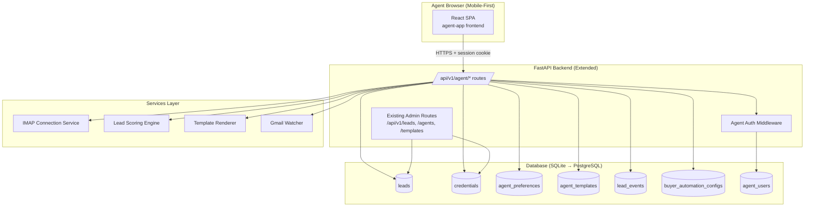
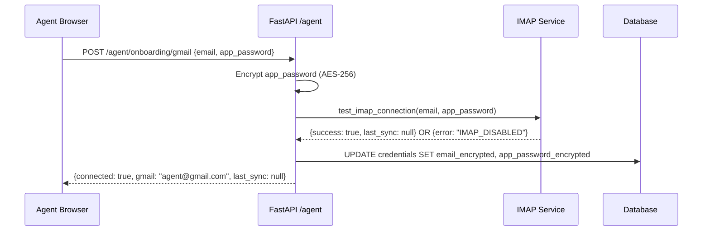
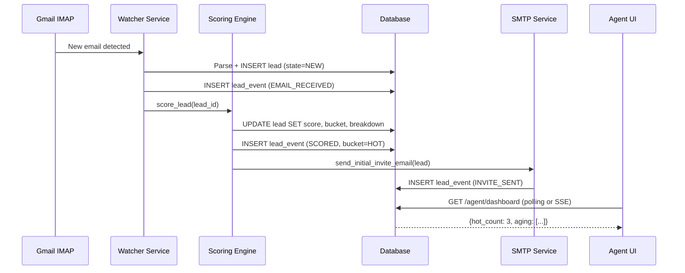
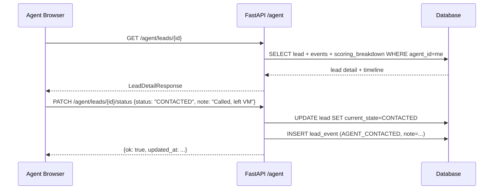

# Design Document: Agent-Facing Web Application (agent-app)

## Overview

The agent-app is a mobile-first responsive web application that gives real estate agents a fast, clear interface to manage leads, configure automation, and monitor their pipeline. It sits alongside the existing admin control panel, sharing the same backend database and API layer, but exposes agent-scoped views and agent-authenticated endpoints. The primary design goals are: enroll a new agent in under 10 minutes, surface HOT leads instantly, and make every automation action transparent and auditable.

The system extends the existing FastAPI + SQLAlchemy backend with new agent-facing routes, new database tables for agent preferences and agent-scoped templates, and a new React (TypeScript) frontend application. The Gmail IMAP/SMTP watcher infrastructure already exists; this feature wires it to an agent self-service enrollment flow and a real-time lead management UI.

The architecture follows a clean separation: the existing admin panel retains full control, while agents operate within boundaries set by admins (e.g., watcher enable/disable, lead source availability). Multi-tenant isolation is enforced at the database query level — every agent query is scoped by `agent_id`.


## Architecture




## Sequence Diagrams

### Onboarding: Gmail Connection + Validation



### Lead Ingestion → Score → Notify



### Lead Detail: Agent Takes Action




## UX Flows + Onboarding Screens

### Route Structure

```
/                          → redirect to /dashboard or /onboarding
/login                     → Agent login
/signup                    → Agent account creation (Step 0)
/onboarding                → Wizard shell (steps 1-6)
  /onboarding/profile      → Step 1: Agent profile
  /onboarding/gmail        → Step 2: Connect Gmail
  /onboarding/sources      → Step 3: Lead intake preferences
  /onboarding/automation   → Step 4: Buyer automation setup
  /onboarding/templates    → Step 5: Email template setup
  /onboarding/golive       → Step 6: Go live + test
/dashboard                 → Home / Today dashboard
/leads                     → Leads inbox
/leads/:id                 → Lead detail
/settings/automation       → Buyer automation settings
/settings/templates        → Email templates settings
/settings/account          → Account + Gmail connection
/reports                   → Lightweight reports
```

### Onboarding Wizard: Step Breakdown

**Step 0 — Account Creation**
- Fields: email (platform login), password, confirm password
- Validation: email format, password min 8 chars, match
- On submit: POST /agent/auth/signup → auto-login → redirect to /onboarding/profile
- Skip email verification for MVP (flag in config)

**Step 1 — Agent Profile**
- Fields: full name (required), phone (optional, click-to-call only), timezone (select, default browser TZ), primary service area (free text: city/zip/neighborhoods)
- Optional: company join code input → POST /agent/company/join
- Progress: 1/6

**Step 2 — Connect Gmail**
- Instructional UI: collapsible "How to create a Gmail App Password" with numbered steps + screenshot placeholders
- Fields: Gmail address, App Password (password input, show/hide toggle)
- Optional: IMAP folder preference (default: INBOX)
- On submit: POST /agent/onboarding/gmail → live IMAP test
- Success state: green checkmark + "Connected ✅ — gmail@example.com"
- Error states: IMAP_DISABLED ("Enable IMAP in Gmail Settings → See how"), TWO_FACTOR_REQUIRED, INVALID_PASSWORD, RATE_LIMITED
- Toggle: "Enable automation watcher" (ON by default; read-only if admin disabled)

**Step 3 — Lead Intake Preferences**
- Checklist of platform-managed lead sources (Zillow, StreetEasy, Realtor.com, etc.)
- Each source shows: logo/name, sample email snippet, parsed preview (name, phone, address, listing_url)
- Default: all common sources enabled
- POST /agent/onboarding/sources

**Step 4 — Buyer Automation Setup**
- Show selected buyer qualification template name (platform default)
- 4 professional questions only:
  1. HOT score threshold (slider 60–95, default 80)
  2. Response SLA for HOT leads (select: 5 min / 15 min / 30 min / 1 hr, default 5 min)
  3. Enable "Tour soon?" question in qualification form (yes/no toggle)
  4. Working hours (time range picker, default 8am–8pm local)
- Confirm summary card: "Your buyer qualification is live."

**Step 5 — Email Template Setup**
- Show 4 template cards: INITIAL_INVITE, POST_HOT, POST_WARM, POST_NURTURE
- Tone selector: Professional | Friendly | Short/Direct (applies platform default variant)
- Inline editor: subject + body textarea, live preview panel with sample lead data
- POST /agent/onboarding/templates

**Step 6 — Go Live + Test**
- Checklist with status icons: Gmail ✅, Watcher ✅, Automation ✅, Templates ✅
- "Run Test" button → POST /agent/onboarding/test
  - Simulates lead ingestion → shows rendered INITIAL_INVITE_EMAIL
  - Simulates form submission with sample answers → shows score/bucket + rendered POST_SUBMISSION_EMAIL
- "Go Live" button → marks onboarding complete → redirect to /dashboard


## Components and Interfaces

### Component 1: OnboardingWizard

**Purpose**: Multi-step enrollment flow with progress tracking, validation, and step persistence.

**Interface**:
```pascal
STRUCTURE OnboardingWizardProps
  currentStep: INTEGER  -- 0..6
  completedSteps: SET OF INTEGER
  onStepComplete: PROCEDURE(step: INTEGER, data: StepData)
  onGoLive: PROCEDURE()
END STRUCTURE

PROCEDURE renderStep(step: INTEGER): ReactNode
  CASE step OF
    0: RETURN AccountCreationStep
    1: RETURN AgentProfileStep
    2: RETURN GmailConnectionStep
    3: RETURN LeadSourcesStep
    4: RETURN BuyerAutomationStep
    5: RETURN TemplateSetupStep
    6: RETURN GoLiveStep
  END CASE
END PROCEDURE
```

**Responsibilities**:
- Persist step progress in localStorage (resume on refresh)
- Validate each step before advancing
- Show progress bar (step N of 6)
- Allow backward navigation without data loss

### Component 2: LeadsInbox

**Purpose**: Filterable, sortable list of leads with urgency-first ordering.

**Interface**:
```pascal
STRUCTURE LeadsInboxProps
  filters: LeadFilters
  onLeadSelect: PROCEDURE(leadId: INTEGER)
END STRUCTURE

STRUCTURE LeadFilters
  bucket: ENUM(ALL, HOT, WARM, NURTURE)
  status: ENUM(ALL, NEW, CONTACTED, APPOINTMENT, LOST)
  search: STRING
  sortBy: ENUM(URGENCY, NEWEST, SCORE)
END STRUCTURE

STRUCTURE LeadCard
  id: INTEGER
  name: STRING
  bucket: ENUM(HOT, WARM, NURTURE)
  score: INTEGER
  address: STRING
  source: STRING
  receivedAt: DATETIME
  lastAction: STRING
  currentState: STRING
  isAging: BOOLEAN
END STRUCTURE
```

**Responsibilities**:
- Infinite scroll or pagination (25 per page)
- HOT leads always appear first regardless of sort
- Aging indicator: HOT > SLA minutes without contact, WARM > 24h
- Search debounced 300ms

### Component 3: LeadDetail

**Purpose**: Single-screen lead view with all contact actions and full timeline.

**Interface**:
```pascal
STRUCTURE LeadDetailProps
  leadId: INTEGER
  onStatusChange: PROCEDURE(status: LeadStatus)
END STRUCTURE

STRUCTURE LeadDetailData
  lead: EnrichedLead
  scoringBreakdown: ScoringBreakdown
  timeline: LIST OF LeadEvent
  renderedEmails: LIST OF RenderedEmail
  notes: LIST OF LeadNote
END STRUCTURE

STRUCTURE ScoringBreakdown
  total: INTEGER
  factors: LIST OF ScoreFactor
END STRUCTURE

STRUCTURE ScoreFactor
  label: STRING   -- e.g. "Pre-approved", "Timeline < 3 months"
  points: INTEGER
  met: BOOLEAN
END STRUCTURE
```

### Component 4: GmailConnectionPanel

**Purpose**: Display Gmail connection status, test connection, update credentials, toggle watcher.

**Interface**:
```pascal
STRUCTURE GmailConnectionState
  connected: BOOLEAN
  gmailAddress: STRING
  lastSync: DATETIME OR NULL
  watcherEnabled: BOOLEAN
  watcherAdminLocked: BOOLEAN  -- if true, agent cannot toggle
  connectionError: STRING OR NULL
END STRUCTURE

PROCEDURE testConnection(): PROMISE OF ConnectionTestResult
PROCEDURE updateCredentials(email: STRING, appPassword: STRING): PROMISE OF VOID
PROCEDURE toggleWatcher(enabled: BOOLEAN): PROMISE OF VOID
PROCEDURE disconnect(): PROMISE OF VOID
```

### Component 5: TemplateEditor

**Purpose**: Edit email template subject/body with live preview using sample lead data.

**Interface**:
```pascal
STRUCTURE TemplateEditorProps
  templateType: ENUM(INITIAL_INVITE, POST_HOT, POST_WARM, POST_NURTURE)
  agentTemplate: AgentTemplate OR NULL  -- null = using platform default
  onSave: PROCEDURE(subject: STRING, body: STRING)
  onRevert: PROCEDURE()
END STRUCTURE

PROCEDURE renderPreview(subject: STRING, body: STRING, sampleLead: SampleLead): PROMISE OF RenderedPreview
```


## Data Models

### New Table: agent_users

Agent-specific login accounts (separate from admin `users` table).

```pascal
STRUCTURE AgentUser
  id: INTEGER PRIMARY KEY
  email: STRING(255) UNIQUE NOT NULL       -- platform login email
  password_hash: STRING(255) NOT NULL
  full_name: STRING(255) NOT NULL
  phone: STRING(50) NULLABLE               -- click-to-call only
  timezone: STRING(100) NOT NULL DEFAULT 'UTC'
  service_area: TEXT NULLABLE              -- city/zip/neighborhoods free text
  company_id: INTEGER FK companies NULLABLE
  credentials_id: INTEGER FK credentials NULLABLE  -- linked Gmail credentials
  onboarding_completed: BOOLEAN DEFAULT FALSE
  onboarding_step: INTEGER DEFAULT 0       -- resume wizard
  role: STRING(50) DEFAULT 'agent'
  created_at: DATETIME NOT NULL
  updated_at: DATETIME NULLABLE
END STRUCTURE
```

### New Table: agent_preferences

Per-agent automation and notification preferences.

```pascal
STRUCTURE AgentPreferences
  id: INTEGER PRIMARY KEY
  agent_user_id: INTEGER FK agent_users NOT NULL UNIQUE
  hot_threshold: INTEGER DEFAULT 80        -- score >= this = HOT
  warm_threshold: INTEGER DEFAULT 50       -- score >= this = WARM (else NURTURE)
  sla_minutes_hot: INTEGER DEFAULT 5       -- alert if HOT not contacted within N min
  quiet_hours_start: TIME NULLABLE         -- e.g. 21:00
  quiet_hours_end: TIME NULLABLE           -- e.g. 08:00
  working_days: STRING(20) DEFAULT 'MON-SAT'
  enable_tour_question: BOOLEAN DEFAULT TRUE
  enabled_lead_source_ids: TEXT            -- JSON array of lead_source IDs
  buyer_automation_config_id: INTEGER FK buyer_automation_configs NULLABLE
  watcher_enabled: BOOLEAN DEFAULT TRUE
  watcher_admin_override: BOOLEAN DEFAULT FALSE  -- admin can lock watcher off
  created_at: DATETIME NOT NULL
  updated_at: DATETIME NULLABLE
END STRUCTURE
```

### New Table: buyer_automation_configs

Buyer qualification template configuration (agent-scoped or platform default).

```pascal
STRUCTURE BuyerAutomationConfig
  id: INTEGER PRIMARY KEY
  agent_user_id: INTEGER FK agent_users NULLABLE  -- NULL = platform default
  name: STRING(255) NOT NULL
  is_platform_default: BOOLEAN DEFAULT FALSE
  hot_threshold: INTEGER DEFAULT 80
  warm_threshold: INTEGER DEFAULT 50
  weight_timeline: INTEGER DEFAULT 25      -- scoring weight: timeline urgency
  weight_preapproval: INTEGER DEFAULT 30   -- scoring weight: pre-approval status
  weight_phone_provided: INTEGER DEFAULT 15
  weight_tour_interest: INTEGER DEFAULT 20
  weight_budget_match: INTEGER DEFAULT 10
  enable_tour_question: BOOLEAN DEFAULT TRUE
  form_link_template: TEXT NULLABLE        -- URL template for qualification form
  created_at: DATETIME NOT NULL
  updated_at: DATETIME NULLABLE
END STRUCTURE
```

### New Table: agent_templates

Agent-scoped email template overrides (cloned from platform defaults).

```pascal
STRUCTURE AgentTemplate
  id: INTEGER PRIMARY KEY
  agent_user_id: INTEGER FK agent_users NOT NULL
  template_type: ENUM('INITIAL_INVITE', 'POST_HOT', 'POST_WARM', 'POST_NURTURE')
  subject: STRING(500) NOT NULL
  body: TEXT NOT NULL
  tone: ENUM('PROFESSIONAL', 'FRIENDLY', 'SHORT') DEFAULT 'PROFESSIONAL'
  is_active: BOOLEAN DEFAULT TRUE
  parent_template_id: INTEGER FK templates NULLABLE  -- platform default it was cloned from
  version: INTEGER DEFAULT 1
  created_at: DATETIME NOT NULL
  updated_at: DATETIME NULLABLE
  UNIQUE(agent_user_id, template_type)
END STRUCTURE
```

### New Table: lead_events

Immutable event log for full lead timeline and transparency.

```pascal
STRUCTURE LeadEvent
  id: INTEGER PRIMARY KEY
  lead_id: INTEGER FK leads NOT NULL
  agent_user_id: INTEGER FK agent_users NULLABLE
  event_type: ENUM(
    'EMAIL_RECEIVED', 'LEAD_PARSED', 'INVITE_CREATED', 'INVITE_SENT',
    'FORM_SUBMITTED', 'LEAD_SCORED', 'POST_EMAIL_SENT',
    'AGENT_CONTACTED', 'APPOINTMENT_SET', 'LEAD_LOST', 'LEAD_CLOSED',
    'NOTE_ADDED', 'STATUS_CHANGED', 'WATCHER_TOGGLED'
  )
  payload: TEXT NULLABLE                   -- JSON: score breakdown, email content, note text
  created_at: DATETIME NOT NULL
  INDEX(lead_id, created_at)
END STRUCTURE
```

### Extended Lead Model (additions to existing `leads` table)

```pascal
-- New columns added to existing leads table:
  property_address: STRING(500) NULLABLE
  listing_url: STRING(1000) NULLABLE
  score: INTEGER NULLABLE
  score_bucket: ENUM('HOT', 'WARM', 'NURTURE') NULLABLE
  score_breakdown: TEXT NULLABLE           -- JSON: {factors: [{label, points, met}]}
  current_state: ENUM(
    'NEW', 'INVITE_SENT', 'FORM_SUBMITTED', 'SCORED',
    'CONTACTED', 'APPOINTMENT_SET', 'LOST', 'CLOSED'
  ) DEFAULT 'NEW'
  agent_user_id: INTEGER FK agent_users NULLABLE
  company_id: INTEGER FK companies NULLABLE
  lead_source_name: STRING(100) NULLABLE   -- denormalized for display speed
  last_agent_action_at: DATETIME NULLABLE  -- for SLA aging calculation
```

### New Table: agent_sessions

Agent-specific session management (mirrors admin sessions pattern).

```pascal
STRUCTURE AgentSession
  id: STRING(128) PRIMARY KEY              -- secure random token
  agent_user_id: INTEGER FK agent_users NOT NULL
  created_at: DATETIME NOT NULL
  expires_at: DATETIME NOT NULL
  last_accessed: DATETIME NOT NULL
  INDEX(agent_user_id)
  INDEX(expires_at)
END STRUCTURE
```


## Backend API Specs

All agent routes are prefixed `/api/v1/agent/` and require agent session cookie authentication.

### Auth Endpoints

```
POST /api/v1/agent/auth/signup
Body: { email, password, full_name }
Response 201: { agent_user_id, email, onboarding_step: 0 }
Response 409: { error: "EMAIL_ALREADY_EXISTS" }

POST /api/v1/agent/auth/login
Body: { email, password }
Response 200: sets session cookie, { agent_user_id, full_name, onboarding_completed }
Response 401: { error: "INVALID_CREDENTIALS" }

POST /api/v1/agent/auth/logout
Response 200: clears session cookie

GET /api/v1/agent/auth/me
Response 200: { agent_user_id, email, full_name, onboarding_completed, onboarding_step }
```

### Onboarding Endpoints

```
PUT /api/v1/agent/onboarding/profile
Body: { full_name, phone?, timezone, service_area, company_join_code? }
Response 200: { ok: true, onboarding_step: 2 }

POST /api/v1/agent/onboarding/gmail
Body: { gmail_address, app_password, imap_folder? }
Response 200: { connected: true, gmail_address, last_sync: null }
Response 422: { error: "IMAP_DISABLED" | "INVALID_PASSWORD" | "TWO_FACTOR_REQUIRED" | "RATE_LIMITED", message: "..." }

PUT /api/v1/agent/onboarding/sources
Body: { enabled_lead_source_ids: [1, 2, 3] }
Response 200: { ok: true, onboarding_step: 4 }

PUT /api/v1/agent/onboarding/automation
Body: { hot_threshold, sla_minutes_hot, enable_tour_question, quiet_hours_start?, quiet_hours_end? }
Response 200: { ok: true, config_id, onboarding_step: 5 }

PUT /api/v1/agent/onboarding/templates
Body: { tone: "PROFESSIONAL"|"FRIENDLY"|"SHORT", overrides?: { INITIAL_INVITE?: {subject, body}, ... } }
Response 200: { ok: true, template_ids: {...}, onboarding_step: 6 }

POST /api/v1/agent/onboarding/test
Response 200: {
  simulated_lead: { name, phone, address, source },
  invite_email: { subject, body_rendered },
  form_submission: { answers: [...], score: 82, bucket: "HOT" },
  post_email: { subject, body_rendered }
}

POST /api/v1/agent/onboarding/complete
Response 200: { ok: true, redirect: "/dashboard" }
```

### Dashboard Endpoints

```
GET /api/v1/agent/dashboard
Response 200: {
  hot_leads: { count: 3, leads: [LeadSummary, ...] },
  aging_leads: { count: 1, leads: [LeadSummary, ...] },
  response_time_today_minutes: 4.2,
  response_time_week_minutes: 6.8,
  watcher_status: "running" | "stopped" | "error",
  automation_enabled: true
}

LeadSummary: { id, name, bucket, score, address, source, received_at, last_action, current_state, is_aging }
```

### Leads Endpoints

```
GET /api/v1/agent/leads
Query: bucket?, status?, search?, sort_by?, page?, per_page?
Response 200: { leads: [LeadCard], total, page, per_page, pages }

GET /api/v1/agent/leads/{id}
Response 200: {
  lead: EnrichedLead,
  scoring_breakdown: { total, factors: [{label, points, met}] },
  timeline: [LeadEvent],
  rendered_emails: [{ type, subject, body, sent_at }],
  notes: [{ text, created_at }]
}
Response 403: { error: "LEAD_NOT_OWNED" }

PATCH /api/v1/agent/leads/{id}/status
Body: { status: "CONTACTED"|"APPOINTMENT_SET"|"LOST"|"CLOSED", note? }
Response 200: { ok: true, current_state, updated_at }

POST /api/v1/agent/leads/{id}/notes
Body: { text }
Response 201: { note_id, text, created_at }
```

### Templates Endpoints

```
GET /api/v1/agent/templates
Response 200: { templates: [{ type, subject, body, is_custom, version, updated_at }] }

PUT /api/v1/agent/templates/{type}
Body: { subject, body }
Response 200: { ok: true, template_id, version }

POST /api/v1/agent/templates/{type}/preview
Body: { subject, body }
Response 200: { subject_rendered, body_rendered }

DELETE /api/v1/agent/templates/{type}
Response 200: { ok: true, reverted_to: "platform_default" }
```

### Automation Settings Endpoints

```
GET /api/v1/agent/automation
Response 200: {
  config: BuyerAutomationConfig,
  is_platform_default: false,
  available_questions: [{ key, label, enabled }]
}

PUT /api/v1/agent/automation
Body: { hot_threshold?, warm_threshold?, enable_tour_question?, weight_timeline?, weight_preapproval?, weight_phone_provided? }
Response 200: { ok: true, config_id, version_note? }
```

### Account / Connections Endpoints

```
GET /api/v1/agent/account/gmail
Response 200: { connected, gmail_address, last_sync, watcher_enabled, watcher_admin_locked }

POST /api/v1/agent/account/gmail/test
Response 200: { ok: true, last_sync } OR { ok: false, error: "IMAP_DISABLED" }

PUT /api/v1/agent/account/gmail
Body: { gmail_address, app_password }
Response 200: { connected: true, gmail_address }

DELETE /api/v1/agent/account/gmail
Response 200: { ok: true, watcher_stopped: true }

PATCH /api/v1/agent/account/watcher
Body: { enabled: true|false }
Response 200: { watcher_enabled } OR 403: { error: "ADMIN_LOCKED" }

PUT /api/v1/agent/account/preferences
Body: { service_area?, timezone?, quiet_hours_start?, quiet_hours_end? }
Response 200: { ok: true }
```

### Reports Endpoints

```
GET /api/v1/agent/reports/summary
Query: period? (7d|30d|90d, default 30d)
Response 200: {
  leads_by_source: [{ source, count }],
  bucket_distribution: { HOT: 12, WARM: 34, NURTURE: 20 },
  avg_response_time_minutes: 5.4,
  appointments_set: 8,
  period_start, period_end
}
```


## Algorithmic Pseudocode

### Main Algorithm: Agent Lead Listing with Urgency Sort

```pascal
PROCEDURE get_agent_leads(agent_user_id, filters)
  INPUT: agent_user_id: INTEGER, filters: LeadFilters
  OUTPUT: leads: LIST OF LeadCard

  SEQUENCE
    -- Enforce tenant isolation
    ASSERT agent_user_id IS NOT NULL

    query ← SELECT leads WHERE agent_user_id = agent_user_id

    -- Apply bucket filter
    IF filters.bucket IS NOT NULL THEN
      query ← query WHERE score_bucket = filters.bucket
    END IF

    -- Apply status filter
    IF filters.status IS NOT NULL THEN
      query ← query WHERE current_state = filters.status
    END IF

    -- Apply search
    IF filters.search IS NOT NULL AND LENGTH(filters.search) > 0 THEN
      term ← "%" + sanitize(filters.search) + "%"
      query ← query WHERE (name LIKE term OR property_address LIKE term OR lead_source_name LIKE term)
    END IF

    -- Urgency sort: HOT first, then by aging flag, then by received_at DESC
    query ← query ORDER BY
      CASE score_bucket WHEN 'HOT' THEN 0 WHEN 'WARM' THEN 1 ELSE 2 END ASC,
      is_aging DESC,
      created_at DESC

    leads ← query PAGINATE(filters.page, filters.per_page)

    -- Annotate aging flag
    prefs ← SELECT agent_preferences WHERE agent_user_id = agent_user_id
    FOR each lead IN leads DO
      IF lead.score_bucket = 'HOT' AND lead.last_agent_action_at IS NULL THEN
        age_minutes ← (NOW() - lead.created_at) IN MINUTES
        lead.is_aging ← age_minutes > prefs.sla_minutes_hot
      ELSE IF lead.score_bucket = 'WARM' THEN
        age_hours ← (NOW() - lead.created_at) IN HOURS
        lead.is_aging ← age_hours > 24
      ELSE
        lead.is_aging ← FALSE
      END IF
    END FOR

    RETURN leads
  END SEQUENCE
END PROCEDURE
```

**Preconditions:**
- `agent_user_id` is authenticated and non-null
- `filters.page >= 1`, `filters.per_page` between 1 and 100

**Postconditions:**
- All returned leads have `agent_user_id` matching the caller
- HOT leads appear before WARM before NURTURE
- `is_aging` is correctly computed per agent SLA preferences

**Loop Invariants:**
- All leads processed so far belong to the authenticated agent

---

### Main Algorithm: IMAP Connection Test

```pascal
PROCEDURE test_imap_connection(gmail_address, app_password)
  INPUT: gmail_address: STRING, app_password: STRING
  OUTPUT: result: ConnectionTestResult

  SEQUENCE
    -- Never log app_password
    ASSERT app_password NOT IN log_output

    TRY
      conn ← IMAP4_SSL("imap.gmail.com", 993)
      conn.login(gmail_address, app_password)
      conn.select("INBOX")
      conn.logout()
      RETURN { success: TRUE, last_sync: NULL }

    CATCH IMAPError AS e
      error_code ← classify_imap_error(e.message)
      RETURN { success: FALSE, error: error_code, message: safe_error_message(error_code) }
    END TRY
  END SEQUENCE
END PROCEDURE

PROCEDURE classify_imap_error(raw_message)
  INPUT: raw_message: STRING
  OUTPUT: error_code: STRING

  SEQUENCE
    IF raw_message CONTAINS "Application-specific password required" THEN
      RETURN "TWO_FACTOR_REQUIRED"
    ELSE IF raw_message CONTAINS "IMAP access is disabled" THEN
      RETURN "IMAP_DISABLED"
    ELSE IF raw_message CONTAINS "Invalid credentials" THEN
      RETURN "INVALID_PASSWORD"
    ELSE IF raw_message CONTAINS "Too many login attempts" THEN
      RETURN "RATE_LIMITED"
    ELSE
      RETURN "CONNECTION_FAILED"
    END IF
  END SEQUENCE
END PROCEDURE
```

**Preconditions:**
- `gmail_address` is a valid email format
- `app_password` is non-empty
- Rate limit check has passed (max 5 attempts per 15 minutes per agent)

**Postconditions:**
- Returns `success: TRUE` only if IMAP login and INBOX select both succeed
- `app_password` never appears in logs, error messages, or responses
- Error codes are from a fixed safe enumeration

---

### Main Algorithm: Lead Scoring

```pascal
PROCEDURE score_lead(lead_id, buyer_config_id)
  INPUT: lead_id: INTEGER, buyer_config_id: INTEGER
  OUTPUT: score: INTEGER, bucket: STRING, breakdown: LIST OF ScoreFactor

  SEQUENCE
    lead ← SELECT lead WHERE id = lead_id
    config ← SELECT buyer_automation_config WHERE id = buyer_config_id
    submission ← SELECT form_submission WHERE lead_id = lead_id  -- may be NULL

    score ← 0
    breakdown ← []

    -- Factor 1: Timeline urgency (weight: config.weight_timeline)
    IF submission IS NOT NULL AND submission.timeline_months <= 3 THEN
      points ← config.weight_timeline
      score ← score + points
      breakdown.append({ label: "Timeline < 3 months", points: points, met: TRUE })
    ELSE
      breakdown.append({ label: "Timeline < 3 months", points: config.weight_timeline, met: FALSE })
    END IF

    -- Factor 2: Pre-approval status (weight: config.weight_preapproval)
    IF submission IS NOT NULL AND submission.preapproved = TRUE THEN
      points ← config.weight_preapproval
      score ← score + points
      breakdown.append({ label: "Pre-approved", points: points, met: TRUE })
    ELSE
      breakdown.append({ label: "Pre-approved", points: config.weight_preapproval, met: FALSE })
    END IF

    -- Factor 3: Phone provided (weight: config.weight_phone_provided)
    IF lead.phone IS NOT NULL AND LENGTH(lead.phone) > 0 THEN
      points ← config.weight_phone_provided
      score ← score + points
      breakdown.append({ label: "Phone provided", points: points, met: TRUE })
    ELSE
      breakdown.append({ label: "Phone provided", points: config.weight_phone_provided, met: FALSE })
    END IF

    -- Factor 4: Tour interest (weight: config.weight_tour_interest)
    IF config.enable_tour_question AND submission IS NOT NULL AND submission.wants_tour = TRUE THEN
      points ← config.weight_tour_interest
      score ← score + points
      breakdown.append({ label: "Wants tour", points: points, met: TRUE })
    ELSE
      breakdown.append({ label: "Wants tour", points: config.weight_tour_interest, met: FALSE })
    END IF

    -- Factor 5: Budget match (weight: config.weight_budget_match)
    IF submission IS NOT NULL AND submission.budget_in_range = TRUE THEN
      points ← config.weight_budget_match
      score ← score + points
      breakdown.append({ label: "Budget in range", points: points, met: TRUE })
    ELSE
      breakdown.append({ label: "Budget in range", points: config.weight_budget_match, met: FALSE })
    END IF

    -- Determine bucket
    IF score >= config.hot_threshold THEN
      bucket ← "HOT"
    ELSE IF score >= config.warm_threshold THEN
      bucket ← "WARM"
    ELSE
      bucket ← "NURTURE"
    END IF

    -- Persist
    UPDATE leads SET score=score, score_bucket=bucket, score_breakdown=JSON(breakdown) WHERE id=lead_id
    INSERT lead_event(lead_id, event_type='LEAD_SCORED', payload=JSON({score, bucket, breakdown}))

    RETURN score, bucket, breakdown
  END SEQUENCE
END PROCEDURE
```

**Preconditions:**
- `lead_id` exists and belongs to the agent
- `buyer_config_id` is valid (platform default or agent-owned)
- Sum of all weights equals 100

**Postconditions:**
- `score` is between 0 and 100 inclusive
- `bucket` is exactly one of HOT, WARM, NURTURE
- `breakdown` contains one entry per scoring factor
- A `LEAD_SCORED` event is persisted

**Loop Invariants:** N/A (no loops; sequential factor evaluation)

---

### Main Algorithm: Onboarding Test Simulation

```pascal
PROCEDURE simulate_onboarding_test(agent_user_id)
  INPUT: agent_user_id: INTEGER
  OUTPUT: simulation_result: OnboardingTestResult

  SEQUENCE
    prefs ← SELECT agent_preferences WHERE agent_user_id = agent_user_id
    config ← SELECT buyer_automation_config WHERE id = prefs.buyer_automation_config_id
    templates ← SELECT agent_templates WHERE agent_user_id = agent_user_id

    -- Build sample lead (never persisted)
    sample_lead ← {
      name: "Alex Johnson",
      phone: "555-867-5309",
      address: "123 Main St, Brooklyn NY 11201",
      listing_url: "https://zillow.com/homes/123-main-st",
      source: "Zillow"
    }

    -- Render invite email
    invite_tmpl ← templates[INITIAL_INVITE] OR platform_default(INITIAL_INVITE)
    invite_rendered ← render_template(invite_tmpl, sample_lead, agent_user_id)

    -- Simulate form submission
    sample_answers ← {
      timeline_months: 2,
      preapproved: TRUE,
      wants_tour: TRUE,
      budget_in_range: TRUE
    }
    score, bucket, breakdown ← score_lead_from_answers(sample_answers, config)

    -- Render post-submission email
    post_tmpl_type ← CASE bucket OF
      'HOT': POST_HOT
      'WARM': POST_WARM
      ELSE: POST_NURTURE
    END CASE
    post_tmpl ← templates[post_tmpl_type] OR platform_default(post_tmpl_type)
    post_rendered ← render_template(post_tmpl, sample_lead, agent_user_id)

    RETURN {
      simulated_lead: sample_lead,
      invite_email: invite_rendered,
      form_submission: { answers: sample_answers, score: score, bucket: bucket },
      post_email: post_rendered
    }
  END SEQUENCE
END PROCEDURE
```

**Preconditions:**
- Agent has completed onboarding steps 1–5
- At least one template (platform default) exists for each type

**Postconditions:**
- No database records are created (pure simulation)
- Rendered emails use actual agent name/phone from profile
- Score reflects actual agent's buyer_automation_config


## Key Functions with Formal Specifications

### `encrypt_app_password(plain_text) → encrypted_blob`

```pascal
FUNCTION encrypt_app_password(plain_text: STRING): STRING
```

**Preconditions:**
- `plain_text` is non-empty
- `ENCRYPTION_KEY` environment variable is set and is 32 bytes (AES-256)

**Postconditions:**
- Returns base64-encoded ciphertext
- `plain_text` is never stored or logged
- Decryption with same key recovers original value exactly

---

### `get_agent_dashboard(agent_user_id) → DashboardData`

```pascal
FUNCTION get_agent_dashboard(agent_user_id: INTEGER): DashboardData
```

**Preconditions:**
- `agent_user_id` is authenticated
- Agent has completed onboarding

**Postconditions:**
- `hot_leads.leads` contains only leads with `score_bucket = 'HOT'` and `agent_user_id = caller`
- `aging_leads` contains HOT leads where `(NOW() - created_at) > sla_minutes_hot` AND `last_agent_action_at IS NULL`
- `response_time_today_minutes` is the mean of `(AGENT_CONTACTED.created_at - EMAIL_RECEIVED.created_at)` for today
- No leads from other agents are included

---

### `update_lead_status(agent_user_id, lead_id, new_status, note?) → UpdateResult`

```pascal
FUNCTION update_lead_status(agent_user_id: INTEGER, lead_id: INTEGER, new_status: STRING, note: STRING OPTIONAL): UpdateResult
```

**Preconditions:**
- Lead with `lead_id` exists and `lead.agent_user_id = agent_user_id`
- `new_status` is one of: CONTACTED, APPOINTMENT_SET, LOST, CLOSED
- Valid state transitions only: NEW/INVITE_SENT/SCORED → CONTACTED → APPOINTMENT_SET → CLOSED; any → LOST

**Postconditions:**
- `lead.current_state` is updated to `new_status`
- If `new_status = CONTACTED`, `lead.last_agent_action_at` is set to NOW()
- A `LeadEvent` of type `STATUS_CHANGED` is inserted with `payload = {from, to, note}`
- Returns `{ ok: true, current_state, updated_at }`

---

### `render_template(template, lead, agent_user_id) → RenderedEmail`

```pascal
FUNCTION render_template(template: AgentTemplate, lead: Lead, agent_user_id: INTEGER): RenderedEmail
```

**Preconditions:**
- `template.subject` and `template.body` contain only supported placeholders
- `lead` is non-null with at least `name` populated
- Agent profile exists for `agent_user_id`

**Postconditions:**
- All `{lead_name}`, `{agent_name}`, `{agent_phone}`, `{agent_email}`, `{form_link}` placeholders are substituted
- No unresolved `{...}` placeholders remain in output
- Subject contains no newline characters (header injection prevention)
- Returns `{ subject: STRING, body: STRING }`

---

### `toggle_watcher(agent_user_id, enabled) → WatcherToggleResult`

```pascal
FUNCTION toggle_watcher(agent_user_id: INTEGER, enabled: BOOLEAN): WatcherToggleResult
```

**Preconditions:**
- `agent_user_id` is authenticated
- `agent_preferences.watcher_admin_override = FALSE` (admin has not locked it)
- Gmail credentials exist and are connected

**Postconditions:**
- If `enabled = TRUE`: watcher process is started for agent, `watcher_enabled = TRUE`
- If `enabled = FALSE`: watcher process is stopped immediately, `watcher_enabled = FALSE`
- A `WATCHER_TOGGLED` lead event is NOT created (account-level event, not lead-level)
- Returns `{ watcher_enabled: BOOLEAN }`
- If `watcher_admin_override = TRUE`: returns 403 `{ error: "ADMIN_LOCKED" }`


## Example Usage

### Example 1: Agent Signup + Onboarding Flow

```pascal
-- Step 0: Create account
POST /api/v1/agent/auth/signup
{ email: "sarah@example.com", password: "Secure123!", full_name: "Sarah Chen" }
→ 201: { agent_user_id: 42, onboarding_step: 0 }

-- Step 2: Connect Gmail
POST /api/v1/agent/onboarding/gmail
{ gmail_address: "sarah.chen.realty@gmail.com", app_password: "abcd efgh ijkl mnop" }
→ 200: { connected: true, gmail_address: "sarah.chen.realty@gmail.com", last_sync: null }

-- Step 4: Configure automation
PUT /api/v1/agent/onboarding/automation
{ hot_threshold: 75, sla_minutes_hot: 10, enable_tour_question: true,
  quiet_hours_start: "21:00", quiet_hours_end: "08:00" }
→ 200: { ok: true, config_id: 7, onboarding_step: 5 }

-- Step 6: Run test
POST /api/v1/agent/onboarding/test
→ 200: {
    simulated_lead: { name: "Alex Johnson", phone: "555-867-5309", ... },
    invite_email: { subject: "Alex, I'd love to help you find your home",
                    body_rendered: "Hi Alex, I'm Sarah Chen..." },
    form_submission: { score: 90, bucket: "HOT" },
    post_email: { subject: "Great news Alex — let's talk!", body_rendered: "..." }
  }
```

### Example 2: Agent Checks Dashboard + Acts on HOT Lead

```pascal
-- Dashboard poll
GET /api/v1/agent/dashboard
→ 200: {
    hot_leads: { count: 2, leads: [
      { id: 101, name: "Marcus Webb", bucket: "HOT", score: 88,
        address: "45 Park Ave, Manhattan", source: "StreetEasy",
        received_at: "2024-01-15T09:02:00Z", is_aging: false }
    ]},
    aging_leads: { count: 1, leads: [
      { id: 98, name: "Priya Patel", bucket: "HOT", score: 82, is_aging: true }
    ]},
    response_time_today_minutes: 3.5
  }

-- Open lead detail
GET /api/v1/agent/leads/101
→ 200: {
    lead: { id: 101, name: "Marcus Webb", score: 88, bucket: "HOT", ... },
    scoring_breakdown: {
      total: 88,
      factors: [
        { label: "Pre-approved", points: 30, met: true },
        { label: "Timeline < 3 months", points: 25, met: true },
        { label: "Phone provided", points: 15, met: true },
        { label: "Wants tour", points: 18, met: true },
        { label: "Budget in range", points: 0, met: false }
      ]
    },
    timeline: [
      { event_type: "EMAIL_RECEIVED", created_at: "2024-01-15T09:02:00Z" },
      { event_type: "INVITE_SENT", created_at: "2024-01-15T09:02:05Z" },
      { event_type: "FORM_SUBMITTED", created_at: "2024-01-15T09:15:00Z" },
      { event_type: "LEAD_SCORED", created_at: "2024-01-15T09:15:01Z", payload: "{score:88,bucket:HOT}" },
      { event_type: "POST_EMAIL_SENT", created_at: "2024-01-15T09:15:02Z" }
    ]
  }

-- Mark contacted
PATCH /api/v1/agent/leads/101/status
{ status: "CONTACTED", note: "Called, scheduled showing for Saturday 2pm" }
→ 200: { ok: true, current_state: "CONTACTED", updated_at: "2024-01-15T09:18:00Z" }
```

### Example 3: Agent Edits Email Template

```pascal
-- Preview before saving
POST /api/v1/agent/templates/POST_HOT/preview
{ subject: "Great news {lead_name} — let's talk!",
  body: "Hi {lead_name},\n\nYou scored high on our buyer match. I'm {agent_name}..." }
→ 200: {
    subject_rendered: "Great news Marcus — let's talk!",
    body_rendered: "Hi Marcus,\n\nYou scored high on our buyer match. I'm Sarah Chen..."
  }

-- Save template
PUT /api/v1/agent/templates/POST_HOT
{ subject: "Great news {lead_name} — let's talk!",
  body: "Hi {lead_name},\n\nYou scored high on our buyer match. I'm {agent_name}..." }
→ 200: { ok: true, template_id: 15, version: 2 }
```


## Correctness Properties

*A property is a characteristic or behavior that should hold true across all valid executions of a system — essentially, a formal statement about what the system should do. Properties serve as the bridge between human-readable specifications and machine-verifiable correctness guarantees.*

### Property 1: Tenant Isolation

*For any* agent API response, every lead, template, preference, and automation config in the response satisfies `resource.agent_user_id = authenticated_agent_user_id`. No agent can read or modify another agent's data.

**Validates: Requirements 10.2, 11.7, 17.3, 18.1, 18.2**

### Property 2: Credential Never Plaintext

*For any* IMAP test or credential update operation, the App Password never appears in log output, error responses, or API responses. The value persisted to the database is always AES-256 encrypted and not equal to the plaintext input.

**Validates: Requirements 5.8, 19.1, 19.4**

### Property 3: Encryption Round-Trip

*For any* non-empty App Password string, encrypting then decrypting with the same AES-256 key produces a value identical to the original plaintext.

**Validates: Requirements 19.5**

### Property 4: Score Computation Correctness

*For any* set of scoring factor inputs, the computed score equals the sum of `factor.points` for all factors where `factor.met = TRUE`, and the result is between 0 and 100 inclusive.

**Validates: Requirements 13.1, 13.6**

### Property 5: Bucket Assignment Determinism

*For any* score value and threshold pair `(hot_threshold, warm_threshold)` where `hot_threshold > warm_threshold > 0`, the bucket assignment is: `HOT` iff `score >= hot_threshold`, `WARM` iff `warm_threshold <= score < hot_threshold`, `NURTURE` iff `score < warm_threshold`. These three cases are mutually exclusive and exhaustive.

**Validates: Requirements 13.3, 13.4, 13.5**

### Property 6: Tour Question Disabled Zeroes Score

*For any* lead scoring operation where `enable_tour_question = FALSE`, the tour interest factor contributes 0 points to the score regardless of the form submission answer.

**Validates: Requirements 13.8**

### Property 7: Event Immutability

*For any* `lead_events` record that has been inserted, it is never updated or deleted. Every state transition, scoring event, email send, agent contact action, and note addition produces exactly one new event record.

**Validates: Requirements 20.1, 20.2**

### Property 8: Watcher Admin Lock

*For any* watcher toggle request where `agent_preferences.watcher_admin_override = TRUE`, the response is always 403 with `error: "ADMIN_LOCKED"` regardless of the `enabled` value in the request body.

**Validates: Requirements 16.6**

### Property 9: Onboarding Completeness Gate

*For any* agent state, `onboarding_completed` is set to `TRUE` if and only if all four conditions hold simultaneously: Gmail is connected, at least one lead source is enabled, a `BuyerAutomationConfig` exists, and all 4 template types have an active template (agent override or platform default).

**Validates: Requirements 9.4**

### Property 10: Template Placeholder Safety

*For any* rendered email, the rendered subject contains no newline characters and no unresolved `{...}` placeholders remain in either subject or body.

**Validates: Requirements 14.5, 14.6, 14.7**

### Property 11: HOT Lead Aging Accuracy

*For any* HOT lead, `is_aging = TRUE` if and only if `last_agent_action_at IS NULL` AND `(NOW() - created_at) > sla_minutes_hot`. This invariant holds in both the dashboard and the leads inbox.

**Validates: Requirements 10.3, 11.5**

### Property 12: WARM Lead Aging Accuracy

*For any* WARM lead, `is_aging = TRUE` if and only if `(NOW() - created_at) > 24 hours`.

**Validates: Requirements 11.6**

### Property 13: IMAP Rate Limiting

*For any* agent, no more than 5 IMAP connection test attempts are permitted within a 15-minute window. The 6th or subsequent attempt within that window returns 429 with `error: "RATE_LIMITED"` and `retry_after_seconds`.

**Validates: Requirements 5.7**

### Property 14: IMAP Error Classification

*For any* IMAP error message string, `classify_imap_error()` returns a value from the fixed safe enumeration `{IMAP_DISABLED, TWO_FACTOR_REQUIRED, INVALID_PASSWORD, RATE_LIMITED, CONNECTION_FAILED}` and never returns the raw error message.

**Validates: Requirements 5.3, 5.4, 5.5, 5.6**

### Property 15: Urgency Sort Order

*For any* leads inbox query result, all HOT leads appear before all WARM leads, and all WARM leads appear before all NURTURE leads, regardless of any other sort parameter.

**Validates: Requirements 11.1**

### Property 16: Filter Correctness

*For any* leads inbox query with one or more active filters (bucket, status, search), every lead in the result satisfies all active filter conditions simultaneously.

**Validates: Requirements 11.2, 11.3**

### Property 17: Pagination Bound

*For any* paginated leads inbox response, the number of leads returned is at most 25.

**Validates: Requirements 11.4**

### Property 18: Status Transition Validity

*For any* lead status update request, if the transition from `current_state` to `new_status` is not in the set of valid transitions, the request is rejected with 422. Valid transitions are: `{NEW, INVITE_SENT, SCORED} → CONTACTED → APPOINTMENT_SET → CLOSED`; any state → LOST.

**Validates: Requirements 12.6**

### Property 19: Template Version Monotonicity

*For any* sequence of template save operations on the same template type for the same agent, each save increments the version number by exactly 1.

**Validates: Requirements 14.2**

### Property 20: Onboarding Test Simulation Leaves No Records

*For any* invocation of the onboarding test simulation, the total count of records in `leads`, `lead_events`, and `agent_templates` tables is identical before and after the simulation.

**Validates: Requirements 9.3**

### Property 21: Unauthenticated Requests Rejected

*For any* request to any `/api/v1/agent/` route without a valid session cookie, the response is 401.

**Validates: Requirements 2.4**

### Property 22: Session Token Uniqueness

*For any* two distinct agent sessions, their session tokens are different. All session tokens are exactly 64 bytes of cryptographically secure random data.

**Validates: Requirements 2.6**


## Error Handling

### Error Scenario 1: Gmail IMAP Connection Failure

**Condition**: Agent submits Gmail credentials that fail IMAP login
**Response**: 422 with structured error code and human-readable message + actionable link
**Recovery**: UI shows inline error with "How to fix" guidance specific to the error code (e.g., "Enable IMAP in Gmail Settings → [See how]")

### Error Scenario 2: Watcher Admin Lock

**Condition**: Agent attempts to enable watcher but admin has set `watcher_admin_override = TRUE`
**Response**: 403 `{ error: "ADMIN_LOCKED", message: "Your watcher is managed by your company admin." }`
**Recovery**: UI shows read-only toggle with explanation; agent contacts admin

### Error Scenario 3: Lead Not Owned

**Condition**: Agent requests lead detail for a lead belonging to another agent
**Response**: 403 `{ error: "LEAD_NOT_OWNED" }` (not 404, to avoid enumeration but still be clear)
**Recovery**: Client redirects to leads inbox

### Error Scenario 4: Invalid Template Placeholder

**Condition**: Agent saves template body containing `{unknown_field}`
**Response**: 422 `{ error: "INVALID_PLACEHOLDER", invalid: ["{unknown_field}"], supported: [...] }`
**Recovery**: UI highlights the invalid placeholder inline in the editor

### Error Scenario 5: Rate Limited IMAP Test

**Condition**: Agent triggers more than 5 connection tests in 15 minutes
**Response**: 429 `{ error: "RATE_LIMITED", retry_after_seconds: 300 }`
**Recovery**: UI disables "Test Connection" button with countdown timer

### Error Scenario 6: Onboarding Step Out of Order

**Condition**: Agent attempts to access step N+2 without completing step N
**Response**: 400 `{ error: "ONBOARDING_STEP_REQUIRED", required_step: N, current_step: N-1 }`
**Recovery**: Wizard redirects to the required step


## Testing Strategy

### Unit Testing Approach

Test each service function in isolation with mocked DB and IMAP:
- `score_lead()`: test all factor combinations, boundary values (score = hot_threshold, warm_threshold, 0, 100)
- `classify_imap_error()`: test each known error string + unknown fallback
- `render_template()`: test all placeholder substitutions, missing fields, header injection attempt in subject
- `get_agent_leads()`: test tenant isolation (agent A cannot see agent B's leads), urgency sort order, aging flag calculation
- `encrypt_app_password()` / `decrypt_app_password()`: round-trip test, verify plaintext never in output

### Property-Based Testing Approach

**Property Test Library**: hypothesis (Python)

Key properties to test:
- For any `score` computed by `score_lead()`, `0 <= score <= 100`
- For any `score` and thresholds `(hot_t, warm_t)` where `hot_t > warm_t > 0`, bucket assignment is deterministic and covers all three cases
- For any template body with only supported placeholders, `render_template()` produces output with zero unresolved `{...}` patterns
- For any lead list query with `agent_user_id = X`, no returned lead has `agent_user_id != X`
- For any IMAP error message string, `classify_imap_error()` returns a value from the fixed safe enumeration

### Integration Testing Approach

- Full onboarding wizard flow: signup → profile → gmail (mock IMAP) → sources → automation → templates → go-live → test simulation
- Lead lifecycle: ingest email → parse → score → send invite → submit form → re-score → send post-email → agent marks contacted
- Watcher toggle: enable → verify watcher starts; disable → verify watcher stops; admin lock → verify 403
- Template CRUD: create agent template → preview → save → revert to default
- Auth: unauthenticated requests return 401; cross-agent requests return 403; session expiry returns 401

### Security Testing

- Verify `app_password` never appears in: API responses, log files, error messages
- Verify IMAP rate limiting: 6th attempt within 15 min returns 429
- Verify tenant isolation: agent A's session token cannot access agent B's leads/templates/preferences
- Verify template header injection: subject with `\n` returns 422


## Implementation Milestones

### Milestone 1: Auth + Onboarding Backend (Week 1–2)
- New DB tables: `agent_users`, `agent_sessions`, `agent_preferences`, `buyer_automation_configs`, `agent_templates`, `lead_events`
- Alembic migrations for new tables + `leads` table column additions
- `POST /agent/auth/signup`, `POST /agent/auth/login`, `POST /agent/auth/logout`, `GET /agent/auth/me`
- Onboarding endpoints: profile, gmail (with IMAP test), sources, automation, templates, test simulation, complete
- Unit tests for IMAP test + scoring

### Milestone 2: Onboarding Frontend (Week 2–3)
- React app scaffold (Vite + TypeScript + React Router)
- Wizard shell with progress bar + step routing
- Steps 0–6 components with validation
- Gmail connection step with live feedback states
- Go Live test simulation display

### Milestone 3: Leads Inbox + Dashboard Backend (Week 3–4)
- `GET /agent/dashboard` with HOT count, aging, response time metrics
- `GET /agent/leads` with filters, urgency sort, aging annotation
- `GET /agent/leads/{id}` with timeline, scoring breakdown, rendered emails
- `PATCH /agent/leads/{id}/status`, `POST /agent/leads/{id}/notes`
- `lead_events` insertion in watcher pipeline (EMAIL_RECEIVED, INVITE_SENT, etc.)

### Milestone 4: Leads Inbox + Lead Detail Frontend (Week 4–5)
- Dashboard page: HOT leads list, aging alerts, response time stats, watcher toggle
- Leads inbox: filter bar, lead cards with urgency indicators, search
- Lead detail: scoring breakdown panel, timeline, contact action buttons, status controls

### Milestone 5: Settings + Reports (Week 5–6)
- Templates settings page: editor + live preview + revert
- Automation settings page: threshold sliders + question toggles
- Account/Gmail page: connection status, test, update, disconnect
- Reports page: source distribution, bucket chart, response time, appointments
- Backend: templates CRUD, automation PUT, account endpoints, reports summary

### Milestone 6: Polish + Testing (Week 6–7)
- Mobile-first CSS audit (test on 375px, 390px, 414px viewports)
- End-to-end integration tests
- Security audit: credential handling, tenant isolation, rate limiting
- Performance: dashboard query optimization, lead list index review

## Performance Considerations

- Dashboard query uses indexed columns: `agent_user_id`, `score_bucket`, `current_state`, `created_at`
- `last_agent_action_at` column on leads enables O(1) aging check without joining events table
- Lead list default page size: 25 (fast first paint on mobile)
- Template preview is server-side rendered (no client-side template engine needed)
- IMAP test is async (FastAPI `async def`) to avoid blocking the event loop

## Security Considerations

- Gmail app passwords stored AES-256 encrypted at rest; encryption key from environment variable, never in code
- Agent sessions use 64-byte cryptographically secure tokens (same pattern as admin sessions)
- All agent routes enforce `agent_user_id` scoping at the query level, not just at the route level
- IMAP connection test rate limited: 5 attempts per 15 minutes per agent (Redis or in-memory counter)
- Template subject validated for newline injection before storage and before rendering
- `app_password` field uses `SecretStr` in Pydantic models to prevent accidental logging
- HTTPS-only in production; session cookie is `httponly=True, secure=True, samesite=lax`

## Dependencies

- **Backend**: FastAPI, SQLAlchemy, Alembic, Pydantic v2, bcrypt, cryptography (AES-256), imaplib (stdlib)
- **Frontend**: React 18, TypeScript, React Router v6, React Hook Form, Zod (validation), TanStack Query (data fetching), Tailwind CSS
- **Testing**: pytest, hypothesis, pytest-asyncio, httpx (async test client)
- **Existing**: gmail_lead_sync watcher engine, existing Credentials model + encryption utilities, existing Company model
