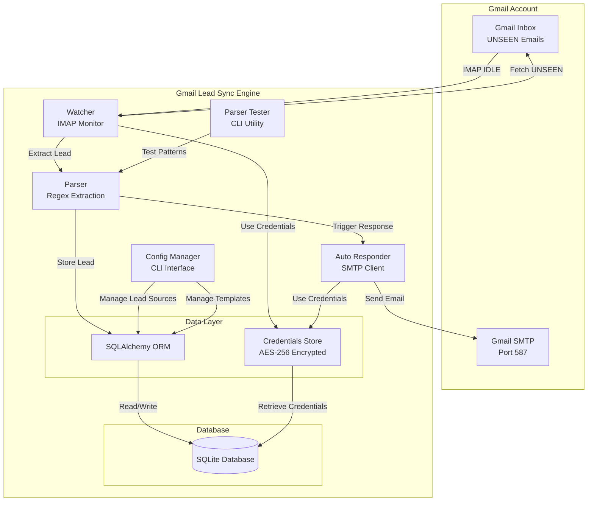
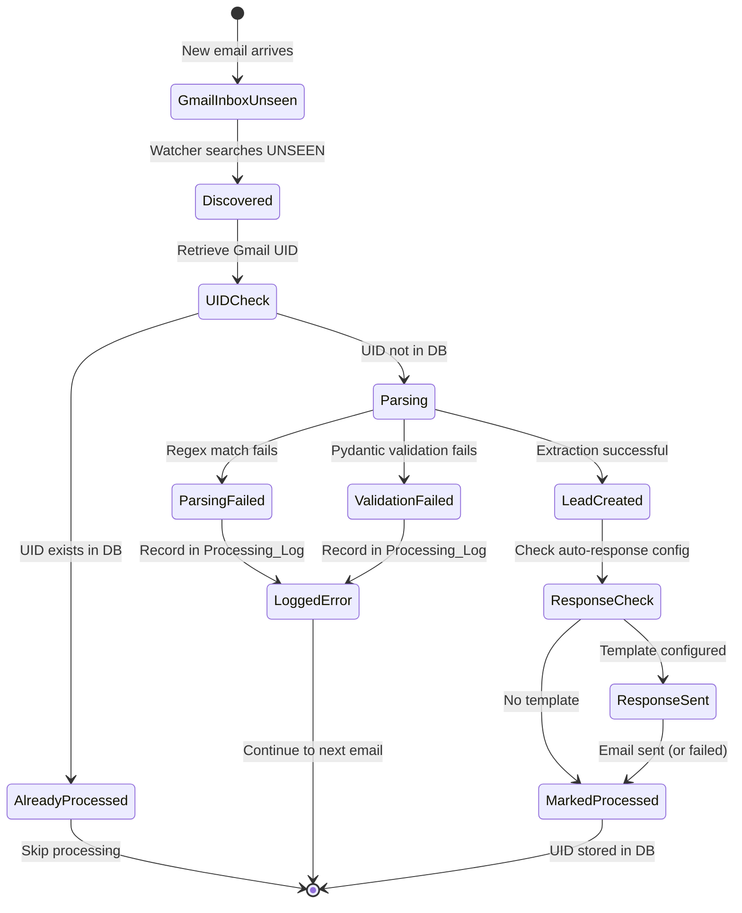
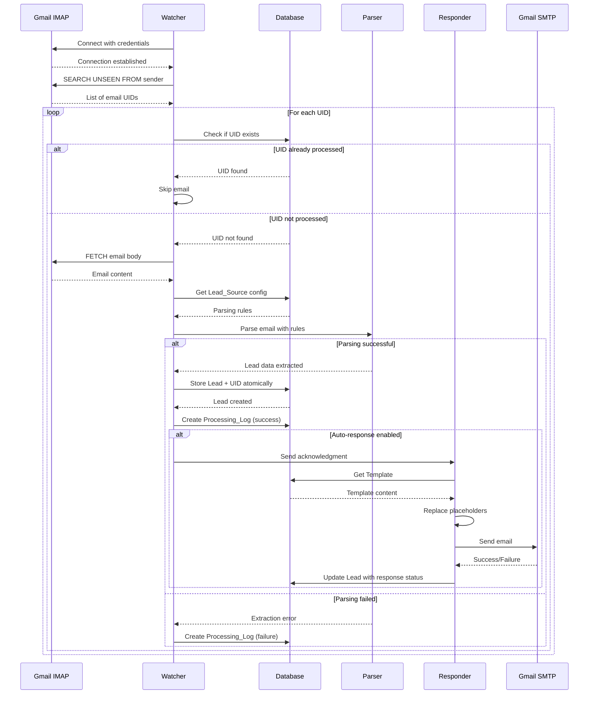
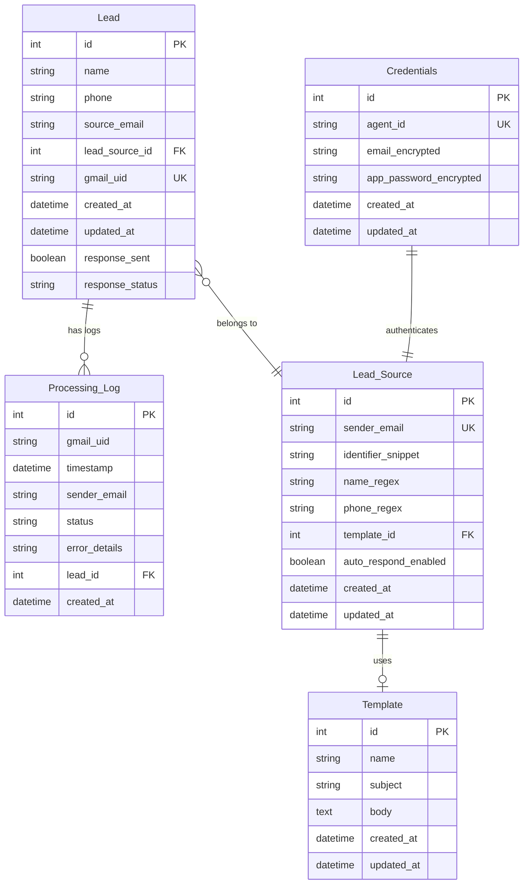

# Design Document: Gmail Lead Sync & Response Engine

## Overview

The Gmail Lead Sync & Response Engine is a Python-based lead management system that monitors Gmail accounts via IMAP, extracts lead information using configurable parsing rules, stores leads in a SQLite database, and sends automated acknowledgment emails via SMTP. The system is designed for zero-cost operation by avoiding Google API usage and implements idempotent sync logic to ensure reliable, duplicate-free lead processing.

### Key Design Principles

1. **Idempotency**: Each email is processed exactly once using Gmail UID tracking
2. **Zero-Cost Operation**: Uses IMAP/SMTP protocols instead of paid Google APIs
3. **Configurability**: Parsing rules and response templates are database-driven
4. **Resilience**: Comprehensive error handling with retry logic and graceful degradation
5. **Auditability**: Complete processing audit trail for debugging and verification
6. **Security**: Encrypted credential storage with AES-256 encryption

### Technology Stack

- **Language**: Python 3.10+
- **Database**: SQLite with SQLAlchemy ORM
- **Email Protocols**: imaplib (IMAP), smtplib (SMTP)
- **Validation**: Pydantic models
- **Migrations**: Alembic
- **Encryption**: cryptography library (Fernet/AES-256)
- **CLI**: Click or argparse

## Architecture

### High-Level Component Diagram



### Email State Transition Diagram



### Component Interactions and Data Flow



## Components and Interfaces

### 1. Watcher Component

**Responsibility**: Monitor Gmail inbox via IMAP and orchestrate email processing.

**Key Classes**:
- `GmailWatcher`: Main orchestrator class
- `IMAPConnection`: Connection manager with retry logic

**Public Interface**:
```python
class GmailWatcher:
    def __init__(self, credentials_store: CredentialsStore, db_session: Session):
        """Initialize watcher with credentials and database session."""
        
    def connect(self) -> bool:
        """Establish IMAP connection with exponential backoff retry."""
        
    def start_monitoring(self) -> None:
        """Start IDLE mode monitoring for new emails."""
        
    def process_unseen_emails(self, sender_list: List[str]) -> None:
        """Process all UNSEEN emails from configured senders."""
        
    def is_email_processed(self, gmail_uid: str) -> bool:
        """Check if email UID exists in database."""
        
    def mark_as_processed(self, gmail_uid: str, lead_id: Optional[int]) -> None:
        """Store UID in database atomically with lead."""
```

**Configuration**:
- Max retry attempts: 5
- Retry backoff: exponential (1s, 2s, 4s, 8s, 16s)
- Reconnection wait: 5 minutes
- IMAP server: imap.gmail.com:993

### 2. Parser Component

**Responsibility**: Extract lead information from email bodies using regex patterns.

**Key Classes**:
- `LeadParser`: Main parsing logic
- `LeadData`: Pydantic model for validation

**Public Interface**:
```python
class LeadParser:
    def __init__(self, db_session: Session):
        """Initialize parser with database session."""
        
    def get_lead_source(self, sender_email: str, email_body: str) -> Optional[LeadSource]:
        """Find matching Lead_Source configuration."""
        
    def extract_lead(self, email_body: str, lead_source: LeadSource) -> Optional[LeadData]:
        """Extract name and phone using regex patterns."""
        
    def validate_and_create_lead(self, lead_data: LeadData, gmail_uid: str, 
                                  lead_source_id: int) -> Lead:
        """Validate with Pydantic and create database record."""

class LeadData(BaseModel):
    name: str = Field(..., min_length=1, max_length=255)
    phone: str = Field(..., regex=r'^\+?[\d\s\-\(\)]+$')
    source_email: EmailStr
```

**Parsing Logic**:
1. Match sender email to Lead_Source records
2. Verify identifier_snippet exists in email body
3. Apply name_regex to extract name (first capture group)
4. Apply phone_regex to extract phone (first capture group)
5. Validate extracted data with Pydantic
6. Create Lead record with foreign key to Lead_Source

### 3. Auto Responder Component

**Responsibility**: Send automated acknowledgment emails via SMTP.

**Key Classes**:
- `AutoResponder`: SMTP client with retry logic
- `TemplateRenderer`: Placeholder replacement engine

**Public Interface**:
```python
class AutoResponder:
    def __init__(self, credentials_store: CredentialsStore, db_session: Session):
        """Initialize responder with credentials and database session."""
        
    def send_acknowledgment(self, lead: Lead, lead_source: LeadSource) -> bool:
        """Send automated response if template configured."""
        
    def render_template(self, template: Template, lead: Lead, 
                       agent_info: Dict[str, str]) -> str:
        """Replace placeholders with actual values."""
        
    def send_email(self, to_address: str, subject: str, body: str) -> bool:
        """Send email via SMTP with retry logic."""
```

**Supported Placeholders**:
- `{lead_name}`: Extracted lead name
- `{agent_name}`: Agent's name from configuration
- `{agent_phone}`: Agent's phone number
- `{agent_email}`: Agent's email address

**Configuration**:
- Max retry attempts: 3
- Retry backoff: exponential (1s, 2s, 4s)
- SMTP server: smtp.gmail.com:587
- TLS: Required

### 4. Credentials Store Component

**Responsibility**: Securely store and retrieve Gmail credentials.

**Key Classes**:
- `CredentialsStore`: Abstract interface
- `EnvironmentCredentialsStore`: Read from environment variables
- `EncryptedDBCredentialsStore`: Store encrypted in database

**Public Interface**:
```python
class CredentialsStore(ABC):
    @abstractmethod
    def get_credentials(self, agent_id: str) -> Tuple[str, str]:
        """Return (email, app_password) tuple."""
        
    @abstractmethod
    def store_credentials(self, agent_id: str, email: str, app_password: str) -> None:
        """Store credentials securely."""

class EncryptedDBCredentialsStore(CredentialsStore):
    def __init__(self, db_session: Session, encryption_key: bytes):
        """Initialize with database session and Fernet encryption key."""
        
    def encrypt(self, plaintext: str) -> bytes:
        """Encrypt using AES-256 via Fernet."""
        
    def decrypt(self, ciphertext: bytes) -> str:
        """Decrypt using AES-256 via Fernet."""
```

**Security Requirements**:
- Encryption key stored in environment variable `ENCRYPTION_KEY`
- Never log credentials in plain text
- Use Fernet (symmetric encryption) from cryptography library
- Credentials table has restricted permissions

### 5. Parser Tester Component

**Responsibility**: CLI utility for testing regex patterns against sample emails.

**Public Interface**:
```python
class ParserTester:
    def test_pattern(self, email_body: str, pattern: str, 
                    pattern_type: str) -> List[str]:
        """Test regex pattern and return all matches."""
        
    def highlight_matches(self, email_body: str, matches: List[str]) -> str:
        """Return email body with matches highlighted."""
        
    def validate_regex(self, pattern: str) -> Tuple[bool, Optional[str]]:
        """Validate regex syntax, return (is_valid, error_message)."""
```

**CLI Commands**:
```bash
# Test name extraction
python -m gmail_lead_sync test-parser --email-file sample.txt --name-regex "Name:\s*(.+)"

# Test phone extraction
python -m gmail_lead_sync test-parser --email-file sample.txt --phone-regex "Phone:\s*([\d\-]+)"

# Test both patterns
python -m gmail_lead_sync test-parser --email-file sample.txt \
    --name-regex "Name:\s*(.+)" \
    --phone-regex "Phone:\s*([\d\-]+)"
```

### 6. Configuration Manager Component

**Responsibility**: CLI interface for managing Lead_Source and Template records.

**CLI Commands**:
```bash
# Lead Source Management
python -m gmail_lead_sync add-source \
    --sender "leads@example.com" \
    --identifier "New Lead Notification" \
    --name-regex "Name:\s*(.+)" \
    --phone-regex "Phone:\s*([\d\-]+)" \
    --template-id 1

python -m gmail_lead_sync list-sources
python -m gmail_lead_sync update-source --id 1 --name-regex "Full Name:\s*(.+)"
python -m gmail_lead_sync delete-source --id 1

# Template Management
python -m gmail_lead_sync add-template \
    --name "Default Acknowledgment" \
    --subject "Thank you for your inquiry" \
    --body-file template.txt

python -m gmail_lead_sync list-templates
python -m gmail_lead_sync update-template --id 1 --body-file new_template.txt
python -m gmail_lead_sync delete-template --id 1
```

## Data Models

### Database Schema



### SQLAlchemy Models

```python
from sqlalchemy import Column, Integer, String, Text, Boolean, DateTime, ForeignKey, Index
from sqlalchemy.orm import relationship, declarative_base
from datetime import datetime

Base = declarative_base()

class Lead(Base):
    __tablename__ = 'leads'
    
    id = Column(Integer, primary_key=True)
    name = Column(String(255), nullable=False)
    phone = Column(String(50), nullable=False)
    source_email = Column(String(255), nullable=False, index=True)
    lead_source_id = Column(Integer, ForeignKey('lead_sources.id'), nullable=False)
    gmail_uid = Column(String(255), unique=True, nullable=False, index=True)
    created_at = Column(DateTime, default=datetime.utcnow, nullable=False)
    updated_at = Column(DateTime, default=datetime.utcnow, onupdate=datetime.utcnow)
    response_sent = Column(Boolean, default=False)
    response_status = Column(String(50))
    
    lead_source = relationship("LeadSource", back_populates="leads")
    processing_logs = relationship("ProcessingLog", back_populates="lead")

class LeadSource(Base):
    __tablename__ = 'lead_sources'
    
    id = Column(Integer, primary_key=True)
    sender_email = Column(String(255), unique=True, nullable=False, index=True)
    identifier_snippet = Column(String(500), nullable=False)
    name_regex = Column(String(500), nullable=False)
    phone_regex = Column(String(500), nullable=False)
    template_id = Column(Integer, ForeignKey('templates.id'), nullable=True)
    auto_respond_enabled = Column(Boolean, default=False)
    created_at = Column(DateTime, default=datetime.utcnow, nullable=False)
    updated_at = Column(DateTime, default=datetime.utcnow, onupdate=datetime.utcnow)
    
    leads = relationship("Lead", back_populates="lead_source")
    template = relationship("Template", back_populates="lead_sources")

class ProcessingLog(Base):
    __tablename__ = 'processing_logs'
    
    id = Column(Integer, primary_key=True)
    gmail_uid = Column(String(255), nullable=False, index=True)
    timestamp = Column(DateTime, default=datetime.utcnow, nullable=False, index=True)
    sender_email = Column(String(255), nullable=False, index=True)
    status = Column(String(50), nullable=False, index=True)  # 'success', 'parsing_failed', 'validation_failed'
    error_details = Column(Text)
    lead_id = Column(Integer, ForeignKey('leads.id'), nullable=True)
    created_at = Column(DateTime, default=datetime.utcnow, nullable=False)
    
    lead = relationship("Lead", back_populates="processing_logs")

class Template(Base):
    __tablename__ = 'templates'
    
    id = Column(Integer, primary_key=True)
    name = Column(String(255), nullable=False)
    subject = Column(String(500), nullable=False)
    body = Column(Text, nullable=False)
    created_at = Column(DateTime, default=datetime.utcnow, nullable=False)
    updated_at = Column(DateTime, default=datetime.utcnow, onupdate=datetime.utcnow)
    
    lead_sources = relationship("LeadSource", back_populates="template")

class Credentials(Base):
    __tablename__ = 'credentials'
    
    id = Column(Integer, primary_key=True)
    agent_id = Column(String(255), unique=True, nullable=False)
    email_encrypted = Column(Text, nullable=False)
    app_password_encrypted = Column(Text, nullable=False)
    created_at = Column(DateTime, default=datetime.utcnow, nullable=False)
    updated_at = Column(DateTime, default=datetime.utcnow, onupdate=datetime.utcnow)

# Indexes for performance
Index('idx_processing_log_query', ProcessingLog.timestamp, ProcessingLog.sender_email, ProcessingLog.status)
```

### Pydantic Validation Models

```python
from pydantic import BaseModel, Field, EmailStr, validator
import re

class LeadData(BaseModel):
    name: str = Field(..., min_length=1, max_length=255)
    phone: str = Field(..., min_length=7, max_length=50)
    source_email: EmailStr
    
    @validator('phone')
    def validate_phone(cls, v):
        # Allow digits, spaces, hyphens, parentheses, and optional + prefix
        if not re.match(r'^\+?[\d\s\-\(\)]+$', v):
            raise ValueError('Phone must contain only digits and formatting characters')
        # Ensure at least 7 digits
        digits = re.sub(r'\D', '', v)
        if len(digits) < 7:
            raise ValueError('Phone must contain at least 7 digits')
        return v
    
    @validator('name')
    def validate_name(cls, v):
        if v.strip() != v:
            return v.strip()
        return v

class LeadSourceConfig(BaseModel):
    sender_email: EmailStr
    identifier_snippet: str = Field(..., min_length=1, max_length=500)
    name_regex: str = Field(..., min_length=1, max_length=500)
    phone_regex: str = Field(..., min_length=1, max_length=500)
    template_id: Optional[int] = None
    auto_respond_enabled: bool = False
    
    @validator('name_regex', 'phone_regex')
    def validate_regex(cls, v):
        try:
            re.compile(v)
        except re.error as e:
            raise ValueError(f'Invalid regex pattern: {e}')
        return v

class TemplateConfig(BaseModel):
    name: str = Field(..., min_length=1, max_length=255)
    subject: str = Field(..., min_length=1, max_length=500)
    body: str = Field(..., min_length=1)
    
    @validator('body')
    def validate_placeholders(cls, v):
        allowed_placeholders = {'{lead_name}', '{agent_name}', '{agent_phone}', '{agent_email}'}
        found_placeholders = set(re.findall(r'\{[^}]+\}', v))
        invalid = found_placeholders - allowed_placeholders
        if invalid:
            raise ValueError(f'Invalid placeholders: {invalid}. Allowed: {allowed_placeholders}')
        return v
```


## Error Handling

### Error Categories and Recovery Strategies

#### 1. Connection Errors (IMAP/SMTP)

**Scenarios**:
- Network timeout
- Authentication failure
- Server unavailable
- Connection dropped during operation

**Recovery Strategy**:
```python
class ConnectionError(Exception):
    """Base class for connection-related errors."""

def connect_with_retry(max_attempts: int = 5) -> IMAPClient:
    """Connect to IMAP with exponential backoff."""
    for attempt in range(max_attempts):
        try:
            client = imaplib.IMAP4_SSL('imap.gmail.com', 993)
            client.login(email, app_password)
            logger.info(f"IMAP connection established on attempt {attempt + 1}")
            return client
        except (imaplib.IMAP4.error, socket.error, OSError) as e:
            wait_time = 2 ** attempt  # Exponential backoff: 1, 2, 4, 8, 16 seconds
            logger.warning(f"Connection attempt {attempt + 1} failed: {e}. Retrying in {wait_time}s")
            if attempt < max_attempts - 1:
                time.sleep(wait_time)
            else:
                logger.error(f"Max retry attempts ({max_attempts}) exhausted. Waiting 5 minutes.")
                time.sleep(300)
                raise ConnectionError(f"Failed to connect after {max_attempts} attempts")
```

**Logging**:
- Log each retry attempt with error details
- Log final failure with full stack trace
- Record connection status in health check endpoint

#### 2. Parsing Errors

**Scenarios**:
- Identifier snippet not found in email body
- Regex pattern doesn't match
- Multiple matches when expecting one
- Pydantic validation failure

**Recovery Strategy**:
```python
def parse_email_safe(email_body: str, lead_source: LeadSource, gmail_uid: str) -> Optional[Lead]:
    """Parse email with comprehensive error handling."""
    try:
        # Check identifier snippet
        if lead_source.identifier_snippet not in email_body:
            log_parsing_failure(
                gmail_uid=gmail_uid,
                sender=lead_source.sender_email,
                reason="identifier_snippet_not_found",
                details=f"Expected: '{lead_source.identifier_snippet}'"
            )
            return None
        
        # Extract name
        name_match = re.search(lead_source.name_regex, email_body)
        if not name_match:
            log_parsing_failure(
                gmail_uid=gmail_uid,
                sender=lead_source.sender_email,
                reason="name_regex_no_match",
                details=f"Pattern: {lead_source.name_regex}"
            )
            return None
        
        # Extract phone
        phone_match = re.search(lead_source.phone_regex, email_body)
        if not phone_match:
            log_parsing_failure(
                gmail_uid=gmail_uid,
                sender=lead_source.sender_email,
                reason="phone_regex_no_match",
                details=f"Pattern: {lead_source.phone_regex}"
            )
            return None
        
        # Validate with Pydantic
        lead_data = LeadData(
            name=name_match.group(1),
            phone=phone_match.group(1),
            source_email=lead_source.sender_email
        )
        
        # Create lead record
        return create_lead(lead_data, gmail_uid, lead_source.id)
        
    except ValidationError as e:
        log_parsing_failure(
            gmail_uid=gmail_uid,
            sender=lead_source.sender_email,
            reason="validation_failed",
            details=str(e)
        )
        return None
    except Exception as e:
        logger.error(f"Unexpected parsing error for UID {gmail_uid}: {e}", exc_info=True)
        log_parsing_failure(
            gmail_uid=gmail_uid,
            sender=lead_source.sender_email,
            reason="unexpected_error",
            details=str(e)
        )
        return None
```

**Behavior**:
- Log detailed failure information to Processing_Log
- Continue processing remaining emails
- Never crash the watcher process
- Include email body snippet in debug logs (truncated to 500 chars)

#### 3. Database Errors

**Scenarios**:
- Database locked (SQLite concurrent access)
- Constraint violation (duplicate UID)
- Disk full
- Corruption

**Recovery Strategy**:
```python
def execute_with_retry(operation: Callable, max_attempts: int = 3) -> Any:
    """Execute database operation with retry logic."""
    for attempt in range(max_attempts):
        try:
            return operation()
        except OperationalError as e:
            if "database is locked" in str(e):
                wait_time = 0.5 * (2 ** attempt)  # 0.5s, 1s, 2s
                logger.warning(f"Database locked, retry {attempt + 1}/{max_attempts} in {wait_time}s")
                time.sleep(wait_time)
                if attempt == max_attempts - 1:
                    raise
            else:
                raise
        except IntegrityError as e:
            if "UNIQUE constraint failed" in str(e) and "gmail_uid" in str(e):
                logger.info(f"Email already processed (duplicate UID), skipping")
                return None
            else:
                raise

def atomic_lead_creation(lead_data: LeadData, gmail_uid: str, lead_source_id: int) -> Lead:
    """Create lead and mark UID as processed atomically."""
    with db_session.begin():
        lead = Lead(
            name=lead_data.name,
            phone=lead_data.phone,
            source_email=lead_data.source_email,
            gmail_uid=gmail_uid,
            lead_source_id=lead_source_id
        )
        db_session.add(lead)
        db_session.flush()  # Get lead.id before commit
        
        log = ProcessingLog(
            gmail_uid=gmail_uid,
            sender_email=lead_data.source_email,
            status='success',
            lead_id=lead.id
        )
        db_session.add(log)
        
    return lead
```

**Configuration**:
- SQLite timeout: 30 seconds
- WAL mode enabled for better concurrency
- Automatic checkpoint every 1000 transactions

#### 4. SMTP Send Errors

**Scenarios**:
- Authentication failure
- Rate limiting
- Recipient address invalid
- Network timeout

**Recovery Strategy**:
```python
def send_email_with_retry(to_address: str, subject: str, body: str, max_attempts: int = 3) -> bool:
    """Send email via SMTP with retry logic."""
    for attempt in range(max_attempts):
        try:
            with smtplib.SMTP('smtp.gmail.com', 587) as server:
                server.starttls()
                server.login(email, app_password)
                
                msg = MIMEText(body, 'plain', 'utf-8')
                msg['Subject'] = subject
                msg['From'] = email
                msg['To'] = to_address
                
                server.send_message(msg)
                logger.info(f"Email sent successfully to {to_address}")
                return True
                
        except smtplib.SMTPException as e:
            wait_time = 2 ** attempt  # 1s, 2s, 4s
            logger.warning(f"SMTP send attempt {attempt + 1} failed: {e}")
            if attempt < max_attempts - 1:
                time.sleep(wait_time)
            else:
                logger.error(f"Failed to send email after {max_attempts} attempts: {e}")
                return False
        except Exception as e:
            logger.error(f"Unexpected SMTP error: {e}", exc_info=True)
            return False
```

**Behavior**:
- Retry up to 3 times with exponential backoff
- Log all failures but don't block lead processing
- Update Lead.response_status field with result
- Continue processing even if email send fails

#### 5. System-Level Errors

**Scenarios**:
- Out of memory
- Disk full
- Permission denied
- Unhandled exceptions

**Recovery Strategy**:
```python
def main_loop():
    """Main watcher loop with top-level error handling."""
    while True:
        try:
            watcher = GmailWatcher(credentials_store, db_session)
            watcher.connect()
            watcher.start_monitoring()
            
        except KeyboardInterrupt:
            logger.info("Shutdown signal received, exiting gracefully")
            break
            
        except Exception as e:
            logger.critical(f"Unhandled exception in main loop: {e}", exc_info=True)
            logger.info("Restarting in 60 seconds...")
            time.sleep(60)

def setup_logging():
    """Configure logging with rotation."""
    handler = RotatingFileHandler(
        'gmail_lead_sync.log',
        maxBytes=10*1024*1024,  # 10MB
        backupCount=5
    )
    formatter = logging.Formatter(
        '%(asctime)s - %(name)s - %(levelname)s - %(message)s'
    )
    handler.setFormatter(formatter)
    logger.addHandler(handler)
    logger.setLevel(logging.INFO)
```

### Health Check Endpoint

```python
from flask import Flask, jsonify
from datetime import datetime, timedelta

app = Flask(__name__)

@app.route('/health')
def health_check():
    """Return system health status."""
    try:
        # Check database connectivity
        db_session.execute("SELECT 1")
        db_healthy = True
    except Exception:
        db_healthy = False
    
    # Check last successful sync
    last_log = db_session.query(ProcessingLog)\
        .filter(ProcessingLog.status == 'success')\
        .order_by(ProcessingLog.timestamp.desc())\
        .first()
    
    last_sync = last_log.timestamp if last_log else None
    sync_healthy = last_sync and (datetime.utcnow() - last_sync) < timedelta(hours=1)
    
    # Check IMAP connection
    imap_healthy = watcher.is_connected() if watcher else False
    
    status = {
        'status': 'healthy' if (db_healthy and sync_healthy and imap_healthy) else 'degraded',
        'database': 'connected' if db_healthy else 'disconnected',
        'imap': 'connected' if imap_healthy else 'disconnected',
        'last_successful_sync': last_sync.isoformat() if last_sync else None,
        'timestamp': datetime.utcnow().isoformat()
    }
    
    return jsonify(status), 200 if status['status'] == 'healthy' else 503
```

### Error Logging Standards

All errors must be logged with:
1. **Timestamp**: ISO 8601 format
2. **Component**: Which component raised the error
3. **Error Type**: Connection, Parsing, Database, SMTP, System
4. **Context**: Gmail UID, sender email, operation being performed
5. **Stack Trace**: For unexpected errors
6. **Recovery Action**: What the system did in response

Example log entry:
```
2024-01-15T10:30:45.123Z - Watcher - WARNING - Parsing failed for UID 12345
  Sender: leads@example.com
  Reason: name_regex_no_match
  Pattern: Name:\s*(.+)
  Action: Logged to Processing_Log, continuing to next email
```

## Security Considerations

### 1. Credential Storage

**Encryption Implementation**:
```python
from cryptography.fernet import Fernet
import os

class EncryptedDBCredentialsStore:
    def __init__(self, db_session: Session):
        self.db_session = db_session
        # Load encryption key from environment
        key = os.environ.get('ENCRYPTION_KEY')
        if not key:
            raise ValueError("ENCRYPTION_KEY environment variable not set")
        self.cipher = Fernet(key.encode())
    
    def store_credentials(self, agent_id: str, email: str, app_password: str) -> None:
        """Store credentials with AES-256 encryption."""
        email_encrypted = self.cipher.encrypt(email.encode())
        password_encrypted = self.cipher.encrypt(app_password.encode())
        
        creds = Credentials(
            agent_id=agent_id,
            email_encrypted=email_encrypted.decode(),
            app_password_encrypted=password_encrypted.decode()
        )
        self.db_session.add(creds)
        self.db_session.commit()
        
        # Never log credentials
        logger.info(f"Credentials stored for agent {agent_id}")
    
    def get_credentials(self, agent_id: str) -> Tuple[str, str]:
        """Retrieve and decrypt credentials."""
        creds = self.db_session.query(Credentials)\
            .filter(Credentials.agent_id == agent_id)\
            .first()
        
        if not creds:
            raise ValueError(f"No credentials found for agent {agent_id}")
        
        email = self.cipher.decrypt(creds.email_encrypted.encode()).decode()
        app_password = self.cipher.decrypt(creds.app_password_encrypted.encode()).decode()
        
        return email, app_password
```

**Key Management**:
- Encryption key stored in `ENCRYPTION_KEY` environment variable
- Key should be 32 bytes (256 bits) base64-encoded
- Generate key: `python -c "from cryptography.fernet import Fernet; print(Fernet.generate_key().decode())"`
- Never commit encryption key to version control
- Rotate keys periodically (requires re-encryption of all credentials)

**Database Permissions**:
```bash
# Restrict database file permissions
chmod 600 gmail_lead_sync.db

# Ensure only application user can read
chown app_user:app_user gmail_lead_sync.db
```

### 2. Gmail App Passwords

**Requirements**:
- Users must enable 2-factor authentication on Gmail
- Generate app-specific password at https://myaccount.google.com/apppasswords
- App password format: 16 characters, no spaces
- Store app password, not main account password

**Validation**:
```python
def validate_app_password(password: str) -> bool:
    """Validate Gmail app password format."""
    # Remove spaces if user copied with spaces
    password = password.replace(' ', '')
    
    # Must be 16 alphanumeric characters
    if len(password) != 16:
        return False
    if not password.isalnum():
        return False
    
    return True
```

### 3. Input Validation and Sanitization

**Email Body Handling**:
```python
def sanitize_email_body(raw_body: str) -> str:
    """Sanitize email body before processing."""
    # Decode if base64 encoded
    if is_base64(raw_body):
        raw_body = base64.b64decode(raw_body).decode('utf-8', errors='ignore')
    
    # Remove null bytes
    raw_body = raw_body.replace('\x00', '')
    
    # Limit size to prevent memory issues
    max_size = 1024 * 1024  # 1MB
    if len(raw_body) > max_size:
        logger.warning(f"Email body truncated from {len(raw_body)} to {max_size} bytes")
        raw_body = raw_body[:max_size]
    
    return raw_body
```

**Regex Pattern Validation**:
```python
def validate_regex_safety(pattern: str) -> Tuple[bool, Optional[str]]:
    """Validate regex pattern for safety."""
    # Check syntax
    try:
        compiled = re.compile(pattern)
    except re.error as e:
        return False, f"Invalid regex syntax: {e}"
    
    # Check for catastrophic backtracking patterns
    dangerous_patterns = [
        r'\(.*\)\*',  # Nested quantifiers
        r'\(.*\)\+',
        r'\(.*\)\{',
    ]
    for dangerous in dangerous_patterns:
        if re.search(dangerous, pattern):
            return False, "Pattern may cause catastrophic backtracking"
    
    # Test with timeout
    try:
        test_string = "a" * 10000
        with timeout(1):  # 1 second timeout
            compiled.search(test_string)
    except TimeoutError:
        return False, "Pattern takes too long to execute"
    
    return True, None
```

### 4. SQL Injection Prevention

**ORM Usage**:
- Always use SQLAlchemy ORM for queries
- Never construct raw SQL with string concatenation
- Use parameterized queries for any raw SQL

```python
# GOOD: Using ORM
leads = db_session.query(Lead)\
    .filter(Lead.source_email == user_input)\
    .all()

# GOOD: Parameterized raw SQL
result = db_session.execute(
    "SELECT * FROM leads WHERE source_email = :email",
    {"email": user_input}
)

# BAD: String concatenation (NEVER DO THIS)
# query = f"SELECT * FROM leads WHERE source_email = '{user_input}'"
```

### 5. Rate Limiting and Abuse Prevention

**IMAP Request Throttling**:
```python
class RateLimiter:
    def __init__(self, max_requests: int, time_window: int):
        self.max_requests = max_requests
        self.time_window = time_window  # seconds
        self.requests = []
    
    def allow_request(self) -> bool:
        """Check if request is allowed under rate limit."""
        now = time.time()
        # Remove old requests outside time window
        self.requests = [req for req in self.requests if now - req < self.time_window]
        
        if len(self.requests) < self.max_requests:
            self.requests.append(now)
            return True
        return False

# Usage
imap_limiter = RateLimiter(max_requests=100, time_window=60)  # 100 requests per minute

def fetch_email_safe(gmail_uid: str) -> str:
    """Fetch email with rate limiting."""
    if not imap_limiter.allow_request():
        logger.warning("IMAP rate limit reached, waiting...")
        time.sleep(1)
    
    return imap_client.fetch(gmail_uid, '(BODY[TEXT])')
```

### 6. Logging Security

**Sensitive Data Redaction**:
```python
def redact_sensitive_data(log_message: str) -> str:
    """Redact sensitive information from logs."""
    # Redact email addresses (partial)
    log_message = re.sub(
        r'([a-zA-Z0-9._%+-]+)@([a-zA-Z0-9.-]+\.[a-zA-Z]{2,})',
        r'\1***@\2',
        log_message
    )
    
    # Redact phone numbers (partial)
    log_message = re.sub(
        r'(\d{3})[\d\-\s]{4,}(\d{4})',
        r'\1-***-\2',
        log_message
    )
    
    # Redact passwords/tokens
    log_message = re.sub(
        r'(password|token|key)[\s:=]+[^\s]+',
        r'\1=***REDACTED***',
        log_message,
        flags=re.IGNORECASE
    )
    
    return log_message

# Configure logger with redaction
class RedactingFormatter(logging.Formatter):
    def format(self, record):
        original = super().format(record)
        return redact_sensitive_data(original)
```


## Correctness Properties

*A property is a characteristic or behavior that should hold true across all valid executions of a system—essentially, a formal statement about what the system should do. Properties serve as the bridge between human-readable specifications and machine-verifiable correctness guarantees.*

### Property Reflection

After analyzing all acceptance criteria, I identified the following redundancies and consolidations:

- **Properties 2.1, 2.2, 2.3 combined**: Instead of separate properties for retrieving UIDs, sender, and body, these can be combined into one property about complete email data retrieval
- **Properties 5.3 and 5.4 combined**: Both test extraction when identifier is present, can be one property about attempting both extractions
- **Properties 10.2 and 10.3 combined**: Both test regex match display, can be one property about displaying all matches
- **Properties 3.3 and 3.4 combined**: Storing UID and atomicity are related, the atomic property subsumes the simple storage property
- **Properties 6.4 and 13.1 combined**: Template placeholder support and replacement are the same concern

### Property 1: Connection Retry Exponential Backoff

*For any* sequence of connection failures, the retry delays SHALL follow exponential backoff pattern (2^attempt seconds) up to 5 attempts.

**Validates: Requirements 1.2**

### Property 2: Connection Loss Resilience

*For any* IMAP connection loss event, the system SHALL attempt reconnection without terminating the application process.

**Validates: Requirements 1.5**

### Property 3: UNSEEN Email Filtering

*For any* set of emails in the inbox, the Watcher SHALL retrieve only emails that have the UNSEEN flag AND match a sender in the Configurable_Sender_List.

**Validates: Requirements 2.1**

### Property 4: Complete Email Data Retrieval

*For any* discovered UNSEEN email, the Watcher SHALL retrieve the Gmail_UID, sender address, and body content before processing.

**Validates: Requirements 2.2, 2.3**

### Property 5: Chronological Processing Order

*For any* set of UNSEEN emails, the Watcher SHALL process them in chronological order based on received date (oldest first).

**Validates: Requirements 2.4**

### Property 6: UID Existence Check Before Processing

*For any* discovered email, the Watcher SHALL query the database for the Gmail_UID before attempting to parse the email.

**Validates: Requirements 3.1**

### Property 7: Idempotent Email Processing

*For any* email with a Gmail_UID that already exists in the database, the Watcher SHALL skip all processing steps for that email.

**Validates: Requirements 3.2**

### Property 8: Atomic Lead and UID Storage

*For any* successfully parsed email, the Lead record and Gmail_UID SHALL be stored in a single database transaction such that either both are committed or both are rolled back.

**Validates: Requirements 3.3, 3.4**

### Property 9: Lead Source Matching

*For any* email being processed, the Parser SHALL attempt to match the sender address against all Lead_Source records in the database.

**Validates: Requirements 4.3**

### Property 10: Unmatched Sender Handling

*For any* email from a sender not in the Lead_Source table, the Parser SHALL skip processing and log a warning.

**Validates: Requirements 4.5**

### Property 11: Identifier Snippet Verification

*For any* email matched to a Lead_Source, the Parser SHALL verify that the identifier_snippet exists in the email body before attempting regex extraction.

**Validates: Requirements 5.1**

### Property 12: Missing Identifier Handling

*For any* email where the identifier_snippet is not found in the body, the Parser SHALL skip extraction and log the mismatch.

**Validates: Requirements 5.2**

### Property 13: Dual Extraction Attempt

*For any* email where the identifier_snippet is found, the Parser SHALL attempt to extract both name (using name_regex) and phone (using phone_regex).

**Validates: Requirements 5.3, 5.4**

### Property 14: Extraction Failure Logging

*For any* email where either name_regex or phone_regex fails to match, the Parser SHALL create a Processing_Log record with the failure reason and patterns used.

**Validates: Requirements 5.5**

### Property 15: Pydantic Validation Gate

*For any* extracted name and phone pair, the Parser SHALL validate the data using Pydantic models before database insertion.

**Validates: Requirements 5.6**

### Property 16: Valid Lead Creation

*For any* lead data that passes Pydantic validation, the Parser SHALL create a Lead record in the database.

**Validates: Requirements 5.7**

### Property 17: Conditional Auto-Response

*For any* Lead created from a Lead_Source with auto_respond_enabled=True and a configured Template, the Auto_Responder SHALL send an acknowledgment email.

**Validates: Requirements 6.1**

### Property 18: Template Placeholder Replacement

*For any* Template containing supported placeholders ({lead_name}, {agent_name}, {agent_phone}, {agent_email}), the Auto_Responder SHALL replace all placeholders with actual values from the Lead and agent configuration.

**Validates: Requirements 6.4, 13.1**

### Property 19: SMTP Retry Logic

*For any* SMTP send failure, the Auto_Responder SHALL retry the operation up to 3 times with exponential backoff (2^attempt seconds).

**Validates: Requirements 6.5**

### Property 20: SMTP Failure Isolation

*For any* email send that fails after all retry attempts, the system SHALL log the failure and continue processing without preventing Lead record creation.

**Validates: Requirements 6.6**

### Property 21: Response Status Recording

*For any* auto-response attempt (success or failure), the Auto_Responder SHALL update the Lead record's response_sent and response_status fields.

**Validates: Requirements 6.7**

### Property 22: Credential Encryption

*For any* credentials stored in the database, the Credentials_Store SHALL encrypt both email and app_password fields using AES-256 encryption before storage.

**Validates: Requirements 7.2**

### Property 23: Processing Audit Trail

*For any* email processing attempt, the Watcher SHALL create a Processing_Log record containing Gmail_UID, timestamp, sender, status, and error details (if applicable).

**Validates: Requirements 8.1, 8.2**

### Property 24: Parsing Failure Diagnostics

*For any* parsing failure, the Processing_Log record SHALL include the failure reason and the regex patterns that were attempted.

**Validates: Requirements 8.3**

### Property 25: Successful Processing Link

*For any* successfully created Lead, the Processing_Log record SHALL contain a foreign key reference to the Lead record.

**Validates: Requirements 8.4**

### Property 26: Parser Tester Match Display

*For any* regex pattern and email body, the Parser_Tester SHALL return all matches found by the pattern in the body.

**Validates: Requirements 10.2, 10.3**

### Property 27: Regex Syntax Validation

*For any* regex pattern provided to Parser_Tester or Lead_Source creation, the system SHALL validate syntax correctness and reject invalid patterns with an error message.

**Validates: Requirements 10.5, 10.6, 12.5**

### Property 28: Exception Logging

*For any* unhandled exception in any component, the system SHALL log the full stack trace before attempting recovery.

**Validates: Requirements 11.1**

### Property 29: Error Isolation

*For any* error encountered while processing a specific email, the Watcher SHALL continue processing the remaining emails in the queue.

**Validates: Requirements 11.2**

### Property 30: Database Operation Retry

*For any* database operation failure, the system SHALL retry the operation up to 3 times with exponential backoff before raising an exception.

**Validates: Requirements 11.3, 11.4**

### Property 31: Email Format Validation

*For any* Lead_Source creation or update, the system SHALL validate that sender_email conforms to valid email address format.

**Validates: Requirements 12.6**

### Property 32: Template Placeholder Validation

*For any* Template creation or update, the system SHALL validate that only supported placeholders ({lead_name}, {agent_name}, {agent_phone}, {agent_email}) are present and reject templates with unsupported placeholders.

**Validates: Requirements 13.3**

### Property 33: No Template No Response

*For any* Lead_Source without an associated Template (template_id is NULL), the Auto_Responder SHALL not send automated responses for leads from that source.

**Validates: Requirements 13.5**

### Property 34: Lead to Template Round-Trip

*For any* valid Lead record with an associated Template, rendering the template with lead data and then extracting placeholder values SHALL produce the original lead name and contact information.

**Validates: Requirements 14.2, 14.3**

## Testing Strategy

### Dual Testing Approach

The system will employ both unit testing and property-based testing to ensure comprehensive coverage:

**Unit Tests** focus on:
- Specific examples of email parsing with known inputs and outputs
- Edge cases (empty email bodies, malformed regex, missing fields)
- Error conditions (connection failures, database locks, SMTP errors)
- Integration points between components (Watcher → Parser → Auto_Responder)
- CLI command functionality (add-source, list-sources, etc.)

**Property-Based Tests** focus on:
- Universal properties that hold for all inputs (idempotency, atomicity, ordering)
- Comprehensive input coverage through randomization
- Round-trip properties (encryption/decryption, template rendering/extraction)
- Invariants (retry counts, backoff timing, data consistency)

Together, unit tests catch concrete bugs in specific scenarios, while property tests verify general correctness across the input space.

### Property-Based Testing Configuration

**Library Selection**: Use **Hypothesis** for Python property-based testing

**Test Configuration**:
```python
from hypothesis import given, settings, strategies as st
import hypothesis

# Configure for thorough testing
hypothesis.settings.register_profile("ci", max_examples=100, deadline=None)
hypothesis.settings.load_profile("ci")

# Example property test
@given(
    emails=st.lists(
        st.tuples(
            st.text(min_size=10, max_size=36),  # Gmail UID
            st.emails(),  # Sender
            st.text(min_size=50, max_size=1000)  # Body
        ),
        min_size=1,
        max_size=20
    )
)
@settings(max_examples=100)
def test_idempotent_processing(emails):
    """
    Feature: gmail-lead-sync-engine, Property 7: Idempotent Email Processing
    
    For any email with a Gmail_UID that already exists in the database,
    the Watcher SHALL skip all processing steps for that email.
    """
    watcher = GmailWatcher(credentials_store, db_session)
    
    # Process emails first time
    for uid, sender, body in emails:
        watcher.process_email(uid, sender, body)
    
    initial_lead_count = db_session.query(Lead).count()
    
    # Process same emails again
    for uid, sender, body in emails:
        watcher.process_email(uid, sender, body)
    
    final_lead_count = db_session.query(Lead).count()
    
    # Assert no new leads created (idempotency)
    assert initial_lead_count == final_lead_count
```

**Tagging Convention**:
Every property-based test MUST include a docstring with the format:
```
Feature: {feature_name}, Property {number}: {property_title}
```

**Minimum Iterations**: Each property test configured with `max_examples=100` to ensure thorough randomized testing.

**Test Organization**:
```
tests/
├── unit/
│   ├── test_watcher.py
│   ├── test_parser.py
│   ├── test_auto_responder.py
│   ├── test_credentials_store.py
│   └── test_cli.py
├── property/
│   ├── test_idempotency_properties.py
│   ├── test_retry_properties.py
│   ├── test_parsing_properties.py
│   ├── test_template_properties.py
│   └── test_roundtrip_properties.py
└── integration/
    ├── test_end_to_end.py
    └── test_health_check.py
```

### Key Test Scenarios

**Unit Test Examples**:
1. Parse email with valid lead information → Lead created
2. Parse email with missing phone number → Parsing failure logged
3. Process email with existing UID → Email skipped
4. Send auto-response with invalid SMTP credentials → Retry 3 times then log failure
5. Add Lead_Source with invalid regex → Validation error returned
6. Render template with all placeholders → All replaced correctly
7. Health check with recent successful sync → Returns "healthy" status

**Property Test Examples**:
1. For any set of emails, processing twice produces same lead count (idempotency)
2. For any connection failure sequence, retry delays follow exponential pattern
3. For any email set, processing order matches chronological order
4. For any valid lead data, Pydantic validation passes
5. For any template with supported placeholders, all are replaced
6. For any credentials, encrypt then decrypt produces original value
7. For any lead, render template then extract produces original data

**Edge Cases to Cover**:
- Empty email body
- Email body with only whitespace
- Regex pattern with no matches
- Regex pattern with multiple matches (use first)
- Very long email body (>1MB)
- Special characters in lead name (unicode, emojis)
- Phone numbers in various formats (international, with/without spaces)
- Database locked during write operation
- IMAP connection drops mid-fetch
- SMTP rate limiting
- Template with missing placeholders
- Template with extra unsupported placeholders

### Mocking Strategy

**External Dependencies to Mock**:
- `imaplib.IMAP4_SSL`: Mock IMAP connection and responses
- `smtplib.SMTP`: Mock SMTP connection and send operations
- `time.sleep`: Mock to speed up retry tests
- Gmail server responses: Use fixtures with realistic email data

**Database Testing**:
- Use in-memory SQLite (`:memory:`) for fast test execution
- Reset database between tests
- Use fixtures for common data setups (Lead_Source configs, Templates)

**Example Mock Setup**:
```python
from unittest.mock import Mock, patch, MagicMock
import pytest

@pytest.fixture
def mock_imap():
    with patch('imaplib.IMAP4_SSL') as mock:
        client = MagicMock()
        client.search.return_value = ('OK', [b'1 2 3'])
        client.fetch.return_value = ('OK', [(b'1', {b'BODY[TEXT]': b'Email content'})])
        mock.return_value = client
        yield mock

@pytest.fixture
def mock_smtp():
    with patch('smtplib.SMTP') as mock:
        server = MagicMock()
        mock.return_value.__enter__.return_value = server
        yield mock

def test_send_email_with_retry(mock_smtp):
    """Test SMTP retry logic on failure."""
    mock_smtp.return_value.__enter__.return_value.send_message.side_effect = [
        smtplib.SMTPException("Temporary failure"),
        smtplib.SMTPException("Temporary failure"),
        None  # Success on third attempt
    ]
    
    responder = AutoResponder(credentials_store, db_session)
    result = responder.send_email("test@example.com", "Subject", "Body")
    
    assert result is True
    assert mock_smtp.return_value.__enter__.return_value.send_message.call_count == 3
```

### Coverage Goals

- **Line Coverage**: Minimum 85%
- **Branch Coverage**: Minimum 80%
- **Property Coverage**: 100% of correctness properties implemented as tests
- **Critical Paths**: 100% coverage for idempotency, atomicity, and credential security

### Continuous Integration

```yaml
# .github/workflows/test.yml
name: Test Suite

on: [push, pull_request]

jobs:
  test:
    runs-on: ubuntu-latest
    steps:
      - uses: actions/checkout@v2
      - name: Set up Python
        uses: actions/setup-python@v2
        with:
          python-version: '3.10'
      - name: Install dependencies
        run: |
          pip install -r requirements.txt
          pip install -r requirements-dev.txt
      - name: Run unit tests
        run: pytest tests/unit -v --cov=gmail_lead_sync --cov-report=xml
      - name: Run property tests
        run: pytest tests/property -v --hypothesis-profile=ci
      - name: Run integration tests
        run: pytest tests/integration -v
      - name: Check coverage
        run: |
          coverage report --fail-under=85
      - name: Upload coverage
        uses: codecov/codecov-action@v2
```

