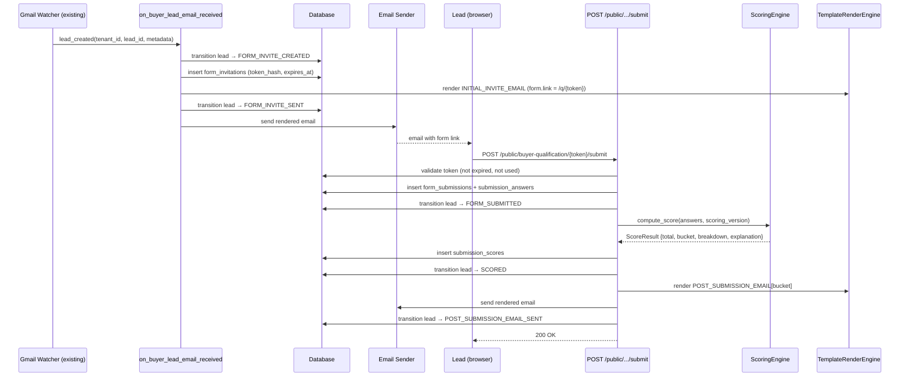

# Design Document: Buyer Lead Qualification (leads-preapproval)

## Overview

This module adds a **Buyer Lead Qualification** pipeline to the existing multi-tenant Gmail Lead Sync SaaS. When a buyer lead email arrives (via the existing Gmail ingestion), the system automatically sends a qualification form invite, collects answers, scores the lead, buckets them (HOT/WARM/NURTURE), and sends a tailored acknowledgement email — all tracked through an immutable state machine.

The architecture is intentionally scoped to `intent_type=BUY` for MVP but is designed to extend to SELL and RENT without schema or service refactoring: every versioned entity carries an `intent_type` discriminator, and question/scoring/template sets are keyed by `(tenant_id, intent_type)`.

Email is the only automation channel for MVP. SMS/voice hooks are reserved via a `channel` enum on invitations and interactions tables.

---

## Architecture

```mermaid
graph TD
    subgraph Gmail Ingestion (existing)
        GI[gmail_lead_sync watcher]
    end

    subgraph Buyer Lead Qualification (new)
        EH[on_buyer_lead_email_received]
        FI[FormInvitationService]
        TE[TemplateRenderEngine]
        ES[EmailSender (existing responder)]
        FS[on_buyer_form_submitted]
        SE[ScoringEngine]
        SM[LeadStateMachine]
        DB[(PostgreSQL / SQLite)]
    end

    subgraph Admin Panel (new tabs)
        AP[BuyerLeadAutomation tabs]
    end

    subgraph Public Endpoint (new)
        PE[POST /public/buyer-qualification/:token/submit]
    end

    GI -->|lead created event| EH
    EH --> SM
    EH --> FI
    FI --> TE
    TE --> ES
    ES -->|INITIAL_INVITE_EMAIL| Lead
    PE --> FS
    FS --> SE
    SE --> DB
    FS --> TE
    TE --> ES
    ES -->|POST_SUBMISSION_EMAIL| Lead
    FS --> SM
    SM --> DB
    AP -->|CRUD + publish| DB
```

---

## Sequence Diagrams

### Buyer Flow: Email → Form → Score → Acknowledgement



---

## Components and Interfaces

### 1. LeadStateMachine

**Purpose**: Enforce valid state transitions, persist immutable event log, update `leads.current_state`.

**Interface**:
```python
class LeadStateMachine:
    VALID_TRANSITIONS: dict[str, list[str]]

    def transition(
        self,
        db: Session,
        tenant_id: int,
        lead_id: int,
        intent_type: IntentType,
        to_state: LeadState,
        actor_type: ActorType = ActorType.SYSTEM,
        actor_id: int | None = None,
        metadata: dict | None = None,
    ) -> LeadStateTransition: ...

    def current_state(self, db: Session, lead_id: int) -> LeadState: ...
```

**Responsibilities**:
- Validate `from_state → to_state` is in `VALID_TRANSITIONS`
- Insert row into `lead_state_transitions` (immutable)
- Update `leads.current_state` + `current_state_updated_at`
- Raise `InvalidTransitionError` on illegal moves

### 2. FormInvitationService

**Purpose**: Generate signed, expiring, single-use tokens for form submission.

**Interface**:
```python
class FormInvitationService:
    def create_invitation(
        self,
        db: Session,
        tenant_id: int,
        lead_id: int,
        form_version_id: int,
        ttl_hours: int = 72,
    ) -> tuple[str, FormInvitation]: ...
    # returns (raw_token, db_record); only hash stored

    def validate_token(
        self,
        db: Session,
        raw_token: str,
    ) -> FormInvitation: ...
    # raises TokenExpiredError | TokenUsedError | TokenNotFoundError

    def mark_used(self, db: Session, invitation: FormInvitation) -> None: ...
```

### 3. ScoringEngine

**Purpose**: Apply versioned tenant scoring rules to a submission's answers, return structured result.

**Interface**:
```python
@dataclass
class ScoreBreakdownItem:
    question_key: str
    answer: Any
    points: int
    reason: str

@dataclass
class ScoreResult:
    total: int
    bucket: Bucket          # HOT | WARM | NURTURE
    breakdown: list[ScoreBreakdownItem]
    explanation: str        # human-readable summary

class ScoringEngine:
    def compute(
        self,
        answers: dict[str, Any],
        scoring_version: ScoringVersion,
        metadata: dict,         # lead_source, property_address, etc.
    ) -> ScoreResult: ...
```

### 4. TemplateRenderEngine

**Purpose**: Render versioned message templates with variable substitution and HTML escaping.

**Interface**:
```python
class TemplateRenderEngine:
    SUPPORTED_VARS: frozenset[str]

    def render(
        self,
        template_version: MessageTemplateVersion,
        context: dict[str, Any],
        variant_key: str | None = None,   # e.g. "HOT", "WARM", "NURTURE"
    ) -> RenderedMessage: ...
    # raises UnknownVariableError, MissingVariableError

    def preview(
        self,
        subject_template: str,
        body_template: str,
        sample_context: dict | None = None,
    ) -> RenderedMessage: ...
```

### 5. Public Submission Endpoint

**Purpose**: Accept tokenized form submissions from leads (no auth, rate-limited).

**Interface**:
```
POST /public/buyer-qualification/{token}/submit
Body: { answers: { [question_key]: value }, user_agent: str, device_type: str }
Response 200: { submission_id, score: { total, bucket, explanation } }
Response 400: validation errors
Response 410: token expired or already used
Response 429: rate limit exceeded
```

### 6. Admin API Routes (auth required)

Mounted under `/api/v1/buyer-leads/`:

| Method | Path | Purpose |
|--------|------|---------|
| GET/POST | `/tenants/{tid}/forms` | List / create form templates |
| GET/PUT/DELETE | `/tenants/{tid}/forms/{fid}` | Manage form template |
| POST | `/tenants/{tid}/forms/{fid}/versions` | Publish new version |
| POST | `/tenants/{tid}/forms/{fid}/versions/{vid}/rollback` | Rollback |
| GET/POST | `/tenants/{tid}/scoring` | List / create scoring configs |
| POST | `/tenants/{tid}/scoring/{sid}/versions` | Publish scoring version |
| GET/POST | `/tenants/{tid}/message-templates` | List / create message templates |
| POST | `/tenants/{tid}/message-templates/{mid}/versions` | Publish version |
| GET | `/tenants/{tid}/leads/states` | Lead state monitoring |
| GET | `/tenants/{tid}/leads/funnel` | Funnel conversion stats |
| POST | `/tenants/{tid}/simulate` | Simulate scoring for test answers |
| GET | `/tenants/{tid}/audit` | Buyer lead audit log |


---

## Data Models

### Enums

```python
class IntentType(str, Enum):
    BUY  = "BUY"
    SELL = "SELL"   # reserved
    RENT = "RENT"   # reserved

class LeadState(str, Enum):
    NEW_EMAIL_RECEIVED         = "NEW_EMAIL_RECEIVED"
    FORM_INVITE_CREATED        = "FORM_INVITE_CREATED"
    FORM_INVITE_SENT           = "FORM_INVITE_SENT"
    FORM_SUBMITTED             = "FORM_SUBMITTED"
    SCORED                     = "SCORED"
    POST_SUBMISSION_EMAIL_SENT = "POST_SUBMISSION_EMAIL_SENT"
    # Future: AGENT_ASSIGNED, CONTACTED, APPOINTMENT_SET, CLOSED

class Bucket(str, Enum):
    HOT     = "HOT"
    WARM    = "WARM"
    NURTURE = "NURTURE"

class ActorType(str, Enum):
    SYSTEM = "system"
    ADMIN  = "admin"

class Channel(str, Enum):
    EMAIL = "email"
    SMS   = "sms"    # reserved
    VOICE = "voice"  # reserved
    WEB   = "web"

class MessageTemplateKey(str, Enum):
    INITIAL_INVITE_EMAIL   = "INITIAL_INVITE_EMAIL"
    POST_SUBMISSION_EMAIL  = "POST_SUBMISSION_EMAIL"
```

### New SQLAlchemy Models (added to `gmail_lead_sync/models.py` or new `models_preapproval.py`)

```python
# --- Form System ---

class FormTemplate(Base):
    __tablename__ = "form_templates"
    id          = Column(Integer, primary_key=True)
    tenant_id   = Column(Integer, ForeignKey("companies.id"), nullable=False, index=True)
    intent_type = Column(String(10), nullable=False, default="BUY")  # IntentType
    name        = Column(String(255), nullable=False)
    status      = Column(String(20), nullable=False, default="draft")  # draft|active|archived
    created_at  = Column(DateTime, default=datetime.utcnow, nullable=False)
    versions    = relationship("FormVersion", back_populates="template")

class FormVersion(Base):
    __tablename__ = "form_versions"
    id             = Column(Integer, primary_key=True)
    template_id    = Column(Integer, ForeignKey("form_templates.id"), nullable=False, index=True)
    version_number = Column(Integer, nullable=False)
    schema_json    = Column(Text, nullable=False)   # full question list snapshot
    created_at     = Column(DateTime, default=datetime.utcnow)
    published_at   = Column(DateTime, nullable=True)
    is_active      = Column(Boolean, default=False)
    questions      = relationship("FormQuestion", back_populates="form_version")
    logic_rules    = relationship("FormLogicRule", back_populates="form_version")

class FormQuestion(Base):
    __tablename__ = "form_questions"
    id              = Column(Integer, primary_key=True)
    form_version_id = Column(Integer, ForeignKey("form_versions.id"), nullable=False, index=True)
    question_key    = Column(String(100), nullable=False)   # e.g. "timeline", "budget"
    type            = Column(String(30), nullable=False)    # single_choice|multi_select|free_text|phone|email
    label           = Column(String(500), nullable=False)
    required        = Column(Boolean, default=True)
    options_json    = Column(Text, nullable=True)           # JSON array of {value, label}
    order           = Column(Integer, nullable=False)
    validation_json = Column(Text, nullable=True)           # JSON validation rules

class FormLogicRule(Base):
    __tablename__ = "form_logic_rules"
    id              = Column(Integer, primary_key=True)
    form_version_id = Column(Integer, ForeignKey("form_versions.id"), nullable=False, index=True)
    rule_json       = Column(Text, nullable=False)
    # rule_json shape: {"if": {"question_key": "agent", "answer": "Yes"}, "then": {"hide": ["tour"]}}

# --- Scoring System ---

class ScoringConfig(Base):
    __tablename__ = "scoring_configs"
    id          = Column(Integer, primary_key=True)
    tenant_id   = Column(Integer, ForeignKey("companies.id"), nullable=False, index=True)
    intent_type = Column(String(10), nullable=False, default="BUY")
    name        = Column(String(255), nullable=False)
    created_at  = Column(DateTime, default=datetime.utcnow)
    versions    = relationship("ScoringVersion", back_populates="config")

class ScoringVersion(Base):
    __tablename__ = "scoring_versions"
    id               = Column(Integer, primary_key=True)
    scoring_config_id= Column(Integer, ForeignKey("scoring_configs.id"), nullable=False, index=True)
    version_number   = Column(Integer, nullable=False)
    rules_json       = Column(Text, nullable=False)
    # rules_json: list of {question_key, answer_value, points, reason}
    # plus special keys: "metadata.property_address", "metadata.listing_url", etc.
    thresholds_json  = Column(Text, nullable=False)
    # thresholds_json: {"HOT": 80, "WARM": 50}  (NURTURE = below WARM)
    created_at       = Column(DateTime, default=datetime.utcnow)
    published_at     = Column(DateTime, nullable=True)
    is_active        = Column(Boolean, default=False)

# --- Invitations & Submissions ---

class FormInvitation(Base):
    __tablename__ = "form_invitations"
    id              = Column(Integer, primary_key=True)
    tenant_id       = Column(Integer, ForeignKey("companies.id"), nullable=False, index=True)
    lead_id         = Column(Integer, ForeignKey("leads.id"), nullable=False, index=True)
    intent_type     = Column(String(10), nullable=False, default="BUY")
    form_version_id = Column(Integer, ForeignKey("form_versions.id"), nullable=False)
    sent_at         = Column(DateTime, nullable=True)
    channel         = Column(String(20), nullable=False, default="email")
    token_hash      = Column(String(64), nullable=False, unique=True, index=True)
    expires_at      = Column(DateTime, nullable=False)
    used_at         = Column(DateTime, nullable=True)

class FormSubmission(Base):
    __tablename__ = "form_submissions"
    id                   = Column(Integer, primary_key=True)
    tenant_id            = Column(Integer, ForeignKey("companies.id"), nullable=False, index=True)
    lead_id              = Column(Integer, ForeignKey("leads.id"), nullable=False, index=True)
    intent_type          = Column(String(10), nullable=False, default="BUY")
    form_version_id      = Column(Integer, ForeignKey("form_versions.id"), nullable=False)
    scoring_version_id   = Column(Integer, ForeignKey("scoring_versions.id"), nullable=True)
    invitation_id        = Column(Integer, ForeignKey("form_invitations.id"), nullable=True)
    submitted_at         = Column(DateTime, default=datetime.utcnow, nullable=False)
    user_agent           = Column(String(500), nullable=True)
    device_type          = Column(String(50), nullable=True)
    time_to_submit_seconds = Column(Integer, nullable=True)
    lead_source          = Column(String(255), nullable=True)
    property_address     = Column(String(500), nullable=True)
    listing_url          = Column(String(1000), nullable=True)
    repeat_inquiry_count = Column(Integer, default=0)
    raw_payload_json     = Column(Text, nullable=True)
    answers              = relationship("SubmissionAnswer", back_populates="submission")
    score                = relationship("SubmissionScore", uselist=False, back_populates="submission")

class SubmissionAnswer(Base):
    __tablename__ = "submission_answers"
    id               = Column(Integer, primary_key=True)
    submission_id    = Column(Integer, ForeignKey("form_submissions.id"), nullable=False, index=True)
    question_key     = Column(String(100), nullable=False)
    answer_value_json= Column(Text, nullable=False)

class SubmissionScore(Base):
    __tablename__ = "submission_scores"
    id               = Column(Integer, primary_key=True)
    submission_id    = Column(Integer, ForeignKey("form_submissions.id"), nullable=False, unique=True)
    total_score      = Column(Integer, nullable=False)
    bucket           = Column(String(20), nullable=False)   # HOT|WARM|NURTURE
    breakdown_json   = Column(Text, nullable=False)
    explanation_text = Column(Text, nullable=False)

# --- Message Templates ---

class MessageTemplate(Base):
    __tablename__ = "message_templates"
    id          = Column(Integer, primary_key=True)
    tenant_id   = Column(Integer, ForeignKey("companies.id"), nullable=False, index=True)
    intent_type = Column(String(10), nullable=False, default="BUY")
    key         = Column(String(50), nullable=False)   # MessageTemplateKey
    created_at  = Column(DateTime, default=datetime.utcnow)
    versions    = relationship("MessageTemplateVersion", back_populates="template")

class MessageTemplateVersion(Base):
    __tablename__ = "message_template_versions"
    id               = Column(Integer, primary_key=True)
    template_id      = Column(Integer, ForeignKey("message_templates.id"), nullable=False, index=True)
    version_number   = Column(Integer, nullable=False)
    subject_template = Column(String(500), nullable=False)
    body_template    = Column(Text, nullable=False)
    variants_json    = Column(Text, nullable=True)
    # variants_json for POST_SUBMISSION_EMAIL:
    # {"HOT": {"subject": "...", "body": "..."}, "WARM": {...}, "NURTURE": {...}}
    created_at       = Column(DateTime, default=datetime.utcnow)
    published_at     = Column(DateTime, nullable=True)
    is_active        = Column(Boolean, default=False)

# --- Lead State Machine ---

class LeadStateTransition(Base):
    __tablename__ = "lead_state_transitions"
    id            = Column(Integer, primary_key=True)
    tenant_id     = Column(Integer, ForeignKey("companies.id"), nullable=False, index=True)
    lead_id       = Column(Integer, ForeignKey("leads.id"), nullable=False, index=True)
    intent_type   = Column(String(10), nullable=False, default="BUY")
    from_state    = Column(String(50), nullable=True)   # null for initial transition
    to_state      = Column(String(50), nullable=False)
    occurred_at   = Column(DateTime, default=datetime.utcnow, nullable=False, index=True)
    metadata_json = Column(Text, nullable=True)
    actor_type    = Column(String(20), nullable=False, default="system")
    actor_id      = Column(Integer, nullable=True)

class LeadInteraction(Base):
    __tablename__ = "lead_interactions"
    id            = Column(Integer, primary_key=True)
    tenant_id     = Column(Integer, ForeignKey("companies.id"), nullable=False, index=True)
    lead_id       = Column(Integer, ForeignKey("leads.id"), nullable=False, index=True)
    intent_type   = Column(String(10), nullable=False, default="BUY")
    channel       = Column(String(20), nullable=False, default="email")
    direction     = Column(String(10), nullable=False)   # inbound|outbound
    occurred_at   = Column(DateTime, default=datetime.utcnow, nullable=False, index=True)
    metadata_json = Column(Text, nullable=True)
    content_text  = Column(Text, nullable=True)
```

### Leads Table Additions (migration)

```sql
ALTER TABLE leads ADD COLUMN current_state VARCHAR(50);
ALTER TABLE leads ADD COLUMN current_state_updated_at DATETIME;
```

### Validation Rules

- `form_versions`: only one `is_active=True` per `template_id` at a time
- `scoring_versions`: only one `is_active=True` per `scoring_config_id` at a time
- `message_template_versions`: only one `is_active=True` per `template_id` at a time
- `form_invitations.token_hash`: SHA-256 of a 32-byte random token; raw token never stored
- `form_invitations.expires_at`: default 72 hours from creation; configurable per tenant
- `submission_answers.answer_value_json`: JSON-encoded; string, array, or null


---

## Algorithmic Pseudocode

### on_buyer_lead_email_received

```pascal
PROCEDURE on_buyer_lead_email_received(tenant_id, lead_id, parsed_metadata)
  INPUT: tenant_id INTEGER, lead_id INTEGER, parsed_metadata DICT
  OUTPUT: void (side effects: DB writes, email sent)

  BEGIN
    // 1. Resolve active form version for this tenant + BUY intent
    form_version ← DB.query(FormVersion)
      .join(FormTemplate)
      .filter(tenant_id=tenant_id, intent_type=BUY, is_active=True)
      .one_or_none()

    IF form_version IS NULL THEN
      LOG warning "No active BUY form for tenant {tenant_id}, skipping invite"
      RETURN
    END IF

    // 2. Transition state: NEW_EMAIL_RECEIVED → FORM_INVITE_CREATED
    state_machine.transition(db, tenant_id, lead_id, BUY, FORM_INVITE_CREATED)

    // 3. Generate invitation token
    raw_token ← secrets.token_urlsafe(32)
    token_hash ← sha256(raw_token)
    invitation ← FormInvitation(
      tenant_id=tenant_id, lead_id=lead_id,
      form_version_id=form_version.id,
      token_hash=token_hash,
      expires_at=now() + 72h,
      channel=EMAIL
    )
    DB.add(invitation); DB.commit()

    // 4. Resolve active INITIAL_INVITE_EMAIL template
    msg_version ← resolve_active_message_template(tenant_id, BUY, INITIAL_INVITE_EMAIL)

    // 5. Build render context
    lead ← DB.get(Lead, lead_id)
    context ← {
      "lead.first_name": lead.name.split()[0],
      "lead.email": lead.source_email,
      "form.link": build_form_url(raw_token),
      ...parsed_metadata
    }

    // 6. Render and send
    rendered ← template_engine.render(msg_version, context)
    email_sender.send(to=lead.source_email, subject=rendered.subject, body=rendered.body)

    // 7. Transition: FORM_INVITE_CREATED → FORM_INVITE_SENT
    invitation.sent_at ← now()
    DB.commit()
    state_machine.transition(db, tenant_id, lead_id, BUY, FORM_INVITE_SENT)

    // 8. Record interaction
    DB.add(LeadInteraction(tenant_id, lead_id, BUY, EMAIL, OUTBOUND, now(), content=rendered.subject))
    DB.commit()
  END
END PROCEDURE
```

**Preconditions:**
- `lead_id` exists in `leads` table
- `tenant_id` matches lead's company
- Lead's `current_state` is `NEW_EMAIL_RECEIVED` or NULL

**Postconditions:**
- `form_invitations` row created with hashed token
- Lead state is `FORM_INVITE_SENT`
- INITIAL_INVITE_EMAIL sent to lead's email address
- `lead_state_transitions` has two new rows

**Loop Invariants:** N/A (no loops)

---

### on_buyer_form_submitted

```pascal
PROCEDURE on_buyer_form_submitted(raw_token, answers_payload, request_metadata)
  INPUT: raw_token STRING, answers_payload DICT, request_metadata DICT
  OUTPUT: SubmitResult {submission_id, score}

  BEGIN
    // 1. Validate token
    token_hash ← sha256(raw_token)
    invitation ← DB.query(FormInvitation).filter(token_hash=token_hash).one_or_none()

    IF invitation IS NULL THEN RAISE TokenNotFoundError END IF
    IF invitation.used_at IS NOT NULL THEN RAISE TokenUsedError END IF
    IF invitation.expires_at < now() THEN RAISE TokenExpiredError END IF

    // 2. Validate answers against form version schema
    form_version ← DB.get(FormVersion, invitation.form_version_id)
    validate_answers(answers_payload, form_version)   // raises ValidationError on failure

    // 3. Persist submission
    submission ← FormSubmission(
      tenant_id=invitation.tenant_id,
      lead_id=invitation.lead_id,
      form_version_id=invitation.form_version_id,
      invitation_id=invitation.id,
      submitted_at=now(),
      user_agent=request_metadata.user_agent,
      device_type=request_metadata.device_type,
      time_to_submit_seconds=request_metadata.time_to_submit_seconds,
      lead_source=request_metadata.lead_source,
      property_address=request_metadata.property_address,
      listing_url=request_metadata.listing_url,
      repeat_inquiry_count=request_metadata.repeat_inquiry_count,
      raw_payload_json=json(answers_payload)
    )
    DB.add(submission); DB.flush()

    FOR each (question_key, answer_value) IN answers_payload DO
      DB.add(SubmissionAnswer(submission_id=submission.id, question_key, answer_value_json=json(answer_value)))
    END FOR

    // 4. Mark token used
    invitation.used_at ← now()

    // 5. Transition: FORM_INVITE_SENT → FORM_SUBMITTED
    state_machine.transition(db, invitation.tenant_id, invitation.lead_id, BUY, FORM_SUBMITTED)

    // 6. Compute score
    scoring_version ← resolve_active_scoring_version(invitation.tenant_id, BUY)
    metadata ← {property_address, listing_url, lead_source, repeat_inquiry_count, ...}
    score_result ← scoring_engine.compute(answers_payload, scoring_version, metadata)

    // 7. Persist score
    submission.scoring_version_id ← scoring_version.id
    DB.add(SubmissionScore(
      submission_id=submission.id,
      total_score=score_result.total,
      bucket=score_result.bucket,
      breakdown_json=json(score_result.breakdown),
      explanation_text=score_result.explanation
    ))
    DB.commit()

    // 8. Transition: FORM_SUBMITTED → SCORED
    state_machine.transition(db, invitation.tenant_id, invitation.lead_id, BUY, SCORED)

    // 9. Send POST_SUBMISSION_EMAIL for bucket
    msg_version ← resolve_active_message_template(invitation.tenant_id, BUY, POST_SUBMISSION_EMAIL)
    lead ← DB.get(Lead, invitation.lead_id)
    context ← build_post_submission_context(lead, score_result, submission)
    rendered ← template_engine.render(msg_version, context, variant_key=score_result.bucket)
    email_sender.send(to=lead.source_email, subject=rendered.subject, body=rendered.body)

    // 10. Transition: SCORED → POST_SUBMISSION_EMAIL_SENT
    state_machine.transition(db, invitation.tenant_id, invitation.lead_id, BUY, POST_SUBMISSION_EMAIL_SENT)

    DB.add(LeadInteraction(tenant_id, lead_id, BUY, EMAIL, OUTBOUND, now(), content=rendered.subject))
    DB.commit()

    RETURN SubmitResult(submission_id=submission.id, score={total, bucket, explanation})
  END
END PROCEDURE
```

**Preconditions:**
- `raw_token` is a valid URL-safe base64 string
- `answers_payload` is a dict keyed by `question_key`

**Postconditions:**
- `form_submissions`, `submission_answers`, `submission_scores` rows created
- `form_invitations.used_at` is set (token consumed)
- Lead state is `POST_SUBMISSION_EMAIL_SENT`
- POST_SUBMISSION_EMAIL sent to lead

**Loop Invariants:**
- Answer insertion loop: all previously inserted answers belong to the same `submission_id`

---

### ScoringEngine.compute

```pascal
ALGORITHM compute_score(answers, scoring_version, metadata)
  INPUT: answers DICT, scoring_version ScoringVersion, metadata DICT
  OUTPUT: ScoreResult

  BEGIN
    rules ← json_parse(scoring_version.rules_json)
    thresholds ← json_parse(scoring_version.thresholds_json)
    total ← 0
    breakdown ← []

    FOR each rule IN rules DO
      // rule shape: {source, key, answer_value, points, reason}
      // source = "answer" | "metadata"
      IF rule.source = "answer" THEN
        actual ← answers.get(rule.key)
      ELSE
        actual ← metadata.get(rule.key)
      END IF

      IF actual MATCHES rule.answer_value THEN
        total ← total + rule.points
        breakdown.append({question_key: rule.key, answer: actual, points: rule.points, reason: rule.reason})
      END IF
    END FOR

    // Determine bucket
    IF total >= thresholds["HOT"] THEN
      bucket ← HOT
    ELSE IF total >= thresholds["WARM"] THEN
      bucket ← WARM
    ELSE
      bucket ← NURTURE
    END IF

    explanation ← build_explanation(bucket, breakdown)

    RETURN ScoreResult(total=total, bucket=bucket, breakdown=breakdown, explanation=explanation)
  END
END ALGORITHM
```

**Preconditions:**
- `scoring_version.rules_json` is valid JSON array
- `scoring_version.thresholds_json` contains "HOT" and "WARM" keys with integer values
- `thresholds["HOT"] > thresholds["WARM"] >= 0`

**Postconditions:**
- `total` is the sum of all matched rule points (may be negative due to disqualifiers)
- `bucket` is exactly one of HOT, WARM, NURTURE
- `breakdown` contains only rules that matched

**Loop Invariants:**
- After each iteration: `total` equals sum of `points` for all matched rules processed so far

---

### LeadStateMachine.transition

```pascal
PROCEDURE state_machine_transition(db, tenant_id, lead_id, intent_type, to_state, actor_type, actor_id, metadata)
  BEGIN
    lead ← DB.get(Lead, lead_id)
    from_state ← lead.current_state

    IF from_state IS NOT NULL AND to_state NOT IN VALID_TRANSITIONS[from_state] THEN
      RAISE InvalidTransitionError("{from_state} → {to_state} is not allowed")
    END IF

    // Immutable event log
    DB.add(LeadStateTransition(
      tenant_id, lead_id, intent_type,
      from_state, to_state,
      occurred_at=now(),
      metadata_json=json(metadata),
      actor_type, actor_id
    ))

    // Update current state on lead
    lead.current_state ← to_state
    lead.current_state_updated_at ← now()
    DB.commit()
  END
END PROCEDURE
```

**Valid Transitions Map:**
```python
VALID_TRANSITIONS = {
    None:                          ["NEW_EMAIL_RECEIVED"],
    "NEW_EMAIL_RECEIVED":          ["FORM_INVITE_CREATED"],
    "FORM_INVITE_CREATED":         ["FORM_INVITE_SENT"],
    "FORM_INVITE_SENT":            ["FORM_SUBMITTED"],
    "FORM_SUBMITTED":              ["SCORED"],
    "SCORED":                      ["POST_SUBMISSION_EMAIL_SENT"],
    "POST_SUBMISSION_EMAIL_SENT":  ["AGENT_ASSIGNED"],   # future
}
```

---

### TemplateRenderEngine.render

```pascal
ALGORITHM render_template(template_version, context, variant_key)
  INPUT: template_version MessageTemplateVersion, context DICT, variant_key STRING|NULL
  OUTPUT: RenderedMessage {subject, body}

  BEGIN
    // Select variant body/subject if applicable
    IF variant_key IS NOT NULL AND template_version.variants_json IS NOT NULL THEN
      variants ← json_parse(template_version.variants_json)
      IF variant_key IN variants THEN
        subject_tpl ← variants[variant_key].subject OR template_version.subject_template
        body_tpl    ← variants[variant_key].body
      ELSE
        RAISE VariantNotFoundError(variant_key)
      END IF
    ELSE
      subject_tpl ← template_version.subject_template
      body_tpl    ← template_version.body_template
    END IF

    // Validate all variables in template are in SUPPORTED_VARS
    used_vars ← extract_vars(subject_tpl + body_tpl)   // regex: \{\{[\w.]+\}\}
    unknown ← used_vars - SUPPORTED_VARS
    IF unknown IS NOT EMPTY THEN RAISE UnknownVariableError(unknown) END IF

    // Substitute variables; HTML-escape user-supplied values
    rendered_subject ← substitute(subject_tpl, context, escape=False)
    rendered_body    ← substitute(body_tpl, context, escape=True)

    RETURN RenderedMessage(subject=rendered_subject, body=rendered_body)
  END
END ALGORITHM
```

**Supported Template Variables:**
```
{{lead.first_name}}       {{lead.email}}          {{lead.phone}}
{{lead.lead_source}}      {{lead.property_address}} {{lead.listing_url}}
{{form.link}}             {{score.total}}         {{score.bucket}}
{{score.explanation}}
```


---

## Default Buyer Form Schema (seed data)

```json
{
  "intent_type": "BUY",
  "questions": [
    {
      "question_key": "timeline",
      "type": "single_choice",
      "label": "How soon are you looking to buy?",
      "required": true,
      "order": 1,
      "options": [
        {"value": "asap",      "label": "ASAP"},
        {"value": "1_3mo",     "label": "1–3 months"},
        {"value": "3_6mo",     "label": "3–6 months"},
        {"value": "6plus_mo",  "label": "6+ months"},
        {"value": "browsing",  "label": "Just browsing"}
      ]
    },
    {
      "question_key": "budget",
      "type": "single_choice",
      "label": "What's your price range?",
      "required": true,
      "order": 2,
      "options": [
        {"value": "under_300k",  "label": "Under $300k"},
        {"value": "300_500k",    "label": "$300k–$500k"},
        {"value": "500_750k",    "label": "$500k–$750k"},
        {"value": "750k_1m",     "label": "$750k–$1M"},
        {"value": "1m_plus",     "label": "$1M+"},
        {"value": "not_sure",    "label": "Not sure"}
      ]
    },
    {
      "question_key": "financing",
      "type": "single_choice",
      "label": "Are you pre-approved for a mortgage?",
      "required": true,
      "order": 3,
      "options": [
        {"value": "pre_approved", "label": "Yes"},
        {"value": "not_yet",      "label": "Not yet"},
        {"value": "cash",         "label": "Cash buyer"},
        {"value": "not_sure",     "label": "Not sure"}
      ]
    },
    {
      "question_key": "areas",
      "type": "multi_select",
      "label": "What area(s) are you interested in?",
      "required": false,
      "order": 4,
      "options": null
    },
    {
      "question_key": "contact_preference",
      "type": "single_choice",
      "label": "Best way to reach you right now?",
      "required": true,
      "order": 5,
      "options": [
        {"value": "call",  "label": "Call me"},
        {"value": "text",  "label": "Text me"},
        {"value": "email", "label": "Email me"}
      ],
      "validation": {"phone_required_if": ["call", "text"]}
    },
    {
      "question_key": "has_agent",
      "type": "single_choice",
      "label": "Are you already working with a real estate agent?",
      "required": false,
      "order": 6,
      "options": [
        {"value": "yes",      "label": "Yes"},
        {"value": "no",       "label": "No"},
        {"value": "not_sure", "label": "Not sure"}
      ]
    },
    {
      "question_key": "wants_tour",
      "type": "single_choice",
      "label": "Do you want to tour a home soon?",
      "required": false,
      "order": 7,
      "options": [
        {"value": "yes",     "label": "Yes"},
        {"value": "not_now", "label": "Not right now"}
      ]
    }
  ]
}
```

## Default Buyer Scoring Rules (seed data)

```json
{
  "rules": [
    {"source": "answer",   "key": "timeline",           "answer_value": "asap",        "points": 35,  "reason": "Ready to buy immediately"},
    {"source": "answer",   "key": "timeline",           "answer_value": "1_3mo",       "points": 25,  "reason": "Short buying timeline"},
    {"source": "answer",   "key": "timeline",           "answer_value": "3_6mo",       "points": 10,  "reason": "Medium buying timeline"},
    {"source": "answer",   "key": "timeline",           "answer_value": "6plus_mo",    "points": 0,   "reason": "Long buying timeline"},
    {"source": "answer",   "key": "timeline",           "answer_value": "browsing",    "points": -25, "reason": "Not actively buying"},
    {"source": "answer",   "key": "budget",             "answer_value": "__any_range__","points": 5,  "reason": "Has a defined budget"},
    {"source": "answer",   "key": "financing",          "answer_value": "cash",        "points": 25,  "reason": "Cash buyer — no financing risk"},
    {"source": "answer",   "key": "financing",          "answer_value": "pre_approved","points": 25,  "reason": "Pre-approved — financing secured"},
    {"source": "answer",   "key": "financing",          "answer_value": "not_yet",     "points": 10,  "reason": "Not yet pre-approved"},
    {"source": "answer",   "key": "contact_preference", "answer_value": "call",        "points": 15,  "reason": "Prefers phone — high engagement"},
    {"source": "answer",   "key": "contact_preference", "answer_value": "text",        "points": 15,  "reason": "Prefers text — high engagement"},
    {"source": "answer",   "key": "wants_tour",         "answer_value": "yes",         "points": 10,  "reason": "Wants to tour — strong intent"},
    {"source": "answer",   "key": "has_agent",          "answer_value": "yes",         "points": -15, "reason": "Already has an agent"},
    {"source": "metadata", "key": "property_address",   "answer_value": "__present__", "points": 10,  "reason": "Specific property interest"},
    {"source": "metadata", "key": "listing_url",        "answer_value": "__present__", "points": 10,  "reason": "Specific listing interest"}
  ],
  "thresholds": {"HOT": 80, "WARM": 50}
}
```

Special `answer_value` sentinels:
- `"__any_range__"` — matches any value except `"not_sure"` (budget question)
- `"__present__"` — matches any non-null, non-empty metadata value

---

## Admin Panel UI Routes & Components

Navigation path: **Tenants → {Tenant} → Buyer Lead Automation**

### Route Structure (React Router v6)

```
/tenants/:tenantId/buyer-leads/
  ├── forms                    → BuyerFormTab
  ├── forms/:formId            → FormVersionEditor
  ├── scoring                  → BuyerScoringTab
  ├── scoring/:configId        → ScoringVersionEditor
  ├── templates                → EmailTemplatesTab
  ├── templates/:templateId    → TemplateVersionEditor
  ├── states                   → LeadStatesTab
  ├── simulate                 → SimulationTab
  └── audit                    → BuyerAuditTab
```

### Tab Components

| Component | Key Features |
|-----------|-------------|
| `BuyerFormTab` | List form templates, create/edit, publish version, rollback, preview rendered form |
| `FormVersionEditor` | Drag-and-drop question ordering, conditional logic rule builder, JSON schema preview |
| `BuyerScoringTab` | List scoring configs, edit rules table (question → answer → points), edit bucket thresholds |
| `ScoringVersionEditor` | Rule CRUD, threshold sliders, version history |
| `EmailTemplatesTab` | List INITIAL_INVITE + POST_SUBMISSION templates, per-bucket variant editor |
| `TemplateVersionEditor` | Rich text / plain text editor, variable picker, live preview panel |
| `LeadStatesTab` | Table of leads with current state, filter by state/bucket, funnel chart (state conversion rates) |
| `SimulationTab` | Fill out buyer form answers → see computed score + bucket + breakdown + rendered email preview |
| `BuyerAuditTab` | Filterable audit log for all buyer-lead automation actions (form publishes, scoring changes, emails sent) |

### Shared UI Patterns (consistent with existing codebase)

- Tailwind CSS utility classes (matching existing pages)
- `axios` for API calls
- `useToast` context for success/error notifications
- Table + pagination pattern (matching `AuditLogsPage`)
- Modal/inline form pattern (matching `CompaniesPage`)

---

## Error Handling

### Token Errors (Public Endpoint)

| Condition | HTTP Status | Response |
|-----------|-------------|----------|
| Token not found | 404 | `{"error": "Invalid submission link"}` |
| Token expired | 410 | `{"error": "This form link has expired"}` |
| Token already used | 410 | `{"error": "This form has already been submitted"}` |
| Rate limit exceeded | 429 | `{"error": "Too many requests"}` |

### Scoring Errors

| Condition | Behavior |
|-----------|----------|
| No active scoring version | Log warning, skip scoring, leave lead in FORM_SUBMITTED state |
| Rule JSON malformed | Raise `ScoringConfigError`, alert admin, do not send POST_SUBMISSION_EMAIL |

### Template Errors

| Condition | Behavior |
|-----------|----------|
| No active template version | Log error, skip email send, record failed interaction |
| Unknown variable in template | Raise `UnknownVariableError` at publish time (prevent publishing broken templates) |
| Missing context variable at render | Substitute empty string, log warning |

### State Machine Errors

| Condition | Behavior |
|-----------|----------|
| Invalid transition | Raise `InvalidTransitionError`, do not persist, log with full context |
| Lead not found | Raise `NotFoundException` |

---

## Testing Strategy

### Unit Testing

- `ScoringEngine.compute`: parametrized tests for each rule, boundary conditions at HOT/WARM thresholds, negative scores, sentinel matching (`__any_range__`, `__present__`)
- `LeadStateMachine.transition`: all valid transitions succeed, all invalid transitions raise `InvalidTransitionError`
- `TemplateRenderEngine.render`: variable substitution, HTML escaping, variant selection, unknown variable detection
- `FormInvitationService`: token generation uniqueness, expiry logic, used-token rejection

### Property-Based Testing (Hypothesis)

- **Scoring monotonicity**: for any two answer sets where set A is a strict superset of positive-scoring answers vs set B, `score(A) >= score(B)`
- **Bucket consistency**: `score.total >= HOT_threshold ⟹ bucket == HOT` for all valid threshold configs
- **Token uniqueness**: generating N tokens produces N distinct hashes
- **Template idempotency**: rendering the same template + context twice produces identical output

### Integration Testing

- Full buyer flow: mock Gmail event → invitation created → token submitted → score persisted → email sent → state = POST_SUBMISSION_EMAIL_SENT
- Token expiry: submit after `expires_at` returns 410
- Tenant isolation: tenant A's form/scoring/templates not accessible by tenant B's API calls
- Rollback: publish v2, rollback to v1, active version is v1

### Admin API Testing

- CRUD for form templates, scoring configs, message templates
- Publish/rollback version endpoints
- Simulation endpoint returns correct score for known answer set
- Funnel stats endpoint returns correct conversion counts

---

## Performance Considerations

- `form_invitations.token_hash` has a unique index — O(1) token lookup
- `lead_state_transitions` is append-only; index on `(lead_id, occurred_at)` for timeline queries
- `submission_scores` has a unique index on `submission_id` — one score per submission enforced at DB level
- Scoring computation is in-memory (no DB queries during rule evaluation) — O(rules) per submission
- Template rendering is string substitution — O(variables) per render
- Rate limiting on `/public/buyer-qualification/{token}/submit`: 5 requests/minute per IP (configurable)

---

## Security Considerations

- **Token security**: 32-byte random token (256 bits entropy), only SHA-256 hash stored in DB; raw token transmitted once via email link
- **Token expiry**: default 72 hours, configurable per tenant; expired tokens return 410 not 401 (no oracle)
- **Rate limiting**: public submit endpoint rate-limited by IP to prevent brute-force token guessing
- **Tenant isolation**: all admin API endpoints filter by `tenant_id` from authenticated session; cross-tenant access returns 404 not 403 (no enumeration)
- **PII handling**: `raw_payload_json` stored but not logged; `content_text` in `lead_interactions` stores subject only, not full body
- **HTML escaping**: all user-supplied values substituted into email body templates are HTML-escaped before send
- **Header injection**: subject templates validated at publish time for newline characters (consistent with existing `TemplateCreateRequest` validation)
- **Input validation**: `answers_payload` validated against `form_version.schema_json` before persistence

---

## Scaling to SELL / RENT (Future)

The following design decisions make SELL/RENT addition a configuration + seed-data task, not a refactor:

1. Every versioned entity (`form_templates`, `scoring_configs`, `message_templates`, `lead_state_transitions`) carries `intent_type` — adding SELL/RENT is inserting new rows with `intent_type=SELL`
2. `on_buyer_lead_email_received` and `on_buyer_form_submitted` are parameterized by `intent_type`; a generic `on_lead_email_received(intent_type, ...)` wrapper dispatches to the same logic
3. `LeadStateMachine.VALID_TRANSITIONS` is a dict — SELL/RENT can have different state graphs without touching BUY transitions
4. `ScoringEngine.compute` is rules-driven — SELL/RENT scoring is a different `scoring_version` row, not code
5. `Channel` enum already includes SMS/VOICE — adding SMS automation is wiring a new sender behind the existing `email_sender` interface

---

## Dependencies

- **Existing**: FastAPI, SQLAlchemy, Alembic, `gmail_lead_sync.responder` (email sender), `api.services.audit_log`, `api.auth`
- **New (Python)**: `secrets` (stdlib), `hashlib` (stdlib), `html` (stdlib) — no new pip dependencies for core logic
- **New (Frontend)**: no new npm packages; uses existing React Router, axios, Tailwind, react-hook-form
- **Rate limiting**: `slowapi` (FastAPI-compatible, wraps `limits`) — one new dependency for public endpoint


---

## Correctness Properties

*A property is a characteristic or behavior that should hold true across all valid executions of a system — essentially, a formal statement about what the system should do. Properties serve as the bridge between human-readable specifications and machine-verifiable correctness guarantees.*

### Property 1: Score-Bucket Consistency

*For any* submission and any valid scoring version, `score.total >= HOT_threshold ⟹ score.bucket == HOT`, `WARM_threshold <= score.total < HOT_threshold ⟹ score.bucket == WARM`, and `score.total < WARM_threshold ⟹ score.bucket == NURTURE`.

**Validates: Requirements 5.3, 5.4, 5.5**

### Property 2: Token Single-Use

*For any* form invitation, once `invitation.used_at` is set, any subsequent submission attempt with the same raw token returns HTTP 410.

**Validates: Requirements 3.5, 4.6**

### Property 3: Token Expiry

*For any* form invitation where `now() > invitation.expires_at`, a submission attempt returns HTTP 410.

**Validates: Requirements 3.4, 4.6**

### Property 4: State Transition Validity

*For any* lead and any requested state transition, the transition succeeds if and only if `to_state` is in `VALID_TRANSITIONS[current_state]`; invalid transitions raise `InvalidTransitionError` and leave `leads.current_state` unchanged.

**Validates: Requirements 1.2, 1.3**

### Property 5: State Monotonicity

*For any* lead, the sequence of states in `lead_state_transitions` ordered by `occurred_at` is a valid path through `VALID_TRANSITIONS`; no state is revisited.

**Validates: Requirements 1.6, 1.4, 1.5**

### Property 6: Tenant Isolation

*For any* admin API call, the response contains only records where `record.tenant_id == authenticated_user.tenant_id`; requests targeting another tenant's resources return HTTP 404.

**Validates: Requirements 17.1, 17.2**

### Property 7: Version Exclusivity

*For any* `template_id`, `scoring_config_id`, or `message_template_id`, at most one version record has `is_active=True` at any point in time, regardless of how many publish or rollback operations have been performed.

**Validates: Requirements 2.5, 6.3, 7.3**

### Property 8: Score Breakdown Completeness

*For any* computed `ScoreResult`, `sum(item.points for item in score.breakdown) == score.total`, and `breakdown` contains exactly one entry per matched rule.

**Validates: Requirements 5.7, 5.6**

### Property 9: Template Variable Safety

*For any* published `MessageTemplateVersion`, every `{{variable}}` token in `subject_template`, `body_template`, and all variant bodies is a member of `SUPPORTED_VARS`; publishing a template with an unknown variable is rejected.

**Validates: Requirements 7.5, 8.1**

### Property 10: Immutable Audit Trail

*For any* sequence of system operations, rows in `lead_state_transitions` and `lead_interactions` are never updated or deleted after insertion; the row count for a given lead only ever increases.

**Validates: Requirements 1.7, 20.1, 20.2**

### Property 11: Invitation-Submission Linkage

*For any* `FormSubmission`, `submission.invitation_id` references a `FormInvitation` where `used_at IS NOT NULL`, and the `SubmissionScore` record exists with `submission_id` matching the submission — all persisted within the same transaction.

**Validates: Requirements 4.3, 20.3, 20.4**

### Property 12: Token Hash Storage

*For any* generated form invitation token, the value stored in `form_invitations.token_hash` equals `sha256(raw_token)`, and the raw token does not appear in any database column.

**Validates: Requirements 3.2, 17.4**

### Property 13: Token Uniqueness

*For any* N independently generated form invitation tokens, all N SHA-256 hashes are distinct.

**Validates: Requirements 3.6**

### Property 14: HTML Escaping in Email Bodies

*For any* context value containing HTML special characters (`<`, `>`, `&`, `"`, `'`), the rendered email body contains the HTML-escaped form of that value, not the raw characters.

**Validates: Requirements 7.7, 17.7**

### Property 15: Subject Newline Rejection

*For any* `subject_template` string containing a newline character (`\n` or `\r`), publishing the `MessageTemplateVersion` is rejected with a descriptive error.

**Validates: Requirements 7.6, 17.8**

### Property 16: Template Rendering Idempotence

*For any* `MessageTemplateVersion` and context dictionary, rendering the same template and context twice produces identical `RenderedMessage` output.

**Validates: Requirements 8.4**

### Property 17: Outbound Interaction Recording

*For any* outbound email sent by the system (INITIAL_INVITE_EMAIL or POST_SUBMISSION_EMAIL), a `LeadInteraction` row is inserted with `channel=EMAIL`, `direction=outbound`, and `content_text` equal to the rendered email subject — not the full body.

**Validates: Requirements 9.4, 10.3, 10.4, 17.6**

### Property 18: Scoring Sentinel Matching

*For any* rule with `answer_value="__any_range__"`, the rule matches any answer value except `"not_sure"`; for any rule with `answer_value="__present__"`, the rule matches any non-null, non-empty metadata value and does not match null or empty string.

**Validates: Requirements 5.8, 5.9**

### Property 19: Threshold Validity Enforcement

*For any* `ScoringVersion` publish attempt, the request is rejected unless `thresholds["HOT"]` and `thresholds["WARM"]` are both present integers satisfying `thresholds["HOT"] > thresholds["WARM"] >= 0`.

**Validates: Requirements 6.4**

### Property 20: Active Version Used for Invitations

*For any* tenant with an active `FormVersion` for BUY intent, every new `FormInvitation` created for that tenant references the currently active `FormVersion`.

**Validates: Requirements 2.9, 9.1**
