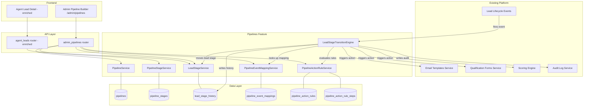
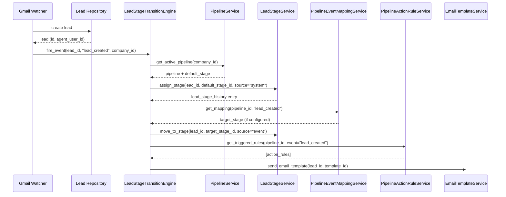
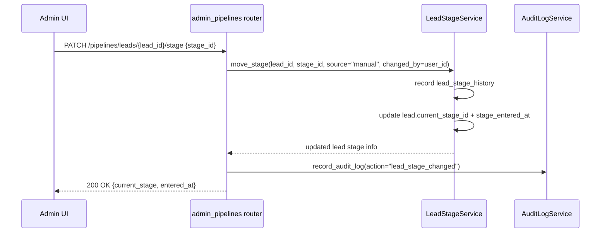
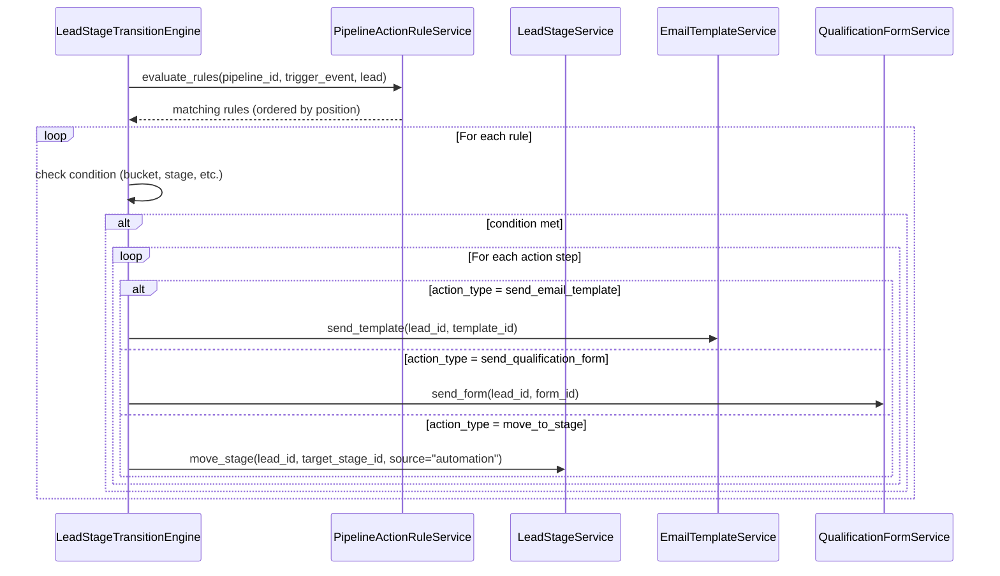

# Design Document: Pipelines

## Overview

The Pipelines feature adds a configurable, multi-stage lead journey system to the existing multi-tenant SaaS platform. It acts as an orchestration layer on top of existing capabilities (email templates, qualification forms, scoring buckets, audit logs) rather than duplicating them — giving platform admins a visual pipeline builder and giving agents a richer, more actionable lead detail view.

The design is intentionally scoped to V1/V1.5: powerful enough to be production-ready, clean enough to extend into a full automation engine later without rewriting the core.

---

## Architecture

The pipeline system sits between the existing lead lifecycle events and the existing platform capabilities. It does not own email sending, form delivery, or scoring — it references and triggers those services through clean boundaries.



---

## Sequence Diagrams

### Lead Created → Auto-assigned to Pipeline



### Admin Manually Moves Lead Stage



### Automation Rule Evaluation



---

## Components and Interfaces

### PipelineService

**Purpose**: CRUD for pipeline configuration. Enforces one active pipeline per company.

**Interface**:
```typescript
interface PipelineService {
  getActivePipeline(companyId: number): Pipeline | null
  createPipeline(companyId: number, data: PipelineCreate): Pipeline
  updatePipeline(pipelineId: number, data: PipelineUpdate): Pipeline
  setActivePipeline(pipelineId: number, companyId: number): Pipeline
  listPipelines(companyId: number): Pipeline[]
}
```

**Responsibilities**:
- Enforce single active pipeline per company (deactivate others on activation)
- Validate pipeline metadata
- Provide seed/template pipeline creation

---

### PipelineStageService

**Purpose**: CRUD and reordering of stages within a pipeline.

**Interface**:
```typescript
interface PipelineStageService {
  listStages(pipelineId: number): PipelineStage[]
  createStage(pipelineId: number, data: StageCreate): PipelineStage
  updateStage(stageId: number, data: StageUpdate): PipelineStage
  deleteStage(stageId: number): void
  reorderStages(pipelineId: number, orderedIds: number[]): PipelineStage[]
  setDefaultStage(stageId: number, pipelineId: number): PipelineStage
}
```

**Responsibilities**:
- Maintain position ordering (1-based, contiguous)
- Enforce exactly one default stage per pipeline
- Prevent deletion of stages with active leads (or reassign first)
- Validate category values: `open | in_progress | waiting | won | lost`

---

### LeadStageService

**Purpose**: Manages lead-to-stage assignment and movement. The single source of truth for a lead's current pipeline position.

**Interface**:
```typescript
interface LeadStageService {
  assignInitialStage(leadId: number, pipelineId: number, stageId: number): LeadStageHistory
  moveStage(leadId: number, toStageId: number, source: ChangeSource, reason?: string, changedByUserId?: number): LeadStageHistory
  getCurrentStage(leadId: number): LeadStageInfo | null
  getStageHistory(leadId: number): LeadStageHistory[]
  getLeadsInStage(stageId: number): Lead[]
}
```

**Responsibilities**:
- Write `lead_stage_history` on every transition
- Update `lead.current_stage_id` and `lead.stage_entered_at`
- Record `change_source`: `system | event | automation | manual`
- Never skip history — every move is recorded

---

### PipelineEventMappingService

**Purpose**: Maps platform lifecycle events to target pipeline stages.

**Interface**:
```typescript
interface PipelineEventMappingService {
  listMappings(pipelineId: number): PipelineEventMapping[]
  upsertMapping(pipelineId: number, eventType: BuiltInEventType, targetStageId: number, enabled: boolean): PipelineEventMapping
  getMapping(pipelineId: number, eventType: BuiltInEventType): PipelineEventMapping | null
}
```

**Supported event types (V1)**:
- `lead_created`
- `response_email_sent`
- `qualification_form_sent`
- `qualification_form_submitted`
- `qualification_bucket_hot`
- `qualification_bucket_warm`
- `qualification_bucket_nurture`

---

### PipelineActionRuleService

**Purpose**: CRUD for automation rules (When/Then logic).

**Interface**:
```typescript
interface PipelineActionRuleService {
  listRules(pipelineId: number): PipelineActionRule[]
  createRule(pipelineId: number, data: RuleCreate): PipelineActionRule
  updateRule(ruleId: number, data: RuleUpdate): PipelineActionRule
  deleteRule(ruleId: number): void
  reorderRules(pipelineId: number, orderedIds: number[]): PipelineActionRule[]
  evaluateRules(pipelineId: number, triggerEvent: string, lead: Lead): EvaluatedRule[]
}
```

**Supported trigger types**: `on_event`, `on_stage_enter`
**Supported condition types**: `bucket_is`, `stage_is`, `always`
**Supported action types**: `send_email_template`, `send_qualification_form`, `send_bucket_followup_email`, `move_to_stage`

---

### LeadStageTransitionEngine

**Purpose**: Orchestration service. Receives lifecycle events, resolves event mappings, evaluates automation rules, and delegates to existing platform services. This is the only component that coordinates across all pipeline services.

**Interface**:
```typescript
interface LeadStageTransitionEngine {
  fireEvent(leadId: number, eventType: BuiltInEventType, context: EventContext): Promise<void>
}
```

**Responsibilities**:
- Look up active pipeline for the lead's company
- Apply event-to-stage mapping if configured and enabled
- Evaluate and execute matching automation rules in order
- Delegate all actual work to existing services (never duplicate logic)
- Log all transitions and actions to audit log

---

## Data Models

### Pipeline

```typescript
interface Pipeline {
  id: number
  company_id: number
  name: string
  description: string | null
  is_active: boolean
  created_at: datetime
  updated_at: datetime
}
```

**Validation Rules**:
- `name`: required, max 100 chars, unique per company
- Only one pipeline may have `is_active = true` per company at a time

---

### PipelineStage

```typescript
interface PipelineStage {
  id: number
  pipeline_id: number
  name: string
  key: string                  // slug, e.g. "new_lead", "contacted"
  color: string                // hex color for UI
  category: StageCategory      // "open" | "in_progress" | "waiting" | "won" | "lost"
  position: number             // 1-based ordering
  is_default: boolean          // assigned to new leads
  is_closed_won: boolean
  is_closed_lost: boolean
  created_at: datetime
  updated_at: datetime
}
```

**Validation Rules**:
- `key`: unique per pipeline, lowercase alphanumeric + underscores
- `color`: valid hex color string
- Exactly one stage per pipeline may have `is_default = true`
- `is_closed_won` and `is_closed_lost` are mutually exclusive

---

### LeadStageHistory

```typescript
interface LeadStageHistory {
  id: number
  lead_id: number
  from_stage_id: number | null   // null on initial assignment
  to_stage_id: number
  change_source: ChangeSource    // "system" | "event" | "automation" | "manual"
  change_reason: string | null
  changed_by_user_id: number | null
  created_at: datetime
}
```

---

### PipelineEventMapping

```typescript
interface PipelineEventMapping {
  id: number
  pipeline_id: number
  event_type: BuiltInEventType
  target_stage_id: number
  is_enabled: boolean
  created_at: datetime
  updated_at: datetime
}
```

**Validation Rules**:
- One mapping per `(pipeline_id, event_type)` pair (upsert semantics)
- `target_stage_id` must belong to the same pipeline

---

### PipelineActionRule

```typescript
interface PipelineActionRule {
  id: number
  pipeline_id: number
  name: string
  trigger_type: "on_event" | "on_stage_enter"
  trigger_stage_id: number | null    // used when trigger_type = "on_stage_enter"
  trigger_event_type: string | null  // used when trigger_type = "on_event"
  condition_type: "bucket_is" | "stage_is" | "always"
  condition_value: string | null     // e.g. "HOT", stage key
  is_enabled: boolean
  position: number
  created_at: datetime
  updated_at: datetime
  steps: PipelineActionRuleStep[]
}

interface PipelineActionRuleStep {
  id: number
  rule_id: number
  action_type: ActionType
  action_config_json: string   // JSON: {template_id, stage_id, form_id, etc.}
  position: number
  created_at: datetime
}
```

---

### Lead (additions)

```typescript
// New columns added to existing leads table
interface LeadPipelineFields {
  pipeline_id: number | null
  current_stage_id: number | null
  stage_entered_at: datetime | null
}
```

---

## API Endpoints

### Pipeline Configuration (Admin)

| Method | Path | Description |
|--------|------|-------------|
| GET | `/api/v1/pipelines` | List pipelines for company |
| POST | `/api/v1/pipelines` | Create pipeline |
| GET | `/api/v1/pipelines/{id}` | Get pipeline detail |
| PUT | `/api/v1/pipelines/{id}` | Update pipeline metadata |
| POST | `/api/v1/pipelines/{id}/activate` | Set as active pipeline |
| GET | `/api/v1/pipelines/{id}/stages` | List stages |
| POST | `/api/v1/pipelines/{id}/stages` | Create stage |
| PUT | `/api/v1/pipelines/{id}/stages/{stage_id}` | Update stage |
| DELETE | `/api/v1/pipelines/{id}/stages/{stage_id}` | Delete stage |
| POST | `/api/v1/pipelines/{id}/stages/reorder` | Reorder stages |
| GET | `/api/v1/pipelines/{id}/event-mappings` | List event mappings |
| PUT | `/api/v1/pipelines/{id}/event-mappings/{event_type}` | Upsert event mapping |
| GET | `/api/v1/pipelines/{id}/rules` | List automation rules |
| POST | `/api/v1/pipelines/{id}/rules` | Create rule |
| PUT | `/api/v1/pipelines/{id}/rules/{rule_id}` | Update rule |
| DELETE | `/api/v1/pipelines/{id}/rules/{rule_id}` | Delete rule |
| POST | `/api/v1/pipelines/{id}/rules/reorder` | Reorder rules |

### Lead Stage Management (Admin)

| Method | Path | Description |
|--------|------|-------------|
| GET | `/api/v1/pipelines/leads/{lead_id}/stage` | Get current stage + history |
| PATCH | `/api/v1/pipelines/leads/{lead_id}/stage` | Manually move lead to stage |

### Metrics (Admin)

| Method | Path | Description |
|--------|------|-------------|
| GET | `/api/v1/pipelines/{id}/metrics` | Pipeline metrics summary |

### Agent-Facing (Agent)

| Method | Path | Description |
|--------|------|-------------|
| GET | `/api/v1/agent/leads/{lead_id}/pipeline` | Pipeline stage + lifecycle for agent lead detail |

---

## Admin UI: Pipeline Builder (`/admin/pipelines`)

### Page Structure

```
/admin/pipelines
├── Header (title, subtitle, "New Pipeline" button)
├── Overview Cards
│   ├── Leads in Pipeline
│   ├── Avg Time in Stage
│   ├── Conversion to Won
│   └── Stuck Leads (>7 days in stage)
├── Pipeline Selector (if multiple pipelines exist)
└── Tab Bar
    ├── [Builder]      — visual stage flow + drag-and-drop
    ├── [Built-in Rules] — event-to-stage mapping table
    ├── [Automations]  — When/Then rule cards
    └── [Activity]     — stage change audit log
```

### Builder Tab

```
┌─────────────────────────────────────────────────────────────────────┐
│  ← New Lead  →  Contacted  →  Appointment Set  →  Won  │  Lost     │
│  [default]      [in_progress]  [in_progress]    [won]   [lost]     │
│                                                                     │
│  [+ Add Stage]                                          [⚙ Stage]  │
└─────────────────────────────────────────────────────────────────────┘
```

- Horizontal stage flow with colored stage pills
- Drag-and-drop reordering (using `@dnd-kit/core`)
- Click a stage to open a side drawer with stage settings
- Stage drawer: name, key, color picker, category selector, default/won/lost toggles
- First-run template chooser modal: Real Estate Buyer Pipeline | Law Firm Pipeline | Blank

### Built-in Rules Tab

Table of all supported event types with a dropdown to select target stage and an enable/disable toggle per row.

### Automations Tab

Card-based rule builder:
```
┌─────────────────────────────────────────────────────────┐
│  WHEN  [lead_created ▼]                                 │
│  AND   [always ▼]                                       │
│  THEN  [send_email_template ▼]  [Select template ▼]    │
│        [+ Add step]                                     │
│                              [Enable] [Delete]          │
└─────────────────────────────────────────────────────────┘
```

### Activity Tab

Paginated table of `lead_stage_history` entries with lead name, from/to stage, source, reason, timestamp.

---

## Agent Panel Integration

The agent lead detail page (`AgentLeadDetailPage.tsx`) gains a new **Pipeline** tab (or prominent header section) showing:

```
┌─────────────────────────────────────────────────────────┐
│  PIPELINE STAGE                                         │
│  ● Appointment Set          Entered 2 days ago          │
│                                                         │
│  ○ New Lead  ●──────────────○ Contacted  ○ Won  ○ Lost  │
│                                                         │
│  LIFECYCLE STATUS                                       │
│  ✓ Response email sent      Jan 12                      │
│  ✓ Qualification form sent  Jan 13                      │
│  ✓ Form submitted           Jan 14                      │
│  ✓ Scored: HOT (82 pts)     Jan 14                      │
│                                                         │
│  QUICK ACTIONS                                          │
│  [📞 Call]  [✉ Email]  [💬 Text (coming soon)]         │
└─────────────────────────────────────────────────────────┘
```

The agent panel API endpoint returns:
```typescript
interface AgentLeadPipelineResponse {
  pipeline_name: string
  current_stage: PipelineStageDetail
  stage_entered_at: datetime
  stages: PipelineStageDetail[]   // all stages for progress visualization
  lifecycle: LifecycleStatus[]    // response_email_sent, form_sent, form_submitted, bucket
  stage_history: LeadStageHistoryEntry[]
}
```

---

## Error Handling

### Stage Deletion with Active Leads

**Condition**: Admin deletes a stage that has leads currently assigned to it.
**Response**: HTTP 409 with message listing affected lead count.
**Recovery**: Admin must move leads to another stage first, or the API accepts an optional `reassign_to_stage_id` parameter.

### No Active Pipeline

**Condition**: A lead is created but the company has no active pipeline.
**Response**: Lead is created normally; `pipeline_id`, `current_stage_id`, `stage_entered_at` remain null. No error is raised.
**Recovery**: When admin activates a pipeline, a backfill endpoint can assign existing leads to the default stage.

### Event Mapping Points to Deleted Stage

**Condition**: A stage referenced by an event mapping is deleted.
**Response**: The mapping is automatically disabled (not deleted) and flagged in the admin UI.
**Recovery**: Admin updates the mapping to point to a valid stage.

### Automation Rule Action Fails

**Condition**: An action step (e.g., send email) fails during rule execution.
**Response**: Log the failure to audit log; continue executing remaining steps. Do not roll back the stage transition.
**Recovery**: Admin can view failures in the Activity tab and retry manually.

---

## Testing Strategy

### Unit Testing

- `PipelineService`: enforce single active pipeline constraint
- `PipelineStageService`: position ordering, default stage uniqueness, category validation
- `LeadStageService`: history recording, stage_entered_at updates
- `PipelineEventMappingService`: upsert semantics, cross-pipeline validation
- `LeadStageTransitionEngine`: event routing, rule evaluation order, condition matching

### Property-Based Testing

**Property Test Library**: `hypothesis` (Python backend)

Key properties:
- For any sequence of stage moves, `lead_stage_history` length equals the number of moves
- After `reorderStages(ids)`, stage positions are always a contiguous 1-based sequence
- `fireEvent` with a disabled mapping never moves the lead
- A lead's `current_stage_id` always matches the `to_stage_id` of the most recent history entry

### Integration Testing

- Full event flow: lead created → event fired → stage assigned → action executed
- Admin manual move: PATCH stage endpoint → history recorded → audit log written
- Pipeline activation: activating one pipeline deactivates all others for the company
- Agent panel endpoint: returns correct stage + lifecycle data for a lead with history

---

## Performance Considerations

- `lead_stage_history` will grow proportionally to lead volume × stage changes. Index on `(lead_id, created_at)` for fast history lookups.
- `pipeline_event_mappings` and `pipeline_action_rules` are small config tables — cache in memory per company after first load (invalidate on write).
- Metrics endpoint aggregates over `lead_stage_history` — add DB-level aggregation queries rather than loading all rows into Python.
- Stage reordering uses a bulk UPDATE rather than N individual updates.

---

## Security Considerations

- All pipeline config endpoints require `platform_admin` role (same pattern as existing admin routers).
- Agent pipeline endpoint is scoped to the agent's own leads — tenant isolation enforced at repository level.
- `action_config_json` is validated on write to prevent injection of arbitrary config values.
- Stage `key` field is sanitized (alphanumeric + underscores only) before storage.
- Audit log records all pipeline config changes and all manual stage moves with `user_id`.

---

## Dependencies

**Backend**:
- FastAPI, SQLAlchemy, Alembic (existing)
- No new Python packages required for V1

**Frontend**:
- `@dnd-kit/core` + `@dnd-kit/sortable` — drag-and-drop stage reordering in the pipeline builder
- React 18, TypeScript, Tailwind CSS (existing)
- All other UI patterns reuse existing component styles (cards, drawers, tabs, tokens)

**Seeding**:
- Optional seed scripts for Real Estate Buyer Pipeline and Landlord-Tenant Law Firm Pipeline
- Integrated into existing `scripts/seed_data.py` pattern
