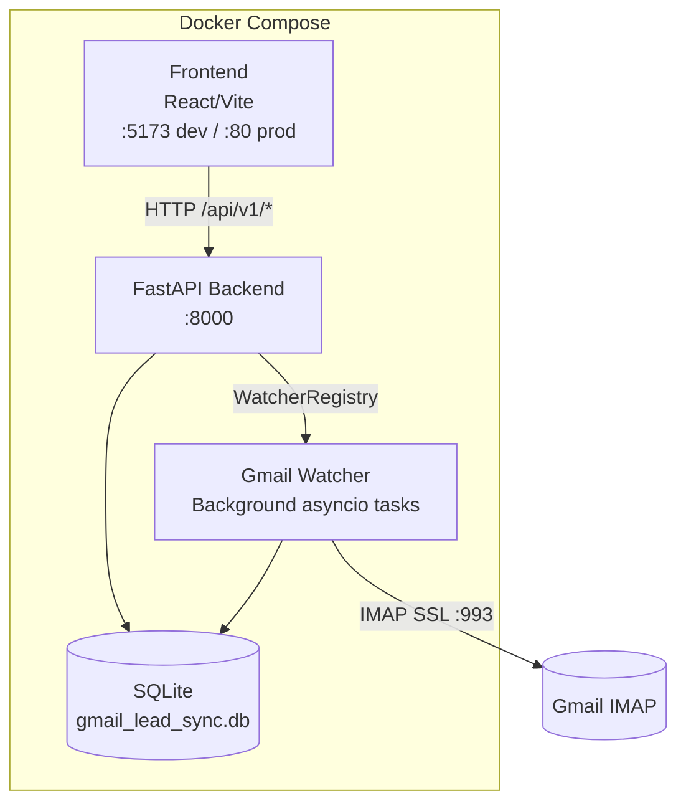
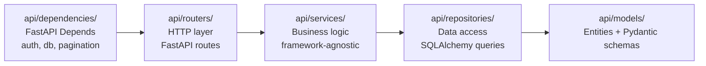
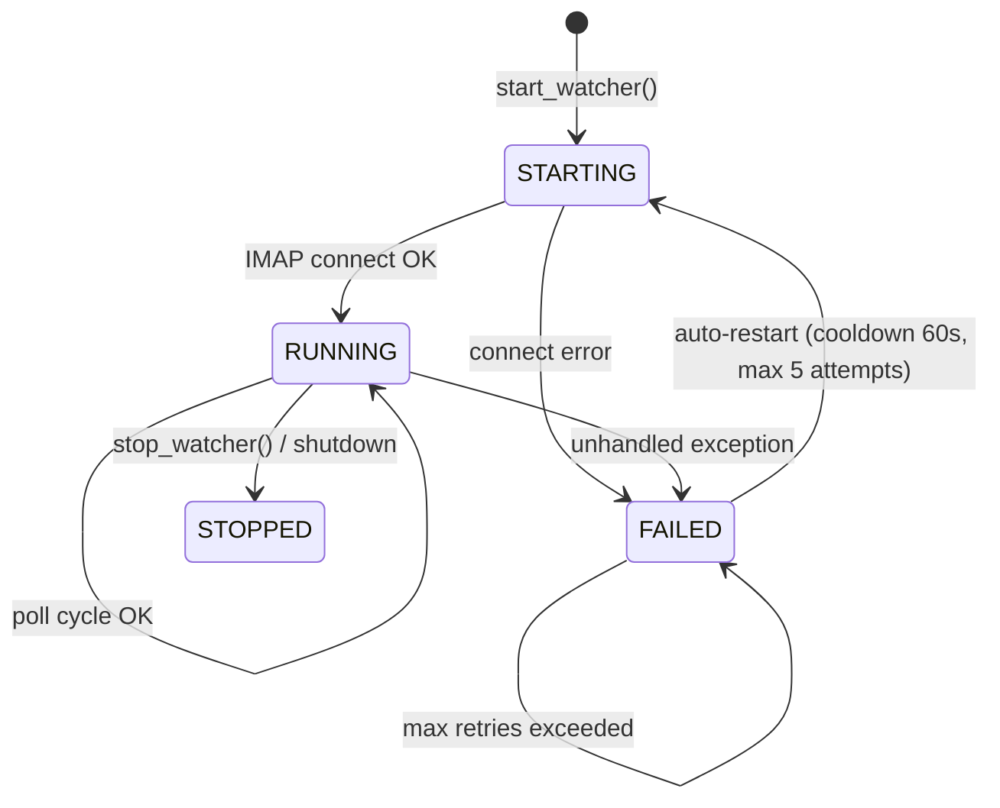

# Design Document: Production Hardening

## Overview

This document describes the technical design for hardening the multi-tenant real estate lead management SaaS into a production-grade system. The work is a cross-cutting engineering pass rather than a single new feature: it touches infrastructure, backend architecture, frontend structure, security, observability, and developer experience simultaneously.

The system already has a working FastAPI backend, a React/TypeScript frontend, a Gmail IMAP watcher, and SQLite/Alembic persistence. The hardening pass standardizes what exists, removes what doesn't belong, and fills the gaps that prevent safe production deployment.

### Goals

- Any developer can clone the repo and have a running system within 15 minutes using one command.
- The codebase passes lint, typecheck, and build with zero errors.
- No secrets are committed; startup fails loudly when required secrets are absent.
- All API endpoints follow a single error schema and consistent conventions.
- Tenant data is strictly isolated at the query layer, not just at the route layer.
- The backend follows a strict 4-layer architecture (routers → services → repositories → models).
- The lead state machine is the single authoritative source of truth for state transitions.
- The frontend is reorganized into `apps/agent`, `apps/platform-admin`, and `shared`.
- The watcher is resilient to transient IMAP failures with exponential backoff and auto-restart.
- Security headers, RBAC, credential encryption, rate limiting, and XSS sanitization are enforced.
- CI runs lint, typecheck, and tests on every push.
- Dead code and stale files are removed.

### Non-Goals

- Migrating from SQLite to PostgreSQL (out of scope for this pass).
- Adding new product features (lead scoring changes, new form types, etc.).
- Full end-to-end test coverage (gaps are documented in `docs/TESTING_GAPS.md`).

---

## Architecture

### System Topology



The watcher runs as asyncio background tasks inside the FastAPI process, managed by `WatcherRegistry`. There is no separate process or container for the watcher.

### Backend Layer Model



**Routing convention**: `api/routes/` is renamed/consolidated into `api/routers/` with a clear naming prefix:
- `api/routers/admin_*.py` — platform-admin routes (require `platform_admin` role)
- `api/routers/agent_*.py` — agent-app routes (require `agent` role)
- `api/routers/public_*.py` — unauthenticated public routes

### Frontend App Structure

```
frontend/src/
├── apps/
│   ├── agent/              # Agent-facing app (moved from src/agent/)
│   │   ├── api/
│   │   ├── components/
│   │   ├── contexts/
│   │   ├── hooks/
│   │   └── pages/
│   └── platform-admin/     # Admin panel (moved from src/pages/ + src/components/)
│       ├── components/
│       ├── contexts/
│       └── pages/
├── shared/                 # Used by both apps
│   ├── api/                # Base API client (moved from src/utils/api.ts)
│   ├── components/         # Shared UI components
│   ├── contexts/           # Shared contexts (ThemeContext, ToastContext)
│   ├── hooks/
│   ├── types/
│   └── utils/
├── main.tsx                # Single entry point, mounts both apps
└── index.css
```

### Watcher Resilience Model



Backoff schedule on IMAP connection failure: 5s → 10s → 20s → 40s → 80s (capped at 300s). After 5 consecutive failures the watcher transitions to `FAILED` and the registry logs at ERROR level with `agent_id`, error type, message, and timestamp.

---

## Components and Interfaces

### 1. One-Command Startup (`docker-compose.yml` + `Makefile`)

**`docker-compose.yml`** defines three services:
- `api`: builds from `Dockerfile`, runs `docker-entrypoint.sh` (migrations then uvicorn)
- `frontend`: builds from `frontend/Dockerfile`, serves `dist/` via nginx
- (optional) `db-init`: one-shot migration service that exits 0 on success

**`Makefile`** targets:

| Target | Command |
|---|---|
| `up` | `docker compose up --build -d` |
| `down` | `docker compose down` |
| `migrate` | `alembic upgrade head` |
| `test` | `pytest tests/ -x` |
| `lint` | `ruff check . && cd frontend && npx eslint src/` |
| `typecheck` | `mypy api/ gmail_lead_sync/ && cd frontend && npx tsc --noEmit` |
| `build` | `cd frontend && npm run build` |
| `generate-secrets` | `scripts/generate_secrets.sh` |

**`docker-entrypoint.sh`** sequence:
1. Validate required env vars (`ENCRYPTION_KEY`, `SECRET_KEY`); exit 1 with descriptive message if absent or < 32 chars.
2. Run `alembic upgrade head`; exit 1 with full stack trace on failure.
3. Exec `uvicorn api.main:app`.

### 2. Health Endpoint (`GET /api/v1/health`)

No authentication required. Returns:

```json
{
  "status": "healthy",
  "database": "connected",
  "active_watchers": 3,
  "errors_last_24h": 0,
  "watchers": {
    "agent_42": {
      "status": "running",
      "last_heartbeat": "2024-01-15T10:30:00Z"
    }
  }
}
```

Returns HTTP 200 when healthy, HTTP 503 when database is unreachable.

### 3. Unified Error Response

All 4xx/5xx responses use the existing `ErrorResponse` schema already defined in `api/models/error_models.py`:

```json
{
  "error": "string",
  "message": "string",
  "code": "string",
  "details": [{"field": "string", "message": "string", "code": "string"}] | null
}
```

A FastAPI `RequestValidationError` handler is added to `api/main.py` to convert Pydantic 422 errors into this schema.

### 4. Backend 4-Layer Architecture

**New directory: `api/repositories/`**

Each repository module owns all SQLAlchemy queries for one domain:

```
api/repositories/
├── __init__.py
├── lead_repository.py        # CRUD + tenant-scoped queries for leads
├── agent_repository.py       # Agent user queries
├── credential_repository.py  # Credential read/write (always scoped)
├── watcher_repository.py     # Watcher config queries
└── lead_source_repository.py # Lead source queries
```

Repository interface pattern:
```python
class LeadRepository:
    def __init__(self, db: Session): ...
    def get_by_id(self, lead_id: int, tenant_id: int) -> Lead | None: ...
    def list_for_tenant(self, tenant_id: int, *, skip: int, limit: int) -> list[Lead]: ...
    def list_all_with_tenant(self, *, skip: int, limit: int) -> list[Lead]: ...  # admin only
    def create(self, data: LeadCreate, tenant_id: int) -> Lead: ...
    def update(self, lead_id: int, tenant_id: int, data: LeadUpdate) -> Lead: ...
```

**`api/dependencies/` additions**:

```python
# api/dependencies/auth.py
def get_current_agent(request: Request, db: Session = Depends(get_db)) -> AgentUser: ...
def get_current_admin(request: Request, db: Session = Depends(get_db)) -> User: ...
def require_role(role: str): ...  # returns a Depends factory

# api/dependencies/db.py
def get_db() -> Generator[Session, None, None]: ...

# api/dependencies/pagination.py
def get_pagination(skip: int = 0, limit: int = 50) -> PaginationParams: ...
```

### 5. Lead State Machine (`api/services/lead_state_machine.py`)

The existing `LeadStateMachine` in `gmail_lead_sync/preapproval/state_machine.py` is the canonical implementation. It is moved/re-exported from `api/services/lead_state_machine.py` so the API layer has a clean import path.

The `LeadState` enum (currently in `gmail_lead_sync/preapproval/models_preapproval.py`) is the single authoritative definition. All other code imports from this location.

**Idempotency**: Before writing a `LeadStateTransition` row, the service checks whether a row with the same `(lead_id, from_state, to_state)` already exists within the last 5 seconds. If so, it returns the existing row without creating a duplicate.

**Event log endpoint**: `GET /api/v1/agent/leads/{lead_id}/events` returns `LeadStateTransition` rows ordered by `occurred_at` ascending.

### 6. Watcher/Worker Resilience

Changes to `WatcherRegistry._run_watcher`:

- **Backoff**: Replace the current fixed `RETRY_DELAYS = [10, 30, 60]` with exponential backoff starting at 5s, doubling each attempt, capped at 300s, for up to 5 attempts.
- **Heartbeat**: Emit a `DEBUG`-level log entry every polling cycle. The health endpoint reads `last_heartbeat` from `WatcherInfo`.
- **Processing timeout**: Wrap `watcher.process_unseen_emails()` in `asyncio.wait_for(..., timeout=30)`. On `TimeoutError`, log WARNING and continue.
- **Exception isolation**: The existing `except Exception` in the polling loop already continues; add structured logging with `agent_id`, `error_type`, and `exc_info=True`.
- **Auto-restart cooldown**: Change from current variable delays to a fixed 60-second cooldown after marking `FAILED`, controlled by `ENABLE_AUTO_RESTART` env var.
- **Message-id idempotency**: `GmailWatcher.is_email_processed` already checks `Lead.gmail_uid`. Ensure the check uses `message-id` header hash (SHA-256) stored in a dedicated `ProcessedMessage` table to decouple from lead creation.

### 7. Security Hardening

**Security headers middleware** added to `api/main.py`:

```python
@app.middleware("http")
async def security_headers(request: Request, call_next):
    response = await call_next(request)
    response.headers["X-Content-Type-Options"] = "nosniff"
    response.headers["X-Frame-Options"] = "DENY"
    response.headers["Referrer-Policy"] = "strict-origin-when-cross-origin"
    return response
```

**Rate limiting** on login endpoints using `slowapi` (wraps `limits` library):
- `POST /api/v1/auth/login`: 10/minute per IP
- `POST /api/v1/agent/auth/login`: 10/minute per IP
- Returns HTTP 429 with unified error schema on excess.

**XSS sanitization**: A `sanitize_string(value: str) -> str` utility in `api/utils/sanitization.py` strips HTML tags using `bleach.clean(value, tags=[], strip=True)`. Applied in Pydantic validators on `lead.name`, `lead.email`, `lead.notes` fields.

**RBAC enforcement**: `require_role("platform_admin")` and `require_role("agent")` dependencies applied at router level via `dependencies=[Depends(require_role("platform_admin"))]` on `APIRouter` constructor.

**Regex timeout**: `api/utils/regex_tester.py` already has timeout logic. Ensure it uses `signal.alarm` (Unix) or a thread-based timeout for `REGEX_TIMEOUT_MS` from config.

**Session cookies**: In production mode (`ENVIRONMENT=production`), set `secure=True`, `httponly=True`, `samesite="strict"` on all session cookies.

**Auth failure logging**: Log `WARNING` with `username_attempted` and `source_ip` (never the password) on every authentication failure.

### 8. Frontend Restructure

Migration mapping:

| Current path | New path |
|---|---|
| `src/agent/` | `src/apps/agent/` |
| `src/pages/` (admin pages) | `src/apps/platform-admin/pages/` |
| `src/components/` (admin components) | `src/apps/platform-admin/components/` |
| `src/contexts/AuthContext.*` | `src/apps/platform-admin/contexts/` |
| `src/contexts/ThemeContext.*` | `src/shared/contexts/` |
| `src/contexts/ToastContext.*` | `src/shared/contexts/` |
| `src/utils/api.ts` | `src/shared/api/client.ts` |
| `src/utils/theme.ts` | `src/shared/utils/theme.ts` |
| `src/utils/useT.ts` | `src/shared/hooks/useT.ts` |

`src/main.tsx` mounts both apps:
```tsx
// Platform-admin at /  (existing behavior)
// Agent app at /agent/*
```

### 9. CI/CD Baseline (`.github/workflows/ci.yml`)

```yaml
on: [push, pull_request]
jobs:
  ci:
    runs-on: ubuntu-latest
    steps:
      - uses: actions/checkout@v4
      - uses: actions/setup-python@v5  # cached
      - uses: actions/setup-node@v4    # cached
      - run: pip install -r requirements-dev.txt
      - run: cd frontend && npm ci
      - run: make lint
      - run: make typecheck
      - run: make test
```

Dependency caching uses `actions/cache` keyed on `requirements-dev.txt` hash and `package-lock.json` hash.

### 10. Dead Code and File Cleanup

Files to remove from repository root:
- `test_connection.py`, `test_watcher_simple.py`
- `test_template_body.txt`, `test_template_body_updated.txt`, `test_template.txt`, `sample_test_email.txt`
- `gmail_lead_sync.db`, `gmail_lead_sync.log`
- `gmail-lead-sync.service` (move to `docs/deployment/systemd/`)

Docs to consolidate into `docs/`:
- `API_DOCUMENTATION.md` → `docs/API.md`
- `API_USAGE_GUIDE.md` → merged into `docs/API.md`
- `BACKEND_API_REVIEW.md`, `BACKEND_COMPLETION_SUMMARY.md` → removed (superseded)
- `FRONTEND_IMPLEMENTATION_PLAN.md` → removed (superseded by `docs/ARCHITECTURE.md`)
- `TESTING_GUIDE.md`, `TESTING_SUMMARY.md` → merged into `docs/TESTING_GAPS.md`

`.gitignore` additions: `frontend/dist/`, `htmlcov/`, `*.db`, `*.log`, `*.sqlite`, `*.sqlite3`, `.hypothesis/`, `__pycache__/`.

---

## Data Models

### Existing Models (unchanged structure, clarified ownership)

**`Lead`** (`gmail_lead_sync/models.py`) — core lead record. Patched with `current_state` and `current_state_updated_at` by `models_preapproval.py`. The `agent_id` column provides tenant scoping for the watcher layer; the API layer uses `agent_user_id` (FK to `AgentUser`).

**`LeadStateTransition`** (`gmail_lead_sync/preapproval/models_preapproval.py`) — immutable event log. Fields: `id`, `tenant_id`, `lead_id`, `intent_type`, `from_state`, `to_state`, `occurred_at`, `metadata_json`, `actor_type`, `actor_id`.

**`Credentials`** (`gmail_lead_sync/models.py`) — encrypted Gmail credentials. `email_encrypted` and `app_password_encrypted` are Fernet-encrypted blobs. Never stored or logged in plaintext.

### New Model: `ProcessedMessage`

Decouples idempotency tracking from lead creation:

```python
class ProcessedMessage(Base):
    __tablename__ = "processed_messages"

    id           = Column(Integer, primary_key=True)
    agent_id     = Column(String(255), nullable=False, index=True)
    message_id_hash = Column(String(64), nullable=False)  # SHA-256 of Message-ID header
    processed_at = Column(DateTime, default=datetime.utcnow, nullable=False)
    lead_id      = Column(Integer, ForeignKey("leads.id"), nullable=True)

    __table_args__ = (
        UniqueConstraint("agent_id", "message_id_hash", name="uq_processed_message"),
    )
```

### Environment Variables (`.env.example`)

| Variable | Required | Default | Description |
|---|---|---|---|
| `DATABASE_URL` | yes | — | SQLite path, e.g. `sqlite:///./gmail_lead_sync.db` |
| `ENCRYPTION_KEY` | yes | — | Fernet key ≥ 32 chars for credential encryption |
| `SECRET_KEY` | yes | — | Session signing key ≥ 32 chars |
| `API_HOST` | no | `0.0.0.0` | Bind host |
| `API_PORT` | no | `8000` | Bind port |
| `CORS_ORIGINS` | no | `http://localhost:5173` | Comma-separated allowed origins |
| `SESSION_TIMEOUT_HOURS` | no | `24` | Session TTL |
| `SYNC_INTERVAL_SECONDS` | no | `300` | Watcher poll interval |
| `REGEX_TIMEOUT_MS` | no | `1000` | Max regex execution time |
| `ENABLE_AUTO_RESTART` | no | `true` | Auto-restart failed watchers |
| `ENVIRONMENT` | no | `development` | `production` enables secure cookies |
| `LOG_LEVEL` | no | `INFO` | Python log level |


---

## Correctness Properties

*A property is a characteristic or behavior that should hold true across all valid executions of a system — essentially, a formal statement about what the system should do. Properties serve as the bridge between human-readable specifications and machine-verifiable correctness guarantees.*

### Property 1: Startup rejects short or absent secrets

*For any* value of `ENCRYPTION_KEY` or `SECRET_KEY` that is absent or shorter than 32 characters, the configuration loader SHALL raise a `ValueError` (or equivalent) and the application SHALL NOT start successfully.

**Validates: Requirements 1.4, 4.4**

---

### Property 2: .env.example covers all config variables

*For any* environment variable referenced in `api/config.py`'s `load_config()` function, that variable name SHALL appear in the root-level `.env.example` file.

**Validates: Requirements 1.3, 4.2**

---

### Property 3: Unified error schema on all error responses

*For any* HTTP request to any API endpoint that results in a 4xx or 5xx response, the response body SHALL be a valid JSON object matching the schema `{"error": string, "message": string, "code": string, "details": array|null}`.

**Validates: Requirements 5.1, 5.2, 5.3, 5.4, 5.5**

---

### Property 4: Tenant isolation — cross-tenant access returns 403

*For any* two distinct authenticated agents A and B, any request by agent A to read, write, or control a resource (lead, credential, watcher) owned by agent B SHALL return HTTP 403 and SHALL NOT include any data from agent B's record in the response body.

**Validates: Requirements 6.1, 6.2, 6.3, 6.4**

---

### Property 5: Invalid lead state transitions are rejected

*For any* lead in state S and any target state T where the pair (S, T) is not present in `LeadStateMachine.VALID_TRANSITIONS`, calling `transition(lead_id, to_state=T)` SHALL raise `InvalidTransitionError` and SHALL NOT modify the lead's `current_state` or create a `LeadStateTransition` row.

**Validates: Requirements 8.2, 8.3**

---

### Property 6: Valid transitions produce exactly one event log row

*For any* lead and any valid transition (S → T), calling `transition()` once SHALL create exactly one `LeadStateTransition` row with `from_state=S`, `to_state=T`, and a non-null `occurred_at`. The lead's `current_state` SHALL equal T after the call.

**Validates: Requirements 8.4**

---

### Property 7: State machine and watcher idempotency

*For any* lead and any valid transition (S → T), calling `transition()` a second time with the same arguments within the idempotency window SHALL return the existing `LeadStateTransition` row and SHALL NOT create a duplicate row. Similarly, for any email `message_id`, processing it a second time SHALL produce no new `Lead` or `ProcessedMessage` rows.

**Validates: Requirements 8.5, 8.6, 10.4**

---

### Property 8: Lead event log is chronologically ordered

*For any* lead with one or more `LeadStateTransition` rows, the `GET /api/v1/agent/leads/{lead_id}/events` endpoint SHALL return those rows in ascending `occurred_at` order.

**Validates: Requirements 8.7**

---

### Property 9: Watcher exponential backoff schedule

*For any* sequence of N consecutive IMAP connection failures (N ≤ 5), the delay before the k-th retry attempt SHALL equal `min(5 * 2^(k-1), 300)` seconds. After 5 consecutive failures the watcher SHALL transition to `FAILED` status.

**Validates: Requirements 10.1**

---

### Property 10: Watcher polling loop survives unhandled exceptions

*For any* exception raised inside the watcher's polling loop body, the loop SHALL catch the exception, log it at ERROR level with `exc_info=True`, and continue to the next polling cycle without the watcher task terminating.

**Validates: Requirements 10.7**

---

### Property 11: Watcher heartbeat reflected in health endpoint

*For any* running watcher, after each completed polling cycle the `last_heartbeat` field in the health endpoint response for that agent SHALL be updated to a timestamp within the last `SYNC_INTERVAL_SECONDS + 30` seconds.

**Validates: Requirements 10.6**

---

### Property 12: Credentials are never stored in plaintext

*For any* credential write operation (create or update), the values stored in `Credentials.email_encrypted` and `Credentials.app_password_encrypted` SHALL NOT equal the plaintext input values. Decrypting the stored values with the `CredentialEncryption` service SHALL return the original plaintext.

**Validates: Requirements 11.1**

---

### Property 13: RBAC — agent sessions cannot access admin endpoints

*For any* request to a platform-admin endpoint made with an agent-role session token, the response SHALL be HTTP 403 with the unified error schema.

**Validates: Requirements 11.2**

---

### Property 14: RBAC — admin sessions cannot act as agents

*For any* request to an agent-app endpoint made with a platform-admin session token (excluding explicit admin-override endpoints), the response SHALL be HTTP 403 with the unified error schema.

**Validates: Requirements 11.3**

---

### Property 15: XSS sanitization strips HTML from string inputs

*For any* string input to `lead.name`, `lead.email`, or `lead.notes` that contains HTML tags, the value stored in the database SHALL have all HTML tags stripped, and the stored value SHALL be equal to `bleach.clean(input, tags=[], strip=True)`.

**Validates: Requirements 11.4**

---

### Property 16: Security headers present on all responses

*For any* HTTP response from the API, the response SHALL include all three headers: `X-Content-Type-Options: nosniff`, `X-Frame-Options: DENY`, and `Referrer-Policy: strict-origin-when-cross-origin`.

**Validates: Requirements 11.5**

---

### Property 17: Rate limiting on login endpoints

*For any* IP address that sends more than 10 requests to `POST /api/v1/auth/login` or `POST /api/v1/agent/auth/login` within a 60-second window, the 11th and subsequent requests within that window SHALL receive HTTP 429 with the unified error schema.

**Validates: Requirements 11.6**

---

### Property 18: Regex timeout enforcement

*For any* regex pattern submitted to lead source configuration that requires more than `REGEX_TIMEOUT_MS` milliseconds to execute against a test input, the validation SHALL fail with an appropriate error and SHALL NOT allow the pattern to be saved.

**Validates: Requirements 11.7**

---

### Property 19: Auth failure logs contain username and IP but not password

*For any* failed authentication attempt, the resulting log entry at WARNING level SHALL contain the `username_attempted` and `source_ip` fields and SHALL NOT contain the attempted password string.

**Validates: Requirements 11.8**

---

### Property 20: PII absent from INFO-level logs

*For any* lead record containing a name, email address, or phone number, processing that lead through the watcher or API SHALL NOT produce any log entries at INFO level or above that contain those PII values as literal strings.

**Validates: Requirements 4.7**

---

## Error Handling

### Startup Errors

| Condition | Behavior |
|---|---|
| `ENCRYPTION_KEY` or `SECRET_KEY` absent or < 32 chars | Log descriptive error listing the missing/invalid variable, exit code 1 |
| Alembic migration fails | Log full stack trace at ERROR, exit code 1 |
| Database unreachable at startup | Log connection error, exit code 1 |

### Runtime API Errors

All errors are returned using the unified `ErrorResponse` schema. The exception hierarchy in `api/exceptions.py` maps directly to HTTP status codes:

| Exception | HTTP Status | When |
|---|---|---|
| `AuthenticationException` | 401 | Missing/invalid/expired session |
| `AuthorizationException` | 403 | Insufficient role or cross-tenant access |
| `ValidationException` | 400 | Business rule validation failure |
| `RequestValidationError` (Pydantic) | 422 | Schema validation failure |
| `NotFoundException` | 404 | Resource does not exist |
| `ConflictException` | 409 | Duplicate resource or conflicting state |
| `TimeoutException` | 408 | Regex or operation timeout |
| `RateLimitExceeded` (slowapi) | 429 | Rate limit exceeded |
| Unhandled `Exception` | 500 | Unexpected error (generic message to client, full trace in logs) |

### Watcher Errors

| Condition | Behavior |
|---|---|
| IMAP connection failure | Exponential backoff retry (5s → 10s → 20s → 40s → 80s, max 300s), up to 5 attempts |
| 5 consecutive failures | Mark watcher `FAILED`, log ERROR with agent_id + error details |
| `ENABLE_AUTO_RESTART=true` | Schedule restart after 60s cooldown |
| Email processing timeout (> 30s) | Log WARNING, skip to next email, continue loop |
| Unhandled exception in poll loop | Log ERROR with full stack trace, continue loop |
| Authentication failure (IMAP) | Do not retry, mark `FAILED` immediately, log ERROR |

### Lead State Machine Errors

| Condition | Behavior |
|---|---|
| Invalid transition (S → T not in map) | Raise `InvalidTransitionError`, no DB write |
| Lead not found | Raise `NotFoundException` |
| Duplicate transition (idempotency window) | Return existing `LeadStateTransition` row, no new write |

---

## Testing Strategy

### Dual Testing Approach

Both unit/integration tests and property-based tests are required. They are complementary:

- **Unit tests**: Verify specific examples, edge cases, and error conditions with known inputs.
- **Property tests**: Verify universal properties across many randomly generated inputs, catching edge cases that examples miss.

### Property-Based Testing

**Library**: `hypothesis` (Python). Already present in the test suite (`tests/property/`).

**Configuration**: Each property test runs a minimum of 100 examples (`@settings(max_examples=100)`).

**Tag format**: Each property test is tagged with a comment referencing the design property:
```python
# Feature: production-hardening, Property N: <property_text>
```

Each correctness property above maps to exactly one property-based test:

| Property | Test file | Hypothesis strategy |
|---|---|---|
| 1 (startup rejects short secrets) | `tests/property/test_prop_startup_validation.py` | `st.text(max_size=31)` for key values |
| 2 (.env.example coverage) | `tests/property/test_prop_env_example_coverage.py` | Enumerate config vars |
| 3 (unified error schema) | `tests/property/test_prop_error_schema.py` | Random invalid requests to each endpoint |
| 4 (tenant isolation) | `tests/property/test_prop_tenant_isolation.py` | Random agent pairs + resource IDs |
| 5 (invalid transitions rejected) | `tests/property/test_prop_status_transitions.py` | Random (from, to) state pairs |
| 6 (valid transitions produce one event) | `tests/property/test_prop_status_transitions.py` | Valid transition sequences |
| 7 (idempotency) | `tests/property/test_prop_idempotency.py` | Random leads + message IDs |
| 8 (event log ordering) | `tests/property/test_prop_event_log_order.py` | Random transition sequences |
| 9 (backoff schedule) | `tests/property/test_prop_watcher_backoff.py` | `st.integers(min_value=1, max_value=5)` for failure count |
| 10 (polling loop survives exceptions) | `tests/property/test_prop_watcher_resilience.py` | Random exception types |
| 11 (heartbeat in health endpoint) | `tests/property/test_prop_watcher_heartbeat.py` | Mock watcher cycles |
| 12 (credentials never plaintext) | `tests/property/test_prop_credential_never_plaintext.py` | Random credential strings (already exists) |
| 13 (RBAC agent → admin 403) | `tests/property/test_prop_rbac.py` | Random admin endpoint paths |
| 14 (RBAC admin → agent 403) | `tests/property/test_prop_rbac.py` | Random agent endpoint paths |
| 15 (XSS sanitization) | `tests/property/test_prop_xss_sanitization.py` | Random strings with HTML tags |
| 16 (security headers) | `tests/property/test_prop_security_headers.py` | Random endpoint paths |
| 17 (rate limiting) | `tests/property/test_prop_rate_limiting.py` | Request counts > 10 |
| 18 (regex timeout) | `tests/property/test_prop_regex_timeout.py` | Catastrophic backtracking patterns |
| 19 (auth log no password) | `tests/property/test_prop_auth_logging.py` | Random username/password pairs |
| 20 (PII absent from logs) | `tests/property/test_prop_pii_logging.py` | Random lead PII values |

### Unit Testing

Unit tests focus on:
- Specific examples demonstrating correct behavior (health endpoint response shape, migration ordering)
- Integration points between layers (router → service → repository)
- Edge cases: empty lead lists, missing optional fields, boundary values

Avoid writing unit tests that duplicate what property tests already cover (e.g., don't write 20 unit tests for different invalid state transitions when the property test covers all of them).

### Integration Testing

The existing `tests/integration/` suite covers:
- Agent lead lifecycle (create → state transitions → event log)
- Agent onboarding flow
- Cross-tenant security (already in `test_agent_security.py`)
- Auth integration

Add integration tests for:
- Clean startup with valid `.env` (smoke test)
- Health endpoint returns all required fields
- Admin leads list includes tenant identifiers

### Test Execution

```bash
make test          # runs pytest tests/ -x
make test-property # runs pytest tests/property/ --hypothesis-seed=0
make test-unit     # runs pytest tests/unit/
make test-integration # runs pytest tests/integration/
```

Property tests use `--hypothesis-seed=0` for reproducible CI runs while still exercising randomness.
