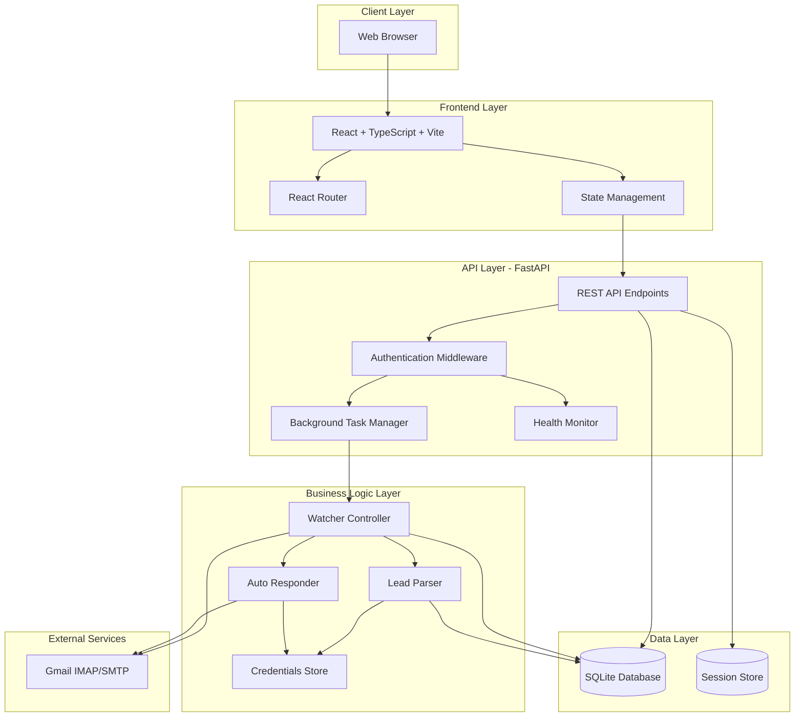
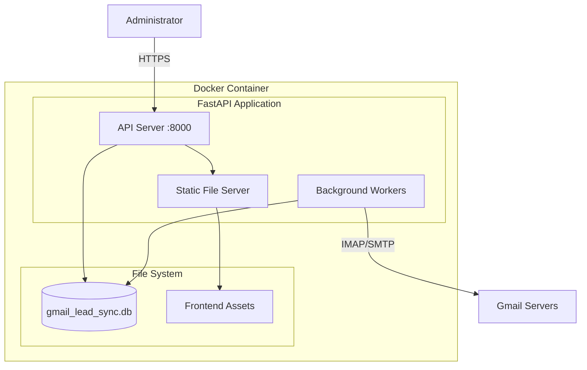
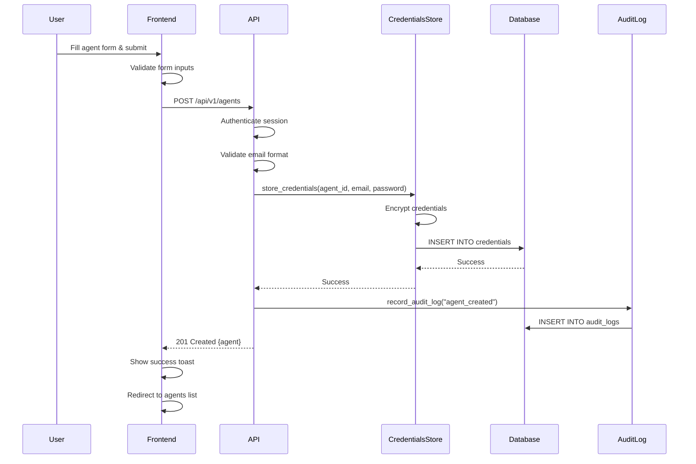
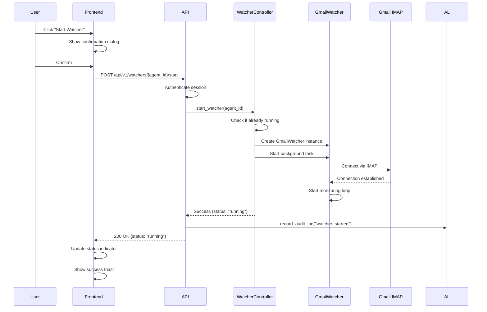
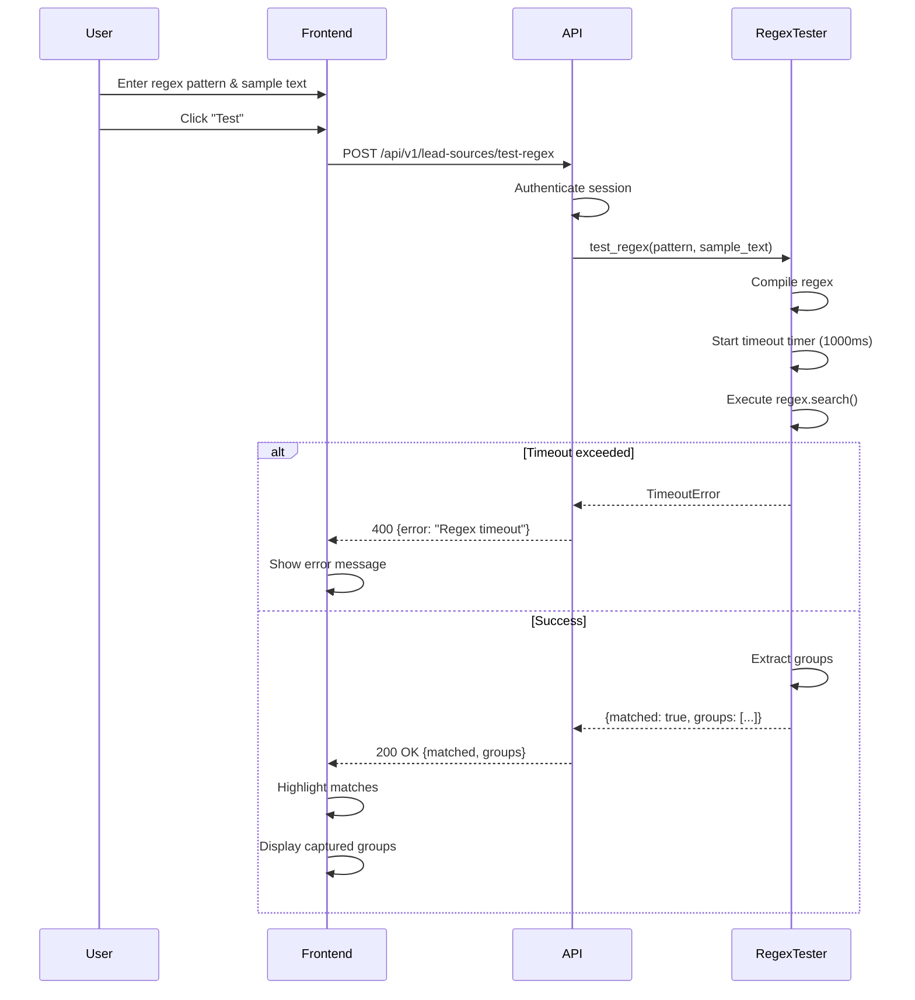
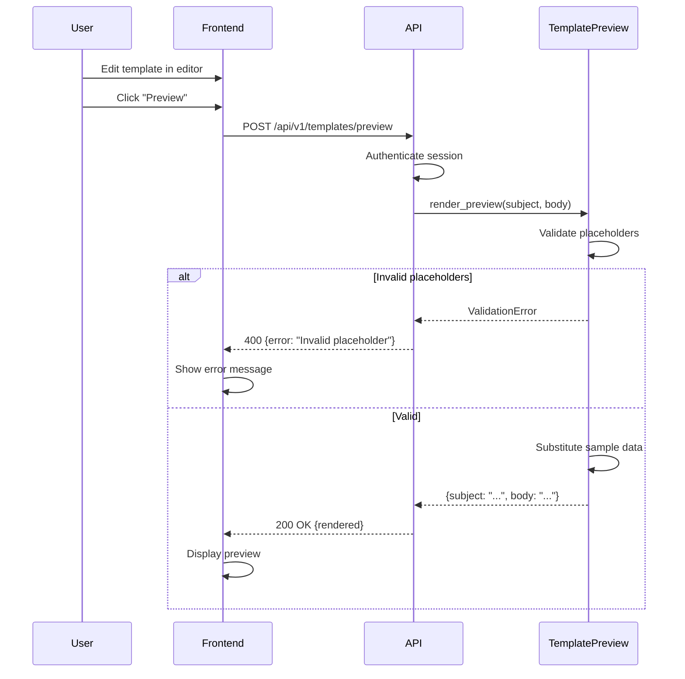
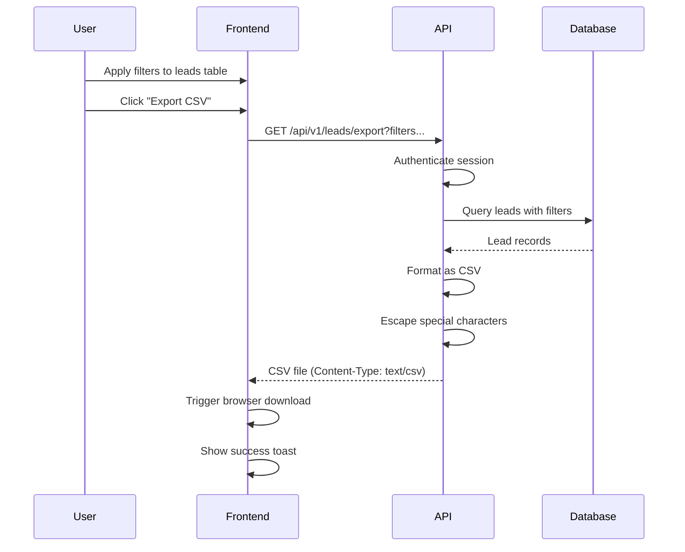
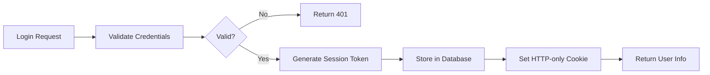
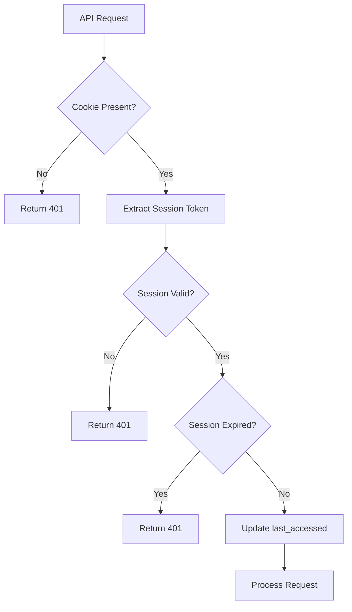

# Design Document: Web UI & API Layer

## Overview

The Gmail Lead Sync Web UI & API Layer is a full-stack web application that provides a comprehensive management interface for the existing Gmail Lead Sync Engine CLI system. This design extends the CLI-based system with a modern web interface and REST API, enabling administrators to manage agents, lead sources, templates, and monitoring operations through a browser-based dashboard.

### System Context

The existing Gmail Lead Sync Engine is a Python-based CLI application that:
- Monitors Gmail accounts for lead emails using IMAP
- Extracts lead information using configurable regex patterns
- Stores leads in a SQLite database
- Sends automated responses via SMTP
- Provides encrypted credential storage

This web layer integrates seamlessly with the existing system by:
- Reusing core modules (`gmail_lead_sync.watcher`, `gmail_lead_sync.parser`, `gmail_lead_sync.credentials`)
- Sharing the same SQLite database schema
- Maintaining backward compatibility with CLI operations
- Preserving all security features (credential encryption, input sanitization)

### Architecture Goals

1. **Seamless Integration**: Leverage existing CLI modules without modification
2. **Security First**: Maintain encryption, authentication, and input validation
3. **Real-Time Monitoring**: Provide live status updates for watcher processes
4. **Developer Experience**: Simple deployment with Docker, comprehensive testing
5. **Auditability**: Complete audit trail of all administrative actions
6. **Extensibility**: Support future multi-tenant and role-based access control


## Architecture

### High-Level Architecture



### Deployment Architecture




### Technology Stack

**Backend:**
- **Framework**: FastAPI 0.104+ (async ASGI framework)
- **Database**: SQLAlchemy 2.0+ with SQLite (existing schema)
- **Authentication**: HTTP-only secure cookies with session tokens
- **Background Tasks**: FastAPI BackgroundTasks + asyncio
- **Validation**: Pydantic 2.0+ (request/response models)
- **Encryption**: cryptography.fernet (existing credential encryption)
- **Logging**: Python logging with structured JSON output
- **Metrics**: Prometheus client library

**Frontend:**
- **Framework**: React 18+ with TypeScript 5+
- **Build Tool**: Vite 5+ (fast dev server, optimized builds)
- **Routing**: React Router 6+
- **HTTP Client**: Axios with interceptors
- **UI Components**: Headless UI + Tailwind CSS
- **Forms**: React Hook Form with Zod validation
- **State Management**: React Context + hooks (no Redux needed)
- **Testing**: Vitest + React Testing Library

**Development & Deployment:**
- **Containerization**: Docker + docker-compose
- **Process Management**: systemd (production)
- **Database Migrations**: Alembic (existing)
- **Code Quality**: pytest, mypy, ruff (backend), ESLint, Prettier (frontend)


## Components and Interfaces

### Backend Components

#### 1. FastAPI Application (`api/main.py`)

Main application entry point that:
- Initializes FastAPI app with CORS middleware
- Mounts API routes under `/api/v1` prefix
- Serves frontend static files for non-API routes
- Configures session middleware
- Sets up structured logging
- Initializes background task manager

**Key Responsibilities:**
- Application lifecycle management
- Middleware configuration
- Route registration
- Static file serving

#### 2. Authentication Module (`api/auth.py`)

Handles user authentication and session management:
- Login endpoint with credential validation
- Logout endpoint with session invalidation
- Session token generation (cryptographically secure)
- Authentication dependency for protected routes
- Session expiration checking (24-hour TTL)

**Session Model:**
```python
class Session(Base):
    __tablename__ = 'sessions'
    id = Column(String(64), primary_key=True)  # Secure random token
    user_id = Column(Integer, ForeignKey('users.id'), nullable=False)
    created_at = Column(DateTime, default=datetime.utcnow)
    expires_at = Column(DateTime, nullable=False)
    last_accessed = Column(DateTime, default=datetime.utcnow)
```

**User Model:**
```python
class User(Base):
    __tablename__ = 'users'
    id = Column(Integer, primary_key=True)
    username = Column(String(255), unique=True, nullable=False)
    password_hash = Column(String(255), nullable=False)  # bcrypt
    role = Column(String(50), default='admin')  # Future RBAC support
    created_at = Column(DateTime, default=datetime.utcnow)
```


#### 3. Agent Management Module (`api/agents.py`)

REST endpoints for agent CRUD operations:
- `POST /api/v1/agents` - Create agent with encrypted credentials
- `GET /api/v1/agents` - List all agents (credentials excluded)
- `GET /api/v1/agents/{agent_id}` - Get agent details
- `PUT /api/v1/agents/{agent_id}` - Update agent configuration
- `DELETE /api/v1/agents/{agent_id}` - Delete agent and stop watcher

**Integration:**
- Uses `EncryptedDBCredentialsStore` for credential storage
- Coordinates with `WatcherController` for watcher lifecycle
- Records all operations in `AuditLog`

#### 4. Lead Source Management Module (`api/lead_sources.py`)

REST endpoints for lead source CRUD operations:
- `POST /api/v1/lead-sources` - Create lead source with regex validation
- `GET /api/v1/lead-sources` - List all lead sources
- `GET /api/v1/lead-sources/{id}` - Get lead source details
- `PUT /api/v1/lead-sources/{id}` - Update lead source
- `DELETE /api/v1/lead-sources/{id}` - Delete lead source
- `POST /api/v1/lead-sources/test-regex` - Test regex pattern with timeout

**Regex Testing:**
- Enforces 1000ms timeout using `signal.alarm()` (Unix) or `threading.Timer()` (Windows)
- Returns match results and captured groups
- Validates regex syntax before storage

#### 5. Template Management Module (`api/templates.py`)

REST endpoints for template CRUD operations with versioning:
- `POST /api/v1/templates` - Create template with validation
- `GET /api/v1/templates` - List all templates
- `GET /api/v1/templates/{id}` - Get template details
- `PUT /api/v1/templates/{id}` - Update template (creates new version)
- `DELETE /api/v1/templates/{id}` - Delete template
- `GET /api/v1/templates/{id}/versions` - Get version history
- `POST /api/v1/templates/{id}/rollback` - Rollback to specific version
- `POST /api/v1/templates/preview` - Render template with sample data

**Template Validation:**
- Checks for email header injection patterns (`\r\n`, `\n`, `\r` in subject)
- Validates placeholders: `{lead_name}`, `{agent_name}`, `{agent_phone}`, `{agent_email}`
- Escapes HTML in body for display


#### 6. Watcher Controller (`api/watcher_controller.py`)

Manages background watcher processes:
- `POST /api/v1/watchers/{agent_id}/start` - Start watcher for agent
- `POST /api/v1/watchers/{agent_id}/stop` - Stop watcher for agent
- `POST /api/v1/watchers/{agent_id}/sync` - Trigger manual sync
- `GET /api/v1/watchers/status` - Get status of all watchers

**Watcher Registry:**
```python
class WatcherRegistry:
    def __init__(self):
        self._watchers: Dict[str, WatcherTask] = {}
        self._lock = asyncio.Lock()
    
    async def start_watcher(self, agent_id: str, db_session: Session, 
                           credentials_store: CredentialsStore) -> bool:
        """Start watcher background task for agent"""
        
    async def stop_watcher(self, agent_id: str) -> bool:
        """Gracefully stop watcher task"""
        
    async def get_status(self, agent_id: str) -> WatcherStatus:
        """Get current watcher status"""
        
    async def trigger_sync(self, agent_id: str) -> bool:
        """Trigger one-time sync operation"""
```

**WatcherTask:**
- Wraps `GmailWatcher` from existing CLI system
- Runs in asyncio background task
- Tracks heartbeat and last sync timestamp
- Auto-restarts on failure (max 3 retries)
- Graceful shutdown on stop request

#### 7. Lead Management Module (`api/leads.py`)

REST endpoints for viewing and exporting leads:
- `GET /api/v1/leads` - List leads with pagination and filtering
- `GET /api/v1/leads/{id}` - Get lead details
- `GET /api/v1/leads/export` - Export leads to CSV

**Filtering Support:**
- By agent_id (via lead_source)
- By date range (created_at)
- By processing status (response_sent, response_status)
- Pagination: `?page=1&per_page=50`

**CSV Export:**
- Applies same filters as list endpoint
- Includes headers: id, name, phone, source_email, created_at, response_sent, response_status
- Properly escapes CSV special characters


#### 8. Audit Log Module (`api/audit.py`)

REST endpoints for audit log viewing:
- `GET /api/v1/audit-logs` - List audit logs with pagination and filtering

**Filtering Support:**
- By action type (agent_created, template_updated, watcher_started, etc.)
- By user_id
- By date range
- Pagination: `?page=1&per_page=100`

**Audit Log Recording:**
All modules record audit entries via helper function:
```python
def record_audit_log(
    db_session: Session,
    user_id: int,
    action: str,
    resource_type: str,
    resource_id: Optional[int],
    details: Optional[str] = None
) -> None:
    """Record audit log entry"""
```

#### 9. Health Monitor Module (`api/health.py`)

Provides system health and metrics:
- `GET /api/v1/health` - Health check endpoint (JSON)
- `GET /metrics` - Prometheus metrics (text format)

**Health Check Response:**
```json
{
  "status": "healthy",
  "timestamp": "2024-01-15T10:30:00Z",
  "database": "connected",
  "watchers": {
    "active": 3,
    "failed": 0
  },
  "errors_24h": 5
}
```

**Prometheus Metrics:**
- `api_requests_total{endpoint, method, status}` - Request counter
- `api_request_duration_seconds{endpoint, method}` - Request histogram
- `watchers_active` - Active watcher gauge
- `leads_processed_total` - Lead processing counter
- `api_errors_total{endpoint, error_type}` - Error counter


#### 10. Settings Module (`api/settings.py`)

REST endpoints for system settings:
- `GET /api/v1/settings` - Get all settings
- `PUT /api/v1/settings` - Update settings

**Supported Settings:**
- `sync_interval_seconds` - Default sync interval for watchers (default: 300)
- `regex_timeout_ms` - Regex execution timeout (default: 1000)
- `session_timeout_hours` - Session expiration time (default: 24)
- `max_leads_per_page` - Pagination limit (default: 50)
- `enable_auto_restart` - Auto-restart failed watchers (default: true)

### Frontend Components

#### Component Hierarchy

```
App
├── AuthProvider (Context)
├── Router
│   ├── LoginPage
│   ├── DashboardLayout
│   │   ├── Sidebar
│   │   ├── Header
│   │   └── Outlet
│   │       ├── DashboardPage
│   │       │   ├── HealthMetrics
│   │       │   ├── WatcherStatusGrid
│   │       │   └── RecentErrorsTable
│   │       ├── AgentsPage
│   │       │   ├── AgentList
│   │       │   ├── AgentForm
│   │       │   └── AgentDetail
│   │       ├── LeadSourcesPage
│   │       │   ├── LeadSourceList
│   │       │   ├── LeadSourceForm
│   │       │   └── RegexTestHarness
│   │       ├── TemplatesPage
│   │       │   ├── TemplateList
│   │       │   ├── TemplateEditor
│   │       │   ├── TemplatePreview
│   │       │   └── VersionHistory
│   │       ├── LeadsPage
│   │       │   ├── LeadTable
│   │       │   ├── LeadFilters
│   │       │   └── LeadDetail
│   │       ├── AuditLogsPage
│   │       │   ├── AuditLogTable
│   │       │   └── AuditLogFilters
│   │       └── SettingsPage
│   │           └── SettingsForm
│   └── NotFoundPage
└── ToastContainer
```


#### Key Frontend Components

**1. AuthProvider (`src/contexts/AuthContext.tsx`)**
- Manages authentication state
- Provides login/logout functions
- Handles session persistence
- Redirects on authentication errors

**2. RegexTestHarness (`src/components/RegexTestHarness.tsx`)**
- Input fields for regex pattern and sample text
- Real-time match highlighting
- Display of captured groups
- Error display for invalid patterns or timeouts

**3. TemplateEditor (`src/components/TemplateEditor.tsx`)**
- Form for subject and body editing
- Placeholder insertion buttons
- Live preview pane
- Validation error display
- Version history sidebar

**4. WatcherStatusGrid (`src/components/WatcherStatusGrid.tsx`)**
- Grid of agent cards with status indicators
- Start/Stop/Sync action buttons
- Last sync timestamp display
- Auto-refresh every 5 seconds

**5. LeadTable (`src/components/LeadTable.tsx`)**
- Sortable columns
- Filter controls
- Pagination
- CSV export button
- Row click for detail view

**6. ConfirmDialog (`src/components/ConfirmDialog.tsx`)**
- Reusable confirmation modal
- Displays resource name
- Confirm/Cancel actions
- Used for all dangerous operations


### API Endpoint Specifications

#### Authentication Endpoints

```
POST /api/v1/auth/login
Request: { "username": "admin", "password": "secret" }
Response: { "user": { "id": 1, "username": "admin", "role": "admin" } }
Sets: HTTP-only secure cookie with session token

POST /api/v1/auth/logout
Response: { "message": "Logged out successfully" }
Clears: Session cookie

GET /api/v1/auth/me
Response: { "user": { "id": 1, "username": "admin", "role": "admin" } }
```

#### Agent Endpoints

```
POST /api/v1/agents
Request: {
  "agent_id": "agent1",
  "email": "agent1@example.com",
  "app_password": "xxxx-xxxx-xxxx-xxxx"
}
Response: {
  "id": 1,
  "agent_id": "agent1",
  "email": "agent1@example.com",
  "created_at": "2024-01-15T10:00:00Z"
}

GET /api/v1/agents
Response: {
  "agents": [
    {
      "id": 1,
      "agent_id": "agent1",
      "email": "agent1@example.com",
      "created_at": "2024-01-15T10:00:00Z",
      "watcher_status": "running"
    }
  ]
}

GET /api/v1/agents/{agent_id}
Response: {
  "id": 1,
  "agent_id": "agent1",
  "email": "agent1@example.com",
  "created_at": "2024-01-15T10:00:00Z",
  "updated_at": "2024-01-15T10:00:00Z"
}

PUT /api/v1/agents/{agent_id}
Request: {
  "email": "newemail@example.com",
  "app_password": "new-password"  // Optional
}
Response: { "id": 1, "agent_id": "agent1", ... }

DELETE /api/v1/agents/{agent_id}
Response: { "message": "Agent deleted successfully" }
```


#### Lead Source Endpoints

```
POST /api/v1/lead-sources
Request: {
  "sender_email": "leads@example.com",
  "identifier_snippet": "New Lead Notification",
  "name_regex": "Name:\\s*(.+)",
  "phone_regex": "Phone:\\s*([\\d-]+)",
  "template_id": 1,
  "auto_respond_enabled": true
}
Response: { "id": 1, "sender_email": "leads@example.com", ... }

GET /api/v1/lead-sources
Response: {
  "lead_sources": [
    {
      "id": 1,
      "sender_email": "leads@example.com",
      "identifier_snippet": "New Lead Notification",
      "name_regex": "Name:\\s*(.+)",
      "phone_regex": "Phone:\\s*([\\d-]+)",
      "template_id": 1,
      "auto_respond_enabled": true,
      "created_at": "2024-01-15T10:00:00Z"
    }
  ]
}

POST /api/v1/lead-sources/test-regex
Request: {
  "pattern": "Name:\\s*(.+)",
  "sample_text": "Name: John Doe\nPhone: 555-1234"
}
Response: {
  "matched": true,
  "groups": ["John Doe"],
  "match_text": "Name: John Doe"
}
// Or on timeout:
Response: {
  "error": "Regex execution timeout (1000ms exceeded)"
}
```

#### Template Endpoints

```
POST /api/v1/templates
Request: {
  "name": "Welcome Template",
  "subject": "Thank you for your inquiry",
  "body": "Hi {lead_name},\n\nThank you for reaching out..."
}
Response: { "id": 1, "name": "Welcome Template", "version": 1, ... }

GET /api/v1/templates/{id}/versions
Response: {
  "versions": [
    {
      "version": 2,
      "subject": "Updated subject",
      "body": "Updated body",
      "created_at": "2024-01-15T11:00:00Z",
      "created_by": "admin"
    },
    {
      "version": 1,
      "subject": "Original subject",
      "body": "Original body",
      "created_at": "2024-01-15T10:00:00Z",
      "created_by": "admin"
    }
  ]
}

POST /api/v1/templates/{id}/rollback
Request: { "version": 1 }
Response: { "id": 1, "version": 3, "subject": "Original subject", ... }

POST /api/v1/templates/preview
Request: {
  "subject": "Thank you {lead_name}",
  "body": "Hi {lead_name}, contact {agent_name} at {agent_phone}"
}
Response: {
  "subject": "Thank you John Doe",
  "body": "Hi John Doe, contact Agent Smith at 555-9999"
}
```


#### Watcher Endpoints

```
POST /api/v1/watchers/{agent_id}/start
Response: {
  "agent_id": "agent1",
  "status": "running",
  "started_at": "2024-01-15T10:00:00Z"
}

POST /api/v1/watchers/{agent_id}/stop
Response: {
  "agent_id": "agent1",
  "status": "stopped",
  "stopped_at": "2024-01-15T10:05:00Z"
}

POST /api/v1/watchers/{agent_id}/sync
Response: {
  "agent_id": "agent1",
  "sync_triggered": true,
  "timestamp": "2024-01-15T10:10:00Z"
}

GET /api/v1/watchers/status
Response: {
  "watchers": [
    {
      "agent_id": "agent1",
      "status": "running",
      "last_heartbeat": "2024-01-15T10:10:00Z",
      "last_sync": "2024-01-15T10:09:00Z",
      "error": null
    },
    {
      "agent_id": "agent2",
      "status": "stopped",
      "last_heartbeat": null,
      "last_sync": "2024-01-15T09:00:00Z",
      "error": null
    }
  ]
}
```

#### Lead Endpoints

```
GET /api/v1/leads?page=1&per_page=50&agent_id=agent1&start_date=2024-01-01&end_date=2024-01-31
Response: {
  "leads": [
    {
      "id": 1,
      "name": "John Doe",
      "phone": "555-1234",
      "source_email": "leads@example.com",
      "gmail_uid": "12345",
      "created_at": "2024-01-15T10:00:00Z",
      "response_sent": true,
      "response_status": "success"
    }
  ],
  "total": 150,
  "page": 1,
  "per_page": 50,
  "pages": 3
}

GET /api/v1/leads/export?agent_id=agent1&start_date=2024-01-01
Response: CSV file download
Content-Type: text/csv
Content-Disposition: attachment; filename="leads_export_2024-01-15.csv"
```


#### Audit Log Endpoints

```
GET /api/v1/audit-logs?page=1&per_page=100&action=agent_created&start_date=2024-01-01
Response: {
  "logs": [
    {
      "id": 1,
      "timestamp": "2024-01-15T10:00:00Z",
      "user_id": 1,
      "username": "admin",
      "action": "agent_created",
      "resource_type": "agent",
      "resource_id": 1,
      "details": "Created agent agent1"
    }
  ],
  "total": 500,
  "page": 1,
  "per_page": 100,
  "pages": 5
}
```

#### Health & Metrics Endpoints

```
GET /api/v1/health
Response: {
  "status": "healthy",
  "timestamp": "2024-01-15T10:30:00Z",
  "database": "connected",
  "watchers": {
    "active": 3,
    "failed": 0
  },
  "errors_24h": 5
}

GET /metrics
Response: (Prometheus text format)
# HELP api_requests_total Total API requests
# TYPE api_requests_total counter
api_requests_total{endpoint="/api/v1/agents",method="GET",status="200"} 150
api_requests_total{endpoint="/api/v1/agents",method="POST",status="201"} 5
# HELP api_request_duration_seconds API request duration
# TYPE api_request_duration_seconds histogram
api_request_duration_seconds_bucket{endpoint="/api/v1/agents",method="GET",le="0.1"} 140
...
```


## Data Models

### New Database Tables

#### Sessions Table

```sql
CREATE TABLE sessions (
    id VARCHAR(64) PRIMARY KEY,
    user_id INTEGER NOT NULL,
    created_at TIMESTAMP NOT NULL DEFAULT CURRENT_TIMESTAMP,
    expires_at TIMESTAMP NOT NULL,
    last_accessed TIMESTAMP NOT NULL DEFAULT CURRENT_TIMESTAMP,
    FOREIGN KEY (user_id) REFERENCES users(id) ON DELETE CASCADE
);

CREATE INDEX idx_sessions_expires_at ON sessions(expires_at);
CREATE INDEX idx_sessions_user_id ON sessions(user_id);
```

#### Users Table

```sql
CREATE TABLE users (
    id INTEGER PRIMARY KEY AUTOINCREMENT,
    username VARCHAR(255) UNIQUE NOT NULL,
    password_hash VARCHAR(255) NOT NULL,
    role VARCHAR(50) NOT NULL DEFAULT 'admin',
    created_at TIMESTAMP NOT NULL DEFAULT CURRENT_TIMESTAMP
);

CREATE INDEX idx_users_username ON users(username);
```

#### Audit Logs Table

```sql
CREATE TABLE audit_logs (
    id INTEGER PRIMARY KEY AUTOINCREMENT,
    timestamp TIMESTAMP NOT NULL DEFAULT CURRENT_TIMESTAMP,
    user_id INTEGER NOT NULL,
    action VARCHAR(100) NOT NULL,
    resource_type VARCHAR(50) NOT NULL,
    resource_id INTEGER,
    details TEXT,
    FOREIGN KEY (user_id) REFERENCES users(id) ON DELETE CASCADE
);

CREATE INDEX idx_audit_logs_timestamp ON audit_logs(timestamp);
CREATE INDEX idx_audit_logs_user_id ON audit_logs(user_id);
CREATE INDEX idx_audit_logs_action ON audit_logs(action);
CREATE INDEX idx_audit_logs_resource ON audit_logs(resource_type, resource_id);
```


#### Template Versions Table

```sql
CREATE TABLE template_versions (
    id INTEGER PRIMARY KEY AUTOINCREMENT,
    template_id INTEGER NOT NULL,
    version INTEGER NOT NULL,
    name VARCHAR(255) NOT NULL,
    subject VARCHAR(500) NOT NULL,
    body TEXT NOT NULL,
    created_at TIMESTAMP NOT NULL DEFAULT CURRENT_TIMESTAMP,
    created_by INTEGER NOT NULL,
    FOREIGN KEY (template_id) REFERENCES templates(id) ON DELETE CASCADE,
    FOREIGN KEY (created_by) REFERENCES users(id),
    UNIQUE (template_id, version)
);

CREATE INDEX idx_template_versions_template_id ON template_versions(template_id);
```

#### Regex Profile Versions Table

```sql
CREATE TABLE regex_profile_versions (
    id INTEGER PRIMARY KEY AUTOINCREMENT,
    lead_source_id INTEGER NOT NULL,
    version INTEGER NOT NULL,
    name_regex VARCHAR(500) NOT NULL,
    phone_regex VARCHAR(500) NOT NULL,
    identifier_snippet VARCHAR(500) NOT NULL,
    created_at TIMESTAMP NOT NULL DEFAULT CURRENT_TIMESTAMP,
    created_by INTEGER NOT NULL,
    FOREIGN KEY (lead_source_id) REFERENCES lead_sources(id) ON DELETE CASCADE,
    FOREIGN KEY (created_by) REFERENCES users(id),
    UNIQUE (lead_source_id, version)
);

CREATE INDEX idx_regex_profile_versions_lead_source_id ON regex_profile_versions(lead_source_id);
```

#### Settings Table

```sql
CREATE TABLE settings (
    key VARCHAR(100) PRIMARY KEY,
    value TEXT NOT NULL,
    updated_at TIMESTAMP NOT NULL DEFAULT CURRENT_TIMESTAMP,
    updated_by INTEGER,
    FOREIGN KEY (updated_by) REFERENCES users(id)
);
```

### Existing Tables (Reused)

The API layer reuses these existing tables from the CLI system:
- `leads` - Lead records
- `lead_sources` - Lead source configurations
- `templates` - Email templates
- `credentials` - Encrypted agent credentials
- `processing_logs` - Email processing audit trail


### Sequence Diagrams

#### Agent Creation Flow



#### Watcher Start Flow




#### Regex Testing Flow



#### Template Preview Flow




#### CSV Export Flow



### Security Architecture

#### Authentication Flow



#### Request Authentication




#### Security Measures

**1. Credential Encryption**
- Reuses existing `EncryptedDBCredentialsStore` from CLI system
- AES-256 encryption via Fernet
- Encryption key from `ENCRYPTION_KEY` environment variable
- Credentials never returned in API responses

**2. Session Management**
- Cryptographically secure random session tokens (64 bytes)
- HTTP-only cookies (prevents XSS access)
- Secure flag in production (HTTPS only)
- SameSite=Lax (CSRF protection)
- 24-hour expiration with sliding window

**3. Input Sanitization**
- All user input validated with Pydantic models
- Email addresses validated against RFC 5322
- Regex patterns validated before storage
- Template validation for header injection
- HTML escaping for display
- Maximum length limits on all text fields

**4. Regex Timeout Protection**
- 1000ms timeout enforced on all regex execution
- Prevents ReDoS (Regular Expression Denial of Service)
- Uses `signal.alarm()` on Unix, `threading.Timer()` on Windows

**5. Template Validation**
- Checks for newline characters in subject (header injection)
- Validates placeholders against whitelist
- Escapes HTML in body for display

**6. CORS Configuration**
- Configurable allowed origins
- Credentials included in CORS responses
- Restricted origins in production
- Development mode allows all origins

**7. Error Handling**
- Generic error messages to clients (no stack traces)
- Detailed errors logged server-side
- No sensitive information in error responses

